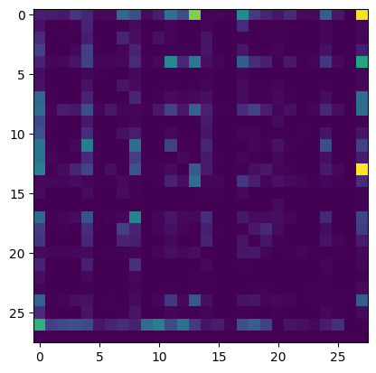
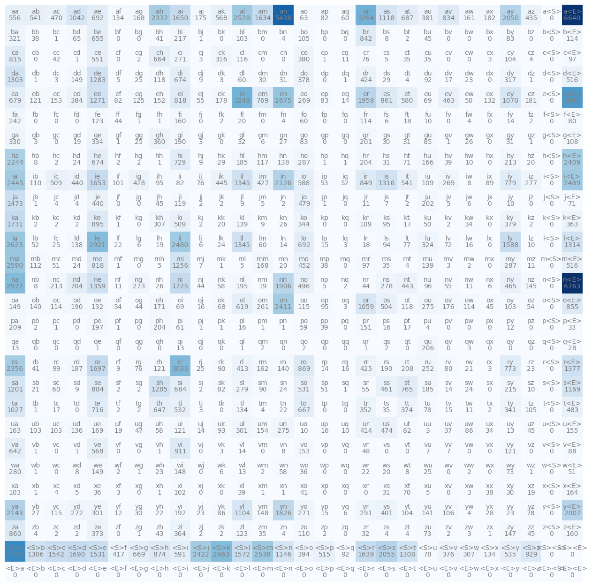
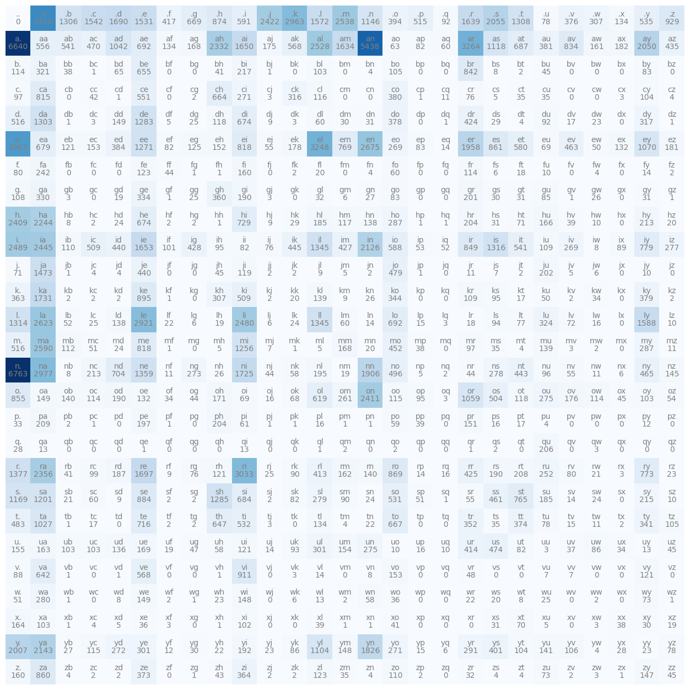
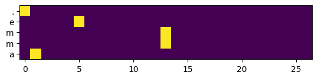

# 构建 Makemore（Building Makemore）

[视频](https://www.youtube.com/watch?v=PaCmpygFfXo)
[代码仓库](https://github.com/karpathy/makemore)
[Eureka Labs Discord](https://discord.com/invite/3zy8kqD9Cp)

## 目录

- [目标](#目标)
- [Bigram 语言模型](#bigram-语言模型)
  - [可视化 Bigram 模型](#可视化-bigram-模型)
  - [处理不可能的组合](#处理不可能的组合)
  - [构建概率分布](#构建概率分布)
  - [从概率分布中采样](#从概率分布中采样)
  - [生成名字的质量](#生成名字的质量)
  - [模型平滑](#模型平滑)
- [神经网络方法 —— 同样的问题，不同的解法](#神经网络方法--同样的问题不同的解法)
  - [喂给网络](#喂给网络)
  - [重新得到正常的分布](#重新得到正常的分布)
  - [回顾](#回顾)
  - [优化](#优化)
  - [反向传播](#反向传播)
- [总结](#总结)

```python
import torch
import torch.nn.functional as F
import matplotlib.pyplot as plt
%matplotlib inline

device = torch.device("cuda:0" if torch.cuda.is_available() else "cpu") # 如果有 GPU 就用 GPU（PyTorch 下计算会快得多）
```

## 目标

本讲将围绕 [makemore](https://github.com/karpathy/makemore) 展开。
Makemore 接收一个文本文件（例如这里提供的 `names.txt`）作为输入。
文本文件中的每一行被视作一个"训练样本"。
随后 Makemore 会学习生成更多与文件中类似的样本。

在内部，makemore 是一个**字符级语言模型（character-level language model）**。
给定一个不完整的序列，makemore 会尝试学习去预测下一个字符。


> 对我们来说至关重要的是，makemore 是一个以*现代*方式实现的字符级语言模型。

**我们的目标是理解 makemore 是如何工作的。**
为此，我们将完全从零开始构建 makemore。

## Bigram 语言模型

Bigram 这种语言建模方法，每次处理**恰好两个**相邻字符，来预测序列中的下一个字符。
这种方法只看*一个*前驱字符来决定接下来的*一个*字符，实际上忽略了样本中可能存在的任何上下文信息。

**Bigram 方法是入门语言建模的绝佳起点。**

要为一个名字生成 bigram，我们可以把名字切分成相邻字符对。
例如，名字 `'emma'` 会被切成 `'em'`、`'mm'`、`'ma'` 这样的 bigram：

```python
for w in words[:1]:
    chs = ['<S>'] + list(w) + ['<E>']
    for ch1, ch2 in zip(chs, chs[1:]): # 巧妙的"双字符滑动窗口"循环
        print(ch1, ch2)
```


**输出：**

```
<S> e
e m
m m
m a
a <E>
```

**注意我们添加了"特殊字符" `<S>` 和 `<E>`**，用来显式标记一个名字/序列的开头和结尾。
对于名字 `emma`，上面的代码现在会生成 bigram：`<S>e, em, mm, ma, a<E>`。

添加这些"特殊字符"会为每个名字额外产生若干字符 bigram。
模型现在可以解读出 `e` 后面很可能跟着 `m`，而 `a` 很可能结束一个名字，等等。
但这暂时还帮不了我们多少。我们需要用某种方式量化这些 bigram，才能基于它们做出预测。

在我们的 `names.txt` 中，要得到"哪个字符后面跟着哪个字符"的最简单统计方法，就是数所有*可能*的 bigram 组合的出现次数。
**为此我们将使用一个字典：**

```python
b = {} # 用于统计 bigram 计数的字典

for w in words:
    chs = ['<S>'] + list(w) + ['<E>']    # 用特殊字符扩展当前词的字符列表
    for ch1, ch2 in zip(chs, chs[1:]):   # 巧妙的"双字符滑动窗口"
        bigram = (ch1, ch2)              # bigram 就是 (ch1, ch2) 这个元组
        b[bigram] = b.get(bigram, 0) + 1 # 如果元组计数不存在 -> 0（不存在时的回退值）+ 1（首次出现的计数）
```

字典 `b` 现在保存了整个 `names.txt` 数据集中所有已存在字符组合的出现计数。
**我们来看看：**

```python
# b.items() 返回类似 (('<S>', a), 34) 的元组
# sorted() 默认会按整个元组排序，而不是按元组里的数量
# 要按数量排序：lambda 函数把排序键替换成数量取负值（按数量从高到低排）
sorted(b.items(), key = lambda keyvalue: -keyvalue[1])
```


**输出：**

```
[(('n', '<E>'), 6763),
 (('a', '<E>'), 6640),
 (('a', 'n'), 5438),
 (('<S>', 'a'), 4410),
 (('e', '<E>'), 3983),
 (('a', 'r'), 3264),
 (('e', 'l'), 3248),
 (('r', 'i'), 3033),
 (('n', 'a'), 2977),
 (('<S>', 'k'), 2963),
 (('l', 'e'), 2921),
 (('e', 'n'), 2675),
 (('l', 'a'), 2623),
 (('m', 'a'), 2590),
... (省略 613 行，最频繁的组合见上) ...
```

在我们的 `names.txt` 中最常出现的组合是 `(('n', '<E>'), 6763)`。

把这一信息保存在一个二维数组里，比保存在字典里实际上更方便、更易理解。
我们可以这样做，因为字符集是固定的而且相对较小。
有了这种二维数组表示，我们就能更方便地访问任意 bigram 的出现次数，同时保持统一的结构。
此外，bigram 统计也更容易可视化，计算上也更高效。

我们构建这个二维数组/矩阵的方式应当是：**行表示第一个字符**，**列表示第二个字符**。
于是每个单元格里保存的就是这两个字符构成的 bigram 的出现次数。

我们有 $26$ 个字母和 $2$ 个特殊字符，因此需要构建一个 $28\times 28$ 的数组：

```python
N = torch.zeros((28,28), dtype=torch.int32)  # 显式设置 dtype，否则默认会是 torch.float32

# 问题： 
# 我们手里只有字符，但需要用整数坐标去索引 N
# -> 需要一个从字符到整数的映射
chars = sorted(list(set(''.join(words))))  # set() 会去掉重复字母

# 解决方案：
# 我们创建一个从字母 s 到整数 i 的映射字典
stoi = {s:i for i,s in enumerate(chars)}
stoi['<S>'] = 26  # 显式追加特殊字符的映射
stoi['<E>'] = 27

# 把前面的 bigram 循环改写一下，
# 现在写入用整数索引的二维张量 N，而不是字典 b
for w in words:
    chs = ['<S>'] + list(w) + ['<E>']
    for ch1, ch2 in zip(chs, chs[1:]):
        ix1 = stoi[ch1]   # 第一个字符映射到索引
        ix2 = stoi[ch2]   # 第二个字符映射到索引
        N[ix1, ix2] += 1  # 在二维矩阵对应单元格上 +1（0 是默认值，见上面的 torch.zeros()）
```

### 可视化 Bigram 模型

如果我们想把新建的 `N` 用数字形式可视化出来，那会是一团乱麻。
我们改用 matplotlib：

```python
plt.imshow(N);
```


**输出：**



**嗯，这看上去依然没说明什么。**
我们可以构建一个好看得多的东西，更清晰地可视化和理解 `N` 内部到底发生了什么。

```python
itos = {i:s for s, i in stoi.items()} # 基本上就是把 stoi 的键值对翻转过来

plt.figure(figsize=(16, 16))
plt.imshow(N, cmap='Blues') # 基本上就是个热力图
for i in range(N.shape[0]):
    for j in range(N.shape[1]):
        chstr = itos[i] + itos[j] # 给热力格加上文字
        plt.text(j, i, chstr, ha="center", va="bottom", color="gray")
        plt.text(j, i, N[i,j].item(), ha="center", va="top", color="gray")
plt.axis('off');
```


**输出：**



### 处理不可能的组合

如果你运行了上面的代码，你会看到有一行和一列给我们的"特殊字符" `<S>` 和 `<E>` 带来了麻烦。
有一列用来统计类似 `(a, <S>)` 的组合（倒数第二列），还有一行用来统计类似 `(<E>, a)` 的组合（最后一行）。
**这些都是不可能的组合。** 字母永远不会出现在 `<S>` 之前，也永远不会出现在 `<E>` 之后。

> 这相当糟糕。**考虑这种不可能的组合会扭曲统计结果。**我们应该修正创建 bigram 的方式。做法是：把特殊的 `<S>` 和 `<E>` 合并成单一的特殊字符 `.`。

```python
N = torch.zeros((27, 27), dtype=torch.int32) # 28x28 -> 27x27

chars = sorted(list(set(''.join(words))))
stoi = {s:i+1 for i,s in enumerate(chars)}
stoi['.'] = 0 # 我们唯一的特殊字符现在放在位置 0，更好看
itos = {i:s for s,i in stoi.items()}

# 从上面复制而来
for w in words:
    chs = ['.'] + list(w) + ['.']
    for ch1, ch2 in zip(chs, chs[1:]): # 巧妙的"双字符滑动窗口"
        ix1 = stoi[ch1]
        ix2 = stoi[ch2]
        N[ix1, ix2] += 1 # 在二维矩阵对应单元格上 +1

plt.figure(figsize=(16, 16))
plt.imshow(N, cmap='Blues') # 基本上就是个热力图
for i in range(N.shape[0]):
    for j in range(N.shape[1]):
        chstr = itos[i] + itos[j] # 给热力格加上文字
        plt.text(j, i, chstr, ha="center", va="bottom", color="gray")
        plt.text(j, i, N[i,j].item(), ha="center", va="top", color="gray")
plt.axis('off');
```


**输出：**



使用单一特殊字符 `.` 消除了之前冗余的行列问题。
事实上 `.` 确实既能正确地出现在名字之前，也能出现在名字之后。
注意，连 `..` 严格来说也是合法的表达。
*只不过这个名字是空的，但它的构造和边界都是正确的。*

### 构建概率分布

每个 bigram 出现的对应计数，为我们提供了创建概率分布所需的数据。
一个字符对出现得越频繁，给定该对的前驱字符后，从中采样到该对后继字符的概率就越高。

例如，如果你当前字母是 `b`，那么下一个字母最可能是 `r`（因为 `('b','r')` 是以 `b` 开头最频繁的 bigram），接着很可能是 `i`（因为 `('r','i')` 是以 `r` 开头最频繁的 bigram），以此类推。从这个思路可以看出，我们具体需要的是*逐行的概率*（每一行在所有列上的概率之和为 1）。

我们将沿着这些概率，从二维数组的逐行出发开始采样。
我们从以 `.` 开头的那些元组开始。

```python
# 取出整个第 0 行
# （一维数组，由以 '.' 开头的元组组成）
print("Raw first row's combination counts:\n", N[0])
print("Row length:\n", N[0].shape)
```


**输出：**

```
Raw first row's combination counts:
 tensor([   0, 4410, 1306, 1542, 1690, 1531,  417,  669,  874,  591, 2422, 2963,
        1572, 2538, 1146,  394,  515,   92, 1639, 2055, 1308,   78,  376,  307,
         134,  535,  929], dtype=torch.int32)
Row length:
 torch.Size([27])
```

假设我们给定的字符是 `.`。
行 `N[0]` 中的元素，保存的就是以 `.` 开头的 bigram 的计数。

现在要选择应该跟在我们的 `.` 后面的下一个字符，我们需要把这些 bigram 计数转换成概率。
做法是把这一行里的每个计数除以该行所有计数之和。

通过这一步，我们得到了一个关于 `.` 后面所有可能下一个字符的概率分布。
这就让我们能够从这个分布中采样出下一个字符了。

```python
p = N[0].float() # 以 '.' 开头这一行 bigram 的概率向量（浮点 numpy 数组）
p = p / p.sum()  # 除以该行所有计数之和做归一化，得到分布

print("First Row's distribution:\n", p)
```


**输出：**

```
First Row's distribution:
 tensor([0.0000, 0.1377, 0.0408, 0.0481, 0.0528, 0.0478, 0.0130, 0.0209, 0.0273,
        0.0184, 0.0756, 0.0925, 0.0491, 0.0792, 0.0358, 0.0123, 0.0161, 0.0029,
        0.0512, 0.0642, 0.0408, 0.0024, 0.0117, 0.0096, 0.0042, 0.0167, 0.0290])
```

我们现在把这新的概率向量存进了 `p`。
让我们玩味一下 `p` 背后的含义，以及我们实际上能用它做什么：

```python
# 我们用 PyTorch 的 Generator 让随机变得可复现
g = torch.Generator().manual_seed(2147483647) # 用固定种子创建生成器
p_tmp = torch.rand(3, generator=g) # 用这个生成器生成三个 [0;1] 的随机数
p_tmp = p_tmp / p_tmp.sum()        # 把随机数映射成一个分布（向量化，一次性完成）

print(p_tmp)       # tensor([0.6064, 0.3033, 0.0903])
print(p_tmp.sum()) # tensor(1.)，这正是分布应有的结果
```


**输出：**

```
tensor([0.6064, 0.3033, 0.0903])
tensor(1.)
```

### 从概率分布中采样

现在要从我们的分布 `p` 中采样，可以用 `torch.multinomial()`。
它接收一个概率分布，并按照该分布返回若干个采样得到的整数。

> `num_samples` 越大，我们就越能从这些样本里精确地逼近这个分布。

把 `num_samples` 设为 $1$，我们也能很方便地从分布里只抽取单个样本：

```python
g = torch.Generator().manual_seed(2147483647)

# 用概率分布 p 创建一个采样
# [replacement: true] 表示抽取一个元素并不会使该元素不能再被抽到
ix = torch.multinomial(p, num_samples=1, replacement=True, generator=g).item()

# ix 就是我们的索引，把它映射回字母
print(itos[ix]) # j
```


**输出：**

```
j
```

我们刚刚为第一个生成的名字建议抽取了一个起始字符 `j`。
有了它，我们就可以在数组里移动到以 `j` 开头的那一行，并对这一行重复抽取过程。

**生成一个名字，于是变成了一个由概率驱动的循环。**

我们现在可以把这个循环运行若干次迭代，来生成一组名字：

```python
g = torch.Generator().manual_seed(2147483647) # 再来一个生成器
n = 20 # 来生成 20 个名字

for i in range(n):
    ix = 0   # 我们特殊 '.' 字符的索引，用来初始化名字的生成
    out = [] # 保存当前名字的字符
    while True:
        p = N[ix].float() # 从当前行取出 bigram 计数
        p = p / p.sum()   # 把对应计数归一化得到概率
        # 从分布 p 中抽取一个整数样本，这就是要追加的字符，也是下一轮迭代的行索引
        ix = torch.multinomial(p, num_samples=1, replacement=True, generator=g).item()
        out.append(itos[ix])
        # 如果我们发现刚刚又抽到了特殊的 '.' 字符，就说明这个名字生成完了
        if ix == 0:
            break
    print(''.join(out))
```


**输出：**

```
junide.
janasah.
p.
cony.
a.
nn.
kohin.
tolian.
juee.
ksahnaauranilevias.
dedainrwieta.
ssonielylarte.
faveumerifontume.
phynslenaruani.
core.
yaenon.
ka.
jabdinerimikimaynin.
anaasn.
ssorionsush.
```

*Et voilà*，糟糕透顶的名字建议。

尽管我们的 bigram 方法看起来表现很差，*但它其实还算合理地起作用了*。
不过它效率低下。**我们来修复它。**

`p = N[ix].float()` 这一行里，我们总是取出一行，并且总是把这一行的元素从 `int` 转换成 `float`。
而且每次迭代我们还要做 `p = p / p.sum()`。
更干净的做法是为这些重复计算预先准备一个专门的、预处理好的矩阵 `P`。
它就是一个预先算好概率的矩阵。

让我们用这个预计算矩阵 `P` 来实现性能上的提升：

```python
# 设置概率矩阵 P，先让它持有计数对应的浮点版本
P = N.float()

# 人们可能会以为循环里替换 p / p.sum() 的计算是：
# P /= P.sum() 
# 问题：这会把所有元素求和（行向和列向一起求）-> 错了，我们只要逐行求和

# 解决方案：PyTorch 里可以这样写：
P /= P.sum(1, keepdims=True) 
# P.sum(1, keepdims=True) 产生一个 27x1 的向量（27 个值，每行的逐行之和各一个）
# 那个 1 表示要保留行数，但列上要逐行求和（正是我们需要的）
# keepdims=True 让结果保持形状 (27, 1) 而不是 (27,)
# (27,27) 除以 (27,1) 在 PyTorch 里可以通过广播（Broadcasting）完成
# 要让广播成立，每一维要么相等要么为 1（或不存在），这里正是如此
# （维度是从右往左对齐的！）

g = torch.Generator().manual_seed(2147483647)
n = 20

for i in range(n):
    ix = 0   # 我们特殊 '.' 字符的索引，用来初始化名字的生成
    out = [] # 保存当前名字的字符
    while True:
        p = P[ix] # 从当前行取出 bigram 概率（现在是预先算好的）
        # 从分布 p 中抽取一个整数样本，这就是要追加的字符，也是下一轮迭代的行索引
        ix = torch.multinomial(p, num_samples=1, replacement=True, generator=g).item()
        out.append(itos[ix])
        # 如果我们发现刚刚又抽到了特殊的 '.' 字符，就说明这个名字生成完了
        if ix == 0:
            break
    print(''.join(out))
```


**输出：**

```
junide.
janasah.
p.
cony.
a.
nn.
kohin.
tolian.
juee.
ksahnaauranilevias.
dedainrwieta.
ssonielylarte.
faveumerifontume.
phynslenaruani.
core.
yaenon.
ka.
jabdinerimikimaynin.
anaasn.
ssorionsush.
```

```python
# 对广播做一下快速检查
# 期望：P 的每一行之和都应当是 1
print(P.sum(1)) # 1 表示"在列上求和"
```


**输出：**

```
tensor([1.0000, 1.0000, 1.0000, 1.0000, 1.0000, 1.0000, 1.0000, 1.0000, 1.0000,
        1.0000, 1.0000, 1.0000, 1.0000, 1.0000, 1.0000, 1.0000, 1.0000, 1.0000,
        1.0000, 1.0000, 1.0000, 1.0000, 1.0000, 1.0000, 1.0000, 1.0000, 1.0000])
```

读到这里，强烈建议你通读一遍 [PyTorch Broadcasting Semantics（广播语义）](https://pytorch.org/docs/stable/notes/broadcasting.html)。
**务必真正理解广播语义，不要走马观花。**

> **广播（Broadcasting）** 可能会接受一些张量形状，并按你意想不到的方式去处理它们。你需要理解广播的用法，才能知道自己在这个过程中有没有出错。绝大多数时候，它*不会*告诉你错在哪了。

### 生成名字的质量

到目前为止，我们通过统计每个字符对出现的频次、把这些计数转换成概率、再从该概率分布中采样，构建了一个 bigram 语言模型。
我们接着从这个模型中（逐字符地）迭代采样，并引入矩阵 `P` 作为性能上的升级，避免重复计算。

*但它在起名字这件事上依然很糟糕。*
**但到底有多糟糕？** 我们知道模型的"知识"/逐 bigram 概率由 `P` 表示。
既然如此，我们能不能用一个单一的数值来量化模型的质量？

我们来看看从 `names.txt` 数据集中构建出来的那些 bigram。
`emma` 对应的 bigram 是 `'.e', 'em', 'mm', 'ma', 'a.'`
**但模型会给每个 bigram 分配多大的概率呢？**

```python
# 从上面复制而来
for w in words[:1]:
    chs = ['.'] + list(w) + ['.']
    for ch1, ch2 in zip(chs, chs[1:]):  # 巧妙的"双字符滑动窗口"
        ix1, ix2 = stoi[ch1], stoi[ch2] # 把 bigram 的字符映射到索引
        prob = P[ix1, ix2] # 模型分配给 bigram (ch1, ch2) 的概率
        print(f'{ch1}{ch2}: {prob:.4f}')
```


**输出：**

```
.e: 0.0478
em: 0.0377
mm: 0.0253
ma: 0.3899
a.: 0.1960
```

一个被分配的概率高于或低于 $\frac{1}{27} = 0.0370$，意味着我们偏离了均值，*我们从数据集中通过 bigram 统计学到了一些东西*。

**问题：** 把这些 bigram 概率所告诉我们的信息，量化成一个能指示质量的单一度量。
**解法：** *对数似然（log-likelihood），即对各个 bigram 概率取 $\log(\text{概率})$ 后的**求和***
（取对数是为了可读性，基本是出于便利的考虑）

$$
\text{log-likelihood} = \sum_{i=1}^{n} \log(P_{b_i})
$$

其中 $P_{b_i}$ 是模型分配给 bigram $b_i$ 的概率。

> **对数似然越高，模型在预测数据集中序列的下一个字符时就越确信。**

```python
log_likelihood = 0.0 # 初始对数似然
n = 0 # 元组计数

# 从上面复制而来，改写成对所有名字累计对数似然
for w in words:
    chs = ['.'] + list(w) + ['.']
    for ch1, ch2 in zip(chs, chs[1:]):
        ix1, ix2 = stoi[ch1], stoi[ch2]
        prob = P[ix1, ix2]        # 模型分配给 bigram (ch1, ch2) 的概率
        logprob = torch.log(prob) # 概率的对数
        log_likelihood += logprob # 累加到总对数似然
        n += 1
        # print(f'{ch1}{ch2}: {prob:.4f} {logprob:.4f}') # bigram 的概率和对数概率

print(f'{log_likelihood=}') # 因为这是个张量，我们想看到这点
nll = -log_likelihood
print(f'{nll=}')            # 负对数似然
print(f'{nll/n}')           # 平均负对数似然（这就是我们要最小化的损失）
```


**输出：**

```
log_likelihood=tensor(-559891.7500)
nll=tensor(559891.7500)
2.454094171524048
```

**为什么我们现在要用负对数似然？**
我们的模型会按 bigram 在数据集中实际被观察到的情况给它们分配概率。
一个更好的模型会给数据集中真正观察到的 bigram 分配更高的概率，从而带来更高的对数似然。
然而在优化中，我们通常更希望*最小化*一个损失函数，而不是*最大化*一个得分。
所以，与其改变整个优化流程，我们干脆对对数似然取负，转而*最小化*它。

> 概率越小/越差，对数似然就越负。这样一来，**负对数似然 `nll` 越高，模型就越差。**
> 这个 `nll` 通常也会做归一化，得到**平均（负）对数似然**。
> 这个度量与数据集大小无关，因而能在不同数据集之间更好地比较。

我们为模型算出了 $2.45$ 的平均负对数似然。*越低越好。*
我们现在要寻找能降低这个值的参数。

**目标：**
相对于 `P` 中的模型参数，最大化训练数据的似然。
这等价于：

- *最大化*对数似然（因为 log 是单调的）
- *最小化**负**对数似然
- *最小化*平均负对数似然（这个与大小无关的质量度量）

从现在起，我们可以通过监控这个损失函数（负对数似然）来评估我们的模型，
因为模型的任何弱点都会反映在这个值上。

**下面马上就出现了这样一个弱点：**

```python
log_likelihood = 0.0
n = 0

# 从上面复制而来
for w in ['andrejq']:
    chs = ['.'] + list(w) + ['.']
    for ch1, ch2 in zip(chs, chs[1:]): # 巧妙的"双字符滑动窗口"
        ix1, ix2 = stoi[ch1], stoi[ch2]
        prob = P[ix1, ix2]
        logprob = torch.log(prob)
        log_likelihood += logprob
        n += 1
        print(f'{ch1}{ch2}: {prob:.4f} {logprob:.4f}')

print(f'\n{log_likelihood=}') # 因为这是个张量，我们想看到这点
nll = -log_likelihood
print(f'{nll=}')
print(f'{nll/n}')
```


**输出：**

```
.a: 0.1377 -1.9829
an: 0.1605 -1.8296
nd: 0.0384 -3.2594
dr: 0.0771 -2.5620
re: 0.1336 -2.0127
ej: 0.0027 -5.9171
jq: 0.0000 -inf
q.: 0.1029 -2.2736

log_likelihood=tensor(-inf)
nll=tensor(inf)
inf
```

当我们的模型被要求给名字 `andrejq` 的 bigram 分配概率时，我们得到了一个最糟的平均负对数似然：$\infty$。
这是因为 bigram `jq` 在我们的 `names.txt` 数据集中并不存在，它的计数为 $0$，因此我们的模型采样到它的似然为 $0\%$。
这个被赋予的似然随后通过 $\log(0) = -\infty$ 级联到最终结果里，严重扭曲了负对数似然。

**这有点恶心。**

### 模型平滑

**模型平滑（Model Smoothing）** 相对轻松地解决了这个问题。
我们基本上就是把现有的每个计数都加 $1$，从而永远避免出现计数为 $0$ 的情况。

```python
P = (N+1).float() # 给 N 里每个计数加得越多，分布就被抹得越平
P /= P.sum(1, keepdims=True) # sum：一个 27x1 向量（1 表示逐行求和）
```

我们给 `N` 里的每个计数都加了 `+1`。
重新运行和之前完全相同的代码，现在平滑处理给 bigram `jq` 赋予了一个（很小的）概率。

> 模型对 `jq` 这个 bigram 仍然感到惊讶，但已经不再是被淹没的程度了。

```python
log_likelihood = 0.0
n = 0

# 从上面复制而来
for w in ['andrejq']:
    chs = ['.'] + list(w) + ['.']
    for ch1, ch2 in zip(chs, chs[1:]): # 巧妙的"双字符滑动窗口"
        ix1, ix2 = stoi[ch1], stoi[ch2]
        prob = P[ix1, ix2]
        logprob = torch.log(prob)
        log_likelihood += logprob
        n += 1

print(f'{log_likelihood=}')
nll = -log_likelihood
print(f'{nll=}')
print(f'{nll/n}')
```


**输出：**

```
log_likelihood=tensor(-27.8672)
nll=tensor(27.8672)
3.4834020137786865
```

**到此为止，这已经是一个相当扎实的 bigram 字符估计模型了。**

我们评估了它的性能，并通过平滑堵上了漏洞。
不过它依然有些摇摇晃晃。

---

## 神经网络方法 —— 同样的问题，不同的解法

**现在**，我们要把字符估计这个问题，纳入神经网络的框架中。
我们处理的问题本身还是那个问题，方法变了，结果应当看起来相似。

我们的神经网络**接收单个字符**，并**输出对下一个可能字符的概率分布**
（本例中是 $27$ 个）。
它会去猜测最可能跟随的字符。
它的性能*仍然*可以用*同一个*损失函数，即负对数似然，来度量。

因为我们有训练数据，我们知道每个训练样本中实际接下来的字符是什么。
这就可以用来调优神经网络，让它做出更好的猜测。**这就是监督学习（Supervised Learning）的实际运作。**

```python
# 创建由所有 bigram 组成的训练集
xs, ys = [], [] # 输入和输出的字符索引

for w in words:
    chs = ['.'] + list(w) + ['.']
    for ch1, ch2 in zip(chs, chs[1:]):
        ix1, ix2 = stoi[ch1], stoi[ch2]
        xs.append(ix1)
        ys.append(ix2)

# 把列表转换成张量
xs = torch.tensor(xs) # 228146 个输入字符索引（bigram 的第一个字符）
ys = torch.tensor(ys) # 228146 个输出字符索引（bigram 的第二个字符）
```

如果我们要为名字 `.emma.` 生成 `xs` 和 `ys`，它们看起来会是这样的：

```python
# 创建某一个 bigram 的训练集
xs, ys = [], []

itos = {i:s for s, i in stoi.items()}

for w in words[:1]:
    chs = ['.'] + list(w) + ['.']
    for ch1, ch2 in zip(chs, chs[1:]):
        ix1, ix2 = stoi[ch1], stoi[ch2]
        print(f'{ch1}{ch2}: {ix1}\t ->  {ix2}')
        xs.append(ix1)
        ys.append(ix2)

xs, ys = torch.tensor(xs), torch.tensor(ys)
xstr, ystr = [''.join([itos[o[i].item()] for i in range(len(o))]) for o in (xs, ys)]

print()
print(xstr, "->", xs) # 5 个输入字符索引（bigram 的第一个字符）
print(ystr, "->", ys) # 5 个输出字符索引（bigram 的第二个字符）
```


**输出：**

```
.e: 0	 ->  5
em: 5	 ->  13
mm: 13	 ->  13
ma: 13	 ->  1
a.: 1	 ->  0

.emma -> tensor([ 0,  5, 13, 13,  1])
emma. -> tensor([ 5, 13, 13,  1,  0])
```

> 实际上同时存在 `torch.tensor` 和 `torch.Tensor`。**该用哪个？**

（来自[这里](https://stackoverflow.com/questions/51911749/what-is-the-difference-between-torch-tensor-and-torch-tensor)）
每个 PyTorch 张量都是 `torch.Tensor` 的一个实例，而 `torch.tensor` 是一个用于构造并返回 `torch.Tensor` 实例的函数。
除了初始化一个完全空的张量之外，一般而言没有理由选择 `torch.Tensor` 而不是 `torch.tensor`。
还要注意 `torch.Tensor` 是 `torch.FloatTensor` 的别名，因此它的 `dtype` 默认是 `torch.float32`。
而 `torch.tensor` 则会从你给它的数据推断出正确的 `dtype`，除非你自己显式指定。

**推荐使用 `torch.tensor`。**

### 喂给网络

把字母的数值表示直接当作单个神经元的输入，是没有意义的。
网络会引用那个数值本身，而完全不考虑可能的取值范围这类上下文。
与某个数字关联的字母处在它所在的索引位置，是因为它与其他字母的关系，而那个数字本身并不能表达这种关系。

对此，**独热编码（One-Hot Encoding）** 会是更好的表示方式。

> 独热编码取一个字母的整数索引（例如 $13$），创建一个全零向量，然后在这个向量的索引 $13$ 处放一个 $1$，其余位置全为 $0$。

我们来看看对输入 `.emma` 做独热编码会是什么样子：

```python
# '. e m m a' 是输入
# 对应的输出是 'e m m a .'

xenc = F.one_hot(xs, num_classes=27).float() # num_classes 提供了向量长度
xenc.shape # 对于 '.emma' 这会是 [5, 27]
plt.yticks(ticks=range(len(xstr)), labels=list(xstr))
plt.imshow(xenc);
```


**输出：**



来自输入 `.emma` 的字符被映射成了 `integer` 值，然后再映射成 `float32` 类型的独热向量。
也就是说，我们终于得到了一个适合喂给神经网络的输入。

我们来玩玩神经元。
我们将构建一个 $27$ 维的神经元，并用我们第一个名字 `.emma`（也就是 $5$ 个字符的输入）逐字符地喂给它。

```python
W = torch.randn((27,1), generator=g) # 这个神经元：从正态分布随机初始化的 27 个数的列向量
a = xenc @ W  # 与独热向量做矩阵乘法，全部一次性、批量地完成；'@' 是 PyTorch 的矩阵乘法运算符 (5x27 @ 27x1 -> 5x1)

print(a) # 现在它是一个 5x1 的向量
```


**输出：**

```
tensor([[ 0.1066],
        [-1.2464],
        [-0.6378],
        [-0.6378],
        [ 1.8598]])
```

`W` 是**单个**神经元。
把它和 `xenc` 相乘，会让它"对每个独热编码的字符表示同时作出反应"。
结果是一个 $5\times 1$ 大小的向量。`.emma` 有 $5$ 个字符，我们有 $1$ 个神经元。
这个向量展示的，是每个独热编码字符所对应的神经元的输出，也就是所谓的 logit。

> 由于输入是独热编码的，单个神经元接收的是一个"宽度为 $27$ 的字符"。
> 在这个例子里，它对全部 $5$ 个字母*一次性*这么做。每个 $27$ 维的字母，它输出恰好一个 logit。
> 它不会直接从那个输出里学习，但这就是大致的思路。
> 关键洞察在于：**由于一个字母通过独热编码具有 $27$ 维，单个神经元也必须具有 $27$ 维。**
> **一旦它有了，我们就能像上面用 `xenc` 那样，一次性把多个独热编码向量丢给它。**

现在，这只是**一个**神经元。我们想要 $27$ 个神经元。
"独热向量中每个可能字符对应一个神经元"的原因，后面就会清楚。

```python
W = torch.randn((27,27), generator=g) # 再次随机初始化 W，一个 27x27 个数的列矩阵（之前是单神经元的 27x1，现在是 27）
a = xenc @ W # @ 是 PyTorch 的矩阵乘法运算符，现在产生一个 5x27 的向量

print(a) # 5x27 的 logits 向量
```


**输出：**

```
tensor([[ 0.2603,  0.9090, -1.4458,  1.1072, -0.7175, -0.3867, -1.2542,  1.2068,
         -0.7305, -1.0926,  0.3223,  0.0717, -0.2774,  1.1634, -0.6691,  0.6492,
         -0.8157,  0.6404,  1.0442, -1.1571,  0.5107,  0.7593, -1.6086, -0.1607,
         -0.7226,  0.5205,  0.7270],
        [ 0.9641,  0.0471,  0.3096,  1.2087, -0.9954, -0.4485, -1.2345,  1.1220,
         -0.6738,  0.6365, -0.5964,  1.3058,  0.3857, -0.7510,  0.9278, -1.4849,
         -0.2129, -0.9419,  1.5729,  1.0105, -0.1085,  0.6006, -0.7091,  1.9217,
         -0.1818, -0.0954, -0.9253],
        [-0.4645, -0.5206, -0.5579,  1.1087,  0.4149,  0.9557, -0.1471, -1.2532,
         -1.1850,  2.1940,  0.6698,  0.4829,  2.0022, -0.6284, -0.9379,  1.6772,
          0.0039, -0.1460, -1.2915, -0.0748,  1.3272,  1.6676,  1.3931,  0.6540,
         -0.2245, -1.8563,  0.9609],
        [-0.4645, -0.5206, -0.5579,  1.1087,  0.4149,  0.9557, -0.1471, -1.2532,
         -1.1850,  2.1940,  0.6698,  0.4829,  2.0022, -0.6284, -0.9379,  1.6772,
          0.0039, -0.1460, -1.2915, -0.0748,  1.3272,  1.6676,  1.3931,  0.6540,
         -0.2245, -1.8563,  0.9609],
        [ 0.1114, -0.5977, -0.3977, -1.2801,  0.0924, -0.1463, -0.5254, -1.5195,
          0.3240, -1.5065,  1.2898, -1.5100,  1.0930,  0.0549,  1.3537, -1.0896,
          0.2558,  0.2469,  0.3190, -0.9861, -0.2138, -3.0010,  1.4111,  0.0317,
         -0.5475,  0.8183, -0.8163]])
```

对于这 $27$ 个神经元中的每一个，我们都会得到它在每个示例上的 firing rate（激发率），因此这是一个 $5\times 27$ 的 logits 向量。

```python
(xenc @ W)[3, 13] # 第 4 个输入下第 14 个神经元的激发率
```


**输出：**

```
tensor(-0.6284)
```

我们现在已经把 $5$ 个 $27$ 维的输入喂给了一个由 $27$ 个神经元组成的输入层。
**我们不会加偏置（Bias）或任何别的东西。** *网络结构上就到这里为止。*

### 重新得到正常的分布

直觉上，我们希望每个输入（每个字符）对应的那些神经元汇聚起来，产生一个 $27$ 维的输出，可以经过一个激活函数后变换成一个正常的（归一）分布，从而像之前那样，我们可以用它来决定接下来选择哪个字符。

**问题：**
我们目前什么都没做。
每个字符，我们目前产生 $27$ 个 logit。有正、有负，啥都有。
而正常的分布不会从任何神经网络里直接冒出来。
**神经网络*不是*这么工作的。**

**解法：**
对每个字符，我们不再期望像上面[可视化 Bigram 模型](#可视化-bigram-模型)那个矩阵里那样得到可能组合的计数，而是得到"log-counts（对数计数）"。
基于这一解读，我们对它们取指数，再按其之和归一化，把它们重新带回到概率空间。
最终，这让我们能够像之前用非神经网络的 bigram 模型那样，从这个分布里采样。

**……啥？**
要把任意的 logit 转换成一个合法的概率分布，我们首先对它们取指数，让它们全部为正。
然后我们再除以这些取了指数的 logit 之和来归一化，确保它们的和为 $1$，从而代表一个合法的概率分布。
**这个过程就是所谓的 softmax 函数：**

$$
P_i = \frac{e^{z_i}}{\sum_j e^{z_j}}
$$

```python
logits = xenc @ W # logits，log-counts 的另一种说法

# 这两步合起来就叫做 Softmax -> 从 logits 构造一个概率分布
counts = logits.exp() # 负数在 1 以下变正，正数在 1 以上变正
# 我们就当 counts 变量里装的是某种"伪计数"，有点像 bigram 那个 N 矩阵里的，我们按同样方式处理它们
probs = counts / counts.sum(1, keepdims=True) # 归一化的概率分布

print(probs.shape)    # 5x27，如预期
print(probs[0].sum()) # 对任意索引 [0-4] 都会是 1.
```


**输出：**

```
torch.Size([5, 27])
tensor(1.0000)
```

这听起来很怪，坦率地说看起来也确实有点怪，但我们现在有了一组数字，可以像对待 bigram 方法里那些真实计数一样去对待它们。
里面没有任何负数。（"就当它是 Count-alike"。）
这样一来，我们的任务就归结为：为神经元找到正确的权重 `W`，让网络输出正确的字符概率分布。

### 回顾

给定示例输入 `.emma.`，神经网络会逐个接收每个字符。
我们从输入 `x = .` 和标签 `y = e` 开始，以此类推。

- 我们取 `.` 的索引，也就是 `0`
- 我们基于索引 `0` 对 `.` 做独热编码，形成一个 $27$ 维向量
  - 它作为一个 $27\times 1$ 向量进入网络
- 这个输入让 $27$ 个不同的 $27$ 维神经元各产生 $27$ 维的输出，即 logits
- 因此 `.` 对应的 logits 构成一个 $1\times 27$ 向量（($1,\ 27$) $\times$ ($27,\ 27$) = ($1,\ 27$) logits）
- 对 logits 应用 Softmax：
  - logits 经过 $e^x$，确保它们现在落在正数范围 $(0;\infty)$
  - 然后，把这 $27$ 个移位后的 logit 值除以它们的和做归一化，确保作为合法概率分布它们之和为 $1$

把 Softmax 想成一个归一化函数：接收一堆乱七八糟的数，返回一个正的归一化分布。
这个分布表示，模型对"在我们提供的输入 `.` 之后应该跟随哪个字母"的预测。

**现在的问题是：**
我们怎样才能找到一组权重 `W`，让网络产生尽可能好的概率？

**上面列出的这些操作都是可微的，因此是可反向传播的**。
为完整起见，这里再用代码把它们写一遍：

```python
# 前向传播（FORWARD-PASS）：
#（xs 仍代表 '.emma' 作为输入的字符索引）

xenc = F.one_hot(xs, num_classes=27).float() # 对名字的输入字符索引做独热编码，现在是 5x27 矩阵
logits = xenc @ W  # 把独热向量送过 27 个神经元，产生一个 5x27 矩阵

# Softmax 作为前向传播的一部分
counts = logits.exp() # "伪计数"，有点像 bigram 那个 N 矩阵里累计的东西
probs = counts / counts.sum(1, keepdims=True) # 归一化的概率分布

print(probs.shape) # 5x27，每个输入字符对应一个概率分布
```


**输出：**

```
torch.Size([5, 27])
```

到这里，神经网络目前能做到的就是这些：

```python
nlls = torch.zeros(len(xs)) # 5

# 构成 '.emma.' 的五个 bigram
for i in range(len(xs)):
    #第 i 个 bigram
    x = xs[i].item() # 输入字符索引
    y = ys[i].item() # 输出字符索引
    print("\n-------\n")

    print(f'bigram example tuple {i+1}: ("{itos[x]}", "{itos[y]}") (indexes ({x}, {y}))') # 输入是索引 x，期望输出是索引 y
    print('\t>> input to the neural net:', x, f'({itos[x]})') # 同样，x 这个索引就是网络的输入
    print('\t>> output probabilities from the neural net:\n\t', probs[i]) # 我们在上一格构建了 probs
    print('\t>> most likely next character:', itos[probs[i].argmax().item()], f'(index {probs[i].argmax().item()}, likelihood {probs[i].max().item()})') # argmax() 返回 probs[i] 中最大值的索引
    print('\t>> label (actual next character):', y)

    p = probs[i, y]
    print('\t>> probability assigned by the net to the correct character:', p.item())
    logp = torch.log(p)
    print('\t>> log likelihood:', logp.item())
    nll = -logp
    print('\t>> negative log likelihood:', nll.item())
    nlls[i] = nll

print('\n============\n')
print('average negative log likelihood, i.e. loss =', nlls.mean().item())
```


**输出：**

```

-------

bigram example tuple 1: (".", "e") (indexes (0, 5))
	>> input to the neural net: 0 (.)
	>> output probabilities from the neural net:
	 tensor([0.0360, 0.0688, 0.0065, 0.0839, 0.0135, 0.0188, 0.0079, 0.0926, 0.0134,
        0.0093, 0.0383, 0.0298, 0.0210, 0.0887, 0.0142, 0.0530, 0.0123, 0.0526,
        0.0787, 0.0087, 0.0462, 0.0592, 0.0055, 0.0236, 0.0135, 0.0466, 0.0573])
	>> most likely next character: g (index 7, likelihood 0.09264726936817169)
	>> label (actual next character): 5
	>> probability assigned by the net to the correct character: 0.018827952444553375
	>> log likelihood: -3.972412586212158
	>> negative log likelihood: 3.972412586212158

-------

... (省略其余 4 个 bigram 的逐项输出) ...

average negative log likelihood, i.e. loss = 4.237281322479248
```

**这个损失一点也不好**，但我们可以直接重新采样网络的权重。
也许能得到更好的结果？更好的办法是不要把这事交给运气。

**让我们系统地优化权重 `W`。**

### 优化

**碰巧**，把权重初始化的生成器种子加 $1$，恰好能产生一个更小的总损失。
*但等随机性送来最优解，是费时费力的小白做法。*

> 计算损失相对于矩阵 `W` 的梯度（每个示例都算），我们就能把 `W` 朝着优化的方向调。**这就是我们在[上一讲](../N001%20-%20Building%20Micrograd/N001%20-%20Micrograd.ipynb)里学到的基于梯度的优化。**

对于示例输入 `.emma`，这意味着神经元激活里相应的部分要分别被修改：

```python
# 各个字符输入对应的激活
print('input ".", output "e":', probs[0, 5])  # 输入 '.'，抽到 'e' 的概率
print('input "e", output "m":', probs[1, 13]) # 输入 'e'，抽到 'm' 的概率，以此类推
print('input "m", output "m":', probs[2, 13])
print('input "m", output "a":', probs[3, 1])
print('input "a", output ".":', probs[4, 0])
```


**输出：**

```
input ".", output "e": tensor(0.0188)
input "e", output "m": tensor(0.0105)
input "m", output "m": tensor(0.0092)
input "m", output "a": tensor(0.0102)
input "a", output ".": tensor(0.0342)
```

由于我们想要*改变*这些特定的概率，就需要*访问*到它们。
事实证明，用 PyTorch 可以做得很漂亮：

```python
# 沿着 probs 的长度方向（维度 0，probs 仍是 5x27），我们逐行取出
#（一行宽 27）位于 ys（形状为 5）中、与该行同索引处的对应索引
target_probs = probs[torch.arange(len(probs)), ys] # 网络分别为 ., e, m, m, a 的正确下一个字符分配的概率

# target_probs 基本上说明的是：
# - 'e' 跟在 '.' 后面的概率是 target_probs[0]
# - 'm' 跟在 'e' 后面的概率是 target_probs[1]
# 以此类推

# 打印 target_probs 可以看出，它实际上和
# 前面那个示例展示的内容相同，只是现在变成了向量形式
print(target_probs)
```


**输出：**

```
tensor([0.0188, 0.0105, 0.0092, 0.0102, 0.0342])
```

如上所述，我们想从模型当前给出的这些目标字符概率中，得到*平均负对数似然*：

```python
loss = -probs[torch.arange(len(probs)), ys].log().mean()
print(loss.item()) # 和上面一样
```


**输出：**

```
4.237281322479248
```

由于我们需要在每次迭代/每个字符进入网络时都计算这个损失，我们现在**把这个损失加进前向传播流水线里**。
这就给了反向传播机会，去"看清网络的错误"并据此行动。

```python
g = torch.Generator().manual_seed(2147483647)
W = torch.randn((27,27), device=torch.device("cpu"), generator=g, requires_grad=True) # 27x27 个数的随机列矩阵（现在 requires_grad=True 以启用 autograd）
```

```python
# 前向传播（FORWARD-PASS）：

# 对输入做独热编码并产生 logits：
xenc = F.one_hot(xs, num_classes=27).float() # 对名字做独热编码
logits = xenc @ W # logits，log-counts 的另一种说法

# 对 logits 做 Softmax 得到概率：
counts = logits.exp() # "伪计数"，有点像之前的 N 矩阵
probs = counts / counts.sum(1, keepdims=True) # 归一化的概率分布（这就是 y_pred）

# 负对数似然损失，用来判断模型表现如何：
loss = -probs[torch.arange(len(probs)), ys].log().mean()
print('Loss:',loss.item())
```


**输出：**

```
Loss: 3.7693049907684326
```

### 反向传播

```python
W.grad = None   # 确保所有梯度都被清空
loss.backward() # Torch 一直追踪了这个变量的依赖图以产生梯度，挺酷的

# 看一下反向传播的影响
W.grad # 现在里面有信息了
print(W.grad.shape) # 27x27 个我们神经元的梯度
print(W.grad[0,0])  # 第一个神经元关于 '.' 字母概率的值，要引起*更大*的损失，应按这个值来抬升它
```


**输出：**

```
torch.Size([27, 27])
tensor(0.0121)
```

由于我们在 `W` 上设置了 `requires_grad=True`，PyTorch 会追踪对 `W` 执行过的操作，从而能够计算损失对 `W` 的梯度，就像我们在 [micrograd 那一讲](../N001%20-%20Building%20Micrograd/N001%20-%20Micrograd.ipynb)里手工做过的一样。
这个梯度告诉我们，要最有效地进一步**最大化**损失，该怎么做。
对它取负，我们就能用这个梯度来更新权重以**最小化**损失。

**我们就这么做，来降低损失：**

```python
W.data += -0.1 * W.grad # 用梯度下降更新权重，0.1 作为学习率
```

> 对最后三个代码单元反复迭代，就是**（小批量）梯度下降**。我们实际上在每次前向加反向传播中降低网络的损失，这反过来应当带来更好的概率，从而带来更好的名字建议。

## 总结

**让我们把到目前为止学到、用到的东西压缩成三个代码块，放到整个训练集上跑一跑：**

```python
# 创建由所有 bigram 组成的训练集
xs, ys = [], []

for w in words:
    chs = ['.'] + list(w) + ['.']
    for ch1, ch2 in zip(chs, chs[1:]): # bigram 循环
        ix1, ix2 = stoi[ch1], stoi[ch2]
        xs.append(ix1)
        ys.append(ix2)

xs = torch.tensor(xs) # 228146 个输入字符索引（bigram 的第一个字符）
ys = torch.tensor(ys) # 228146 个输出字符索引（bigram 的第二个字符）

num = xs.nelement()
print('number of examples', num)
```


**输出：**

```
number of examples 228146
```

```python
# 初始化神经网络的可学习权重
g = torch.Generator(device=device).manual_seed(2147483647)
W = torch.randn((27,27), device=device, generator=g, requires_grad=True) # 27x27 个数的随机列矩阵（requires_grad=True 以启用 autograd）
```

```python
# 训练循环，使用整个数据集 -> 200 个 Epoch
for k in range(200):
    # 前向传播
    xenc = F.one_hot(xs, num_classes=27).float().to(device) # 对名字做独热编码
    logits = xenc @ W # logits，log-counts 的另一种说法
    counts = logits.exp() # "伪计数"，有点像 bigram 那个 N 矩阵里的
    probs = counts / counts.sum(1, keepdims=True) # 归一化的概率分布（这就是 y_pred）
    loss = -probs[torch.arange(len(probs)), ys].log().mean()
    print(f'Loss @ iteration {k+1}: {loss}')
  
    # 反向传播
    W.grad = None # 确保所有梯度被重置
    loss.backward() # Torch 一直追踪了这个变量，挺酷的
  
    # 权重更新
    W.data += -50 * W.grad
```


**输出：**

```
Loss @ iteration 1: 3.758953332901001
Loss @ iteration 2: 3.371100664138794
Loss @ iteration 3: 3.1540427207946777
Loss @ iteration 4: 3.020374059677124
Loss @ iteration 5: 2.927711248397827
Loss @ iteration 6: 2.8604023456573486
Loss @ iteration 7: 2.8097290992736816
Loss @ iteration 8: 2.7701022624969482
... (省略中间迭代) ...
Loss @ iteration 195: 2.4626379013061523
Loss @ iteration 196: 2.462587594985962
Loss @ iteration 197: 2.462538242340088
Loss @ iteration 198: 2.462489128112793
Loss @ iteration 199: 2.4624407291412354
Loss @ iteration 200: 2.462393045425415
```

上面那种用 bigram 计数得到概率分布的显式方法，其精度和这个训练好的神经网络大致相当。
它的损失是 $2.4540$。用神经网络我们现在到了大约 $2.46$。
这是因为我们本质上在做同一件事，模仿之前 bigram 模型那种"从计数到分布"的关系。

但是，**这种神经网络方法要灵活得多**。
我们可以把神经网络变得更复杂，或者进一步训练它。

> 务必理解，以下这套基本做法
> 1）有权重，
> 2）计算它们的激活，
> 3）把它们变换成概率，
> 4）基于从 ys 和这些概率算出的损失来优化权重，**不会有太大变化**。

随着我们继续，它只会变成一个更具层次性的系统。
**唯一有较大变化的是激活的计算，因为它现在会分层。**

至于如何借助神经网络的灵活性来扩展 bigram 方法，这一点并不那么显而易见。*但某种程度上又是显而易见的。*
想象把神经网络扩展，使其能衡量多于 `(a, b)` 这种 bigram 的概率，也许是 `(a, b, ..., c)`。

如果你要评估的是最后 $10$ 个字符，那就不该再继续用 bigram 那种表的方式了。

> Bigram 不能很好地扩展，而神经网络的强项恰恰就在于此。

和 bigram 方法一样，神经网络方法也有一个对应于*平滑*的东西。
假如权重 `W` 不是随机初始化的，而是比方说全部为 $0$，那就只会让 `probs` 得到一个均匀分布。

> 你越是在损失函数里激励 `W` 接近零，分布就越平滑，越均匀。

这就把我们引向了所谓的**正则化（Regularization）**。我们用一个小的项、一个正则化损失，来扩充/扩展损失函数。
例如，我们可以对 `W` 中元素的平方取平均。**这个值随后被视作额外的代价。**
如果 `W` 全是零，它就是零，也就是最优的均匀分布。
它对代价的影响由一个额外的因子 $\lambda$ 控制。

可以把它想成一种重力，温柔地把 `W` 推向全零。
这种推动也作用在分布上，让分布更平、更均匀。

```python
print("Additional term to be appended to the loss function, morphing it to regularize W:")
(W**2).mean().item()
```


**输出：**

```
Additional term to be appended to the loss function, morphing it to regularize W:
```

```
2.108032464981079
```

```python
# 训练循环，使用整个数据集 -> 200 个 Epoch
for k in range(200):
  
    # 前向传播
    xenc = F.one_hot(xs, num_classes=27).float().to(device) # 对名字做独热编码
    logits = xenc @ W # logits，log-counts 的另一种说法
    counts = logits.exp() # "伪计数"，有点像 bigram 那个 N 矩阵里的
    probs = counts / counts.sum(1, keepdims=True) # 归一化的概率分布（这就是 y_pred）
    loss = -probs[torch.arange(len(probs)), ys].log().mean() + 0.01 * (W**2).mean()
    print(f'Loss @ iteration {k+1}: {loss}')
  
    # 反向传播
    W.grad = None # 确保所有梯度被重置
    loss.backward() # Torch 一直追踪了这个变量，挺酷的
  
    # 权重更新
    W.data += -50 * W.grad
```


**输出：**

```
Loss @ iteration 1: 2.4834256172180176
Loss @ iteration 2: 2.4833858013153076
Loss @ iteration 3: 2.4833483695983887
Loss @ iteration 4: 2.4833130836486816
Loss @ iteration 5: 2.4832799434661865
Loss @ iteration 6: 2.4832475185394287
Loss @ iteration 7: 2.4832167625427246
Loss @ iteration 8: 2.483186960220337
... (省略中间迭代) ...
Loss @ iteration 195: 2.4812722206115723
Loss @ iteration 196: 2.4812681674957275
Loss @ iteration 197: 2.4812636375427246
Loss @ iteration 198: 2.48125958442688
Loss @ iteration 199: 2.481255292892456
Loss @ iteration 200: 2.4812514781951904
```

```python
# 最后，从这个神经网络模型采样
#（这个结构从 bigram 方法复制而来）
g = torch.Generator(device=device).manual_seed(2147483642)

for i in range(5):
    out = []
    ix = 0
    while True:
        # ----------
        # 之前：
        # p = P[ix] # bigram 的显式概率方法
        # ----------
        # 现在：
        xenc = F.one_hot(torch.tensor([ix]), num_classes=27).float().to(device)
        logits = xenc @ W # 预测 log-counts
        counts = logits.exp() # counts，等价于 N
        p = counts / counts.sum(1, keepdims=True) # 下一个字符的概率
        # ----------
  
        ix = torch.multinomial(p, num_samples=1, replacement=True, generator=g).item()
        out.append(itos[ix])
      
        if ix == 0:
            break
    print(''.join(out))
```


**输出：**

```
oneneinislynanau.
lyalitonan.
jick.
shmineanra.
l.
```

这现在基本上和 bigram 模型是同一个模型，只不过用完全不同的方式实现，得到了相同的结果，但具有不同的模型属性。
**神经网络要灵活得多。**

在[后续](../N003%20-%20Makemore%202%20-%20MLP/N003%20-%20Makemore_2.ipynb)的课程中，这个神经网络会被进一步扩展。
它会被做得更复杂，最终把我们引向 Transformer 模型。

<center>Notebook by <a href="https://github.com/mk2112" target="_blank">mk2112</a>。</center>
