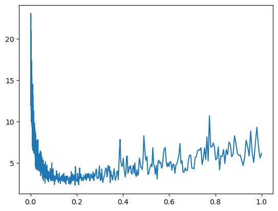
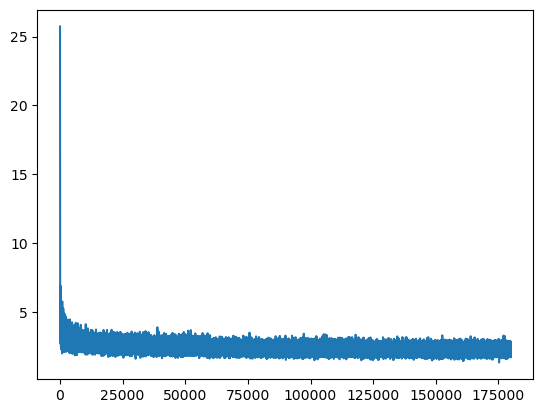
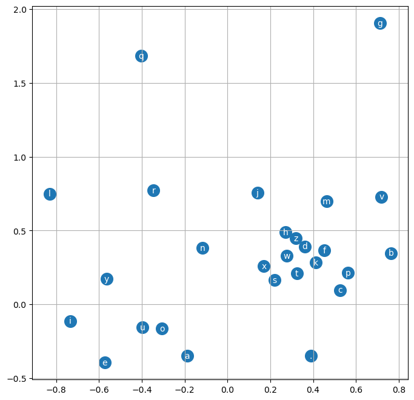
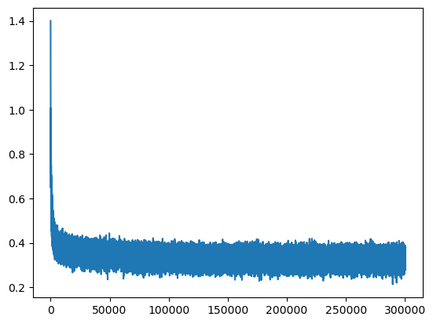

# Makemore 2

[视频](https://www.youtube.com/watch?v=TCH_1BHY58I)
[代码仓库](https://github.com/karpathy/makemore)
[Eureka Labs Discord](https://discord.com/invite/3zy8kqD9Cp)

## 目录

- [目标](#目标)
- [深入解读：Bengio 等人 2003](#深入解读bengio-等人-2003)
- [构建数据集](#构建数据集)
- [字符嵌入](#字符嵌入)
- [隐藏层构建](#隐藏层构建)
- [输出层](#输出层)
- [概念整合](#概念整合)
- [使用完整数据集](#使用完整数据集)
  - [通过批处理加速](#通过批处理加速)
  - [改进学习率](#改进学习率)
  - [划分数据集](#划分数据集)
  - [消除嵌入瓶颈](#消除嵌入瓶颈)

## 目标

在[上一讲](../N002%20-%20Makemore%201/N002%20-%20Makemore.ipynb)中，我们基于 Bigram 模型构建了 makemore。
随后，我们用一个小型单层神经网络从零开始重建了它。
**这两种方法都有*严重的*局限性。**

例如，这两种方法的预测都只基于*单一*前一个字符作为上下文。
单个字符就是我们在预测下一个字符时提供给模型的全部上下文。

**说实话，我们构建的这两个模型最终都没能真正生成好看、令人信服的名字。**

所以，如果我们在预测下一个字符时能使用*多于一个*字符作为上下文：
**a)** 我们就能建模信息更丰富的分布，从而得到更好的预测
**b)** 我们现有的两种方法的代价会*非常快地*变得高昂

我们已经注意到，神经网络（NN）方法比不学习的 Bigram 模型明显更灵活、更具可扩展性。
**我们可以通过将单层 NN 扩展为更深的多层感知机模型（MLP）来进一步改进神经网络方法**。
在扩展过程中，我们将遵循这篇写得非常好的论文的总体思路：[\[Bengio 等人 2003\]](https://www.jmlr.org/papers/volume3/bengio03a/bengio03a.pdf)

```python
import torch
import torch.nn.functional as F
import matplotlib.pyplot as plt
%matplotlib inline

device = torch.device("cuda:0" if torch.cuda.is_available() else "cpu") # 如果可用则使用 GPU
```

## 深入解读：Bengio 等人 2003

[\[Bengio 等人 2003\]](https://www.jmlr.org/papers/volume3/bengio03a/bengio03a.pdf) 开发了一个*词级别*的语言模型，词表大小为 $17,000$ 个词。
注意，我们之前构建的模型都是*字符级别*的。
**我们打算继续在字符级别上工作，但以与论文中相同的精神来构建我们的 MLP。**

论文为词表中的每个输入词分配一个 $30$ 维的特征向量。
这是通过将词映射到连续的、实值向量空间中的一个点来实现的。
这些特征值**不一定**显式地表示单词中的各个字母或位置。
相反，它们编码的是词与词之间的语义和句法关系。

换言之，在论文的*词级别*模型中，每个输入是 $17,000$ 条目词表中的一个完整单词，而**不是**一个字母序列。
每个词通过一个查找表被映射为一个 $30$ 维向量，其中每个词的索引对应一个唯一的向量。

*（这张图是自下而上的，即输入在底部）*

> 在论文中，**多个词**作为输入被读入模型，即多个词向量。
> 例如，一个输入可能是：`"A dog was running in a [...]"`

沿用论文的设定，假设我们有 $3$ 个词。我们将其嵌入，得到三个 $30$ 维向量。
这些向量拼接后的结果作为全连接层的输入，该层的宽度可以任意选择。
注意，该层的宽度在逻辑上与输入中词的数量是解耦的。
该层的输出使用 $\tanh$ 激活。

接着是另一层。它的宽度固定为 $17,000$ 个神经元，并对其输出应用 `softmax`。
我们在[上一讲](../N002%20-%20Makemore%201/N002%20-%20Makemore.ipynb)中已经遇到过 `softmax`。简而言之，`softmax` 将输出归一化为 $17,000$ 个可能词上的部分概率。
最后，我们可以从这个分布中采样，得到预测的下一个词的索引。
在训练期间，可以通过将预测分布与训练数据中真实下一个词的 one-hot 编码进行比较来进行反向传播。

图中的虚线可以忽略。那是我们在这里不会进一步探讨的想法。
那么，让我们（与之前的 makemore 部分一样）从创建必要的数据结构开始。

**现在从论文转向我们的需求，我们想要：**

- 一个用于*字符*嵌入向量的查找表（不是*词*嵌入，我们在这一点上有所偏离）
- 一个全连接层，$\tanh$ 激活，任意宽度，用于处理由拼接的嵌入向量组成的输入
- 另一个全连接层，应用 $\text{softmax}$，固定宽度为 $27$ 个字符，以形成对下一个字符候选的输出分布（你很快就会看到 $27$ 这个数字的由来）
- 一个损失函数
- 一个训练循环

## 构建数据集

我们将再次使用 `names.txt` 数据集，和之前一样，目标是生成更多与数据集中风格相似的名字。

```python
# 读取全部 32033 个名字，将它们拆分为字符串列表
words = open('../names.txt', 'r').read().splitlines()
print(f"First eight names in dataset:\t\t{words[:8]}")
print(f"Count of names in dataset:\t\t{len(words)}")
print(f"Count of unique characters in dataset:\t{len(list(set(''.join(words))))}")
```

```
First eight names in dataset:		['emma', 'olivia', 'ava', 'isabella', 'sophia', 'charlotte', 'mia', 'amelia']
Count of names in dataset:		32033
Count of unique characters in dataset:	26
```

和我们在[上一讲](../N002%20-%20Makemore%201/N002%20-%20Makemore.ipynb)中所做的一样，我们创建两个映射："整数到字符"（`itos`）和"字符到整数"（`stoi`），以处理数据集中的 $27$ 个可能字符（$26\ +$ `.`）。

```python
# 构建字符词表并将其映射为整数
chars = sorted(list(set(''.join(words)))) # set(): 去除重复字母

# 创建从字符到整数索引的映射
stoi = {s:i+1 for i,s in enumerate(chars)}
stoi['.'] = 0 # 显式添加特殊字符的条目

# 交换顺序，创建从整数索引到字符的映射
itos = {i:s for s,i in stoi.items()}

# 展示两个映射的前 10 个条目
#（它们只是互为镜像）
print(f"Integer-to-Character Map: {list(itos.items())[:10]}")
print(f"Character-to-Integer Map: {list(stoi.items())[:10]}")
```

```
Integer-to-Character Map: [(1, 'a'), (2, 'b'), (3, 'c'), (4, 'd'), (5, 'e'), (6, 'f'), (7, 'g'), (8, 'h'), (9, 'i'), (10, 'j')]
Character-to-Integer Map: [('a', 1), ('b', 2), ('c', 3), ('d', 4), ('e', 5), ('f', 6), ('g', 7), ('h', 8), ('i', 9), ('j', 10)]
```

现在来准备我们的 `names.txt` 数据集，我们定义一个新参数 `block_size`。
这个新参数表示：为了预测下一个字符，我们会从一个名字中取多少个字符作为上下文。
我们暂时将 `block_size` 设为 $3$。

```python
# 构建数据集
block_size = 3 # 上下文长度：用多少个字符来预测下一个？（之前是 1）
X, Y = [], []  # 特征（输入，上下文）和标签（输出，下一个字符）

# 遍历前五个名字
# 将每个拆分为字符并映射为它们的索引
# 然后形成输入上下文和训练数据中预期的输出字符条目
for w in words[:5]:
    print(f'\n{w}')
    context = [0] * block_size # 上下文/输入初始化为 block_size 个零组成的列表（0 是特殊字符 '.' 的索引）
    for ch in w + '.':    # 遍历名字中的字符；名字以我们的特殊字符结尾
        ix = stoi[ch]     # 将字符映射为它的索引
        X.append(context) # 将当前上下文追加到输入列表
        Y.append(ix)      # 将字符的索引追加到标签列表
        # 展示当前输入和预期输出
        print(''.join(itos[i] for i in context), '--->', itos[ix])
        # 裁剪并追加，像一个滑动窗口；巧妙！
        # 新上下文从旧上下文的索引 1 开始，并追加这一个新索引——
        # 巧合的是，它正是之前生成的那个输入-标签对的标签 -> 这样就形成了一个在 block_size 个字符上滑动的窗口
        context = context[1:] + [ix] # 新上下文是

# 同样，这些*不*携带字符，而是它们各自的索引
X = torch.tensor(X) # block_size 个字符索引组成输入；形状：(训练样本数, block_size)
Y = torch.tensor(Y) # 下一个字符的索引构成标签；形状：(训练样本数,)
```

```
emma
... ---> e
..e ---> m
.em ---> m
emm ---> a
mma ---> .

olivia
... ---> o
..o ---> l
.ol ---> i
oli ---> v
liv ---> i
ivi ---> a
via ---> .

ava
... ---> a
..a ---> v
.av ---> a
ava ---> .

isabella
... ---> i
..i ---> s
.is ---> a
isa ---> b
sab ---> e
abe ---> l
bel ---> l
ell ---> a
lla ---> .

sophia
... ---> s
..s ---> o
.so ---> p
sop ---> h
oph ---> i
phi ---> a
hia ---> .
```

```python
print(f'Input:  {X.shape}\tdtype: {X.dtype}\tInitial example: {X[0]}') # 32 次，每次 3 个字符索引组成一个输入样本
print(f'Output: {Y.shape}\tdtype: {Y.dtype}\tInitial example: {Y[0]}') # 32 次，输入的 3 个字符索引之后的字符索引
```

```
Input:  torch.Size([32, 3])	dtype: torch.int64	Initial example: tensor([0, 0, 0])
Output: torch.Size([32])	dtype: torch.int64	Initial example: 5
```

## 字符嵌入

对于我们的 `names.txt` 数据集，我们现在可以开始构建一个受论文启发的神经网络。
我们从一个查找表 `C` 开始，它将 $27$ 个可能的字符索引
（$26$ 个字符加上特殊的 `.` 字符）每个映射到一个各自的 $2$ 维向量。
选择嵌入大小为 $2$ 是为了我们之后可以很好地可视化学习到的表示。

```python
# 这将是我们的查找表，随机初始化
C = torch.randn((27, 2)) # 27 个字符索引每个都有自己唯一的 2 维数值嵌入
print(C)
```

```
tensor([[-0.4419,  0.1553],
        [-1.6764, -0.3994],
        [ 0.2392,  0.5514],
        [ 0.8007, -0.2385],
        [-0.5862,  1.6433],
        [-0.5207,  0.1235],
        [-0.8141,  0.1193],
        [-1.8369,  2.0794],
        [-0.9639, -1.1367],
        [-0.3800,  1.1889],
        [-0.6910,  0.1486],
        [ 1.2373,  0.9832],
        [-0.3871, -0.4789],
        [-0.9008,  0.9777],
        [-0.9691, -0.2301],
        [ 1.1531,  0.6399],
        [-0.7923, -0.8893],
        [-1.2573, -0.6138],
        [-0.2224, -0.8774],
        [ 0.4720, -1.4401],
        [ 0.6611,  2.1106],
        [ 1.6101,  0.4079],
        [-0.9142, -0.1439],
        [-0.0656,  0.2405],
        [-0.2395,  0.4158],
        [-0.0672,  1.9994],
        [-0.9840,  0.3630]])
```

在通过 `C` 嵌入整个 $X$ 之前，让我们先用单个数值来熟悉一下*嵌入*这个概念：

```python
xc = 'e'
i_xc = stoi[xc]
print(f"Embedding of character '{xc}' through its index {i_xc} in C: {C[i_xc]}")
```

```
Embedding of character 'e' through its index 5 in C: tensor([-0.5207,  0.1235])
```

**太棒了！**

在[上一讲](../N002%20-%20Makemore%201/N002%20-%20Makemore.ipynb)的 makemore 迭代中，我们使用了 *One-Hot 编码*。
有趣的是，我们只用它来表示标签，这让我们能够计算*负对数似然*损失，并最终据此进行反向传播。

有趣的是，在我们当前的设置中，**我们也可以将 *One-Hot 编码*用于输入表示：**

```python
# 给定 27 个可能字符，嵌入数字 5（通过 stoi['e'] 提供）
F.one_hot(torch.tensor(stoi['e']), num_classes=27) # 形状为 (27,)
```

```
tensor([0, 0, 0, 0, 0, 1, 0, 0, 0, 0, 0, 0, 0, 0, 0, 0, 0, 0, 0, 0, 0, 0, 0, 0,
        0, 0, 0])
```

如果我们现在将这个 One-Hot 向量与嵌入矩阵 `C` 相乘，One-Hot 向量恰好可以充当一个选择器。
它会从 `C` 中提取出由它所编码的 `stoi` 值指定的那一行。
对于用 One-Hot 向量表示的 `5 = stoi['e']`，它与 `C` 做矩阵乘法得到的结果，和直接索引 `C` 是一样的：`C[stoi['e']]`。
**这很巧妙。**

虽然 One-Hot 编码看起来像是一个不必要的额外步骤，但它将每个字符索引转换为固定的 $27$ 维向量。
这确保模型将字符视为离散类别而非标量数值，并允许我们使用矩阵乘法与嵌入矩阵相乘。

这里的要点在于，**虽然对输入进行 One-Hot 编码并不会改进反向传播本身，但它使嵌入查找变得可微**，并在数学上更一致。

我们可以用这样的 One-Hot 向量做这件事：

```python
print(F.one_hot(torch.tensor(stoi['e']), num_classes=27).float() @ C) # stoi['e'] = 5
print(F.one_hot(torch.tensor(stoi['e']), num_classes=27).float() @ C == C[stoi['e']])
```

```
tensor([-0.5207,  0.1235])
tensor([True, True])
```

听起来不错？
*嗯，我们不会用它。*

**为什么？** 虽然这是一种成熟的技术，但对于我们的需求，像 `C[5]` 这样的直接调用就足够了。
不过，One-Hot 编码在这个情况下的效果仍然非常有趣。理解为什么在这里可能要用到它，以后会派上用场。
应用 One-Hot 编码使像 `C[5]` 这样的操作变得可微。

**但是，我们现在该如何把训练集 `X` 中所有 $32\times 3$ 个整数索引值嵌入呢？**
`X` 的 $32\times 3$ 形状从何而来？
嗯，我们最初的 $5$ 个词构成了这个小数据集，从中得到了 $32$ 个输入。
这些输入上下文中的每一个由 $3$ 个字符索引组成。因此 $32$ 与我们对数据集大小的任意选择直接相关。
幸运的是，Python 在切片方面*相当灵活*。
但要正确利用切片的灵活性，我们必须*真正*理解它。

例如，给定嵌入向量 `a` 或嵌入矩阵 `b`，你可以像这样一次性从它们中请求多个嵌入：

```python
# a 是 (27,) 张量，值从 0 到 -26（负数是为了显示我们确实从下面的 a 中获取了值）
a = -torch.arange(27)
print("Results for the single dimension tensor a:")
print(a[[3,4,5]])                     # tensor([-3, -4, -5])
print(a[[torch.tensor([3,4,5])]])     # 相同
print(a[[torch.tensor([3,4,4,4,5])]]) # tensor([[-3, -4, -4, -4, -5]])，我们甚至可以随意重复索引

# b 只是 a 沿第二维复制（两列与 a 相同的列）
b = a.unsqueeze(1).expand(-1, 2)
print("\nResults for the two-dimensional tensor b:")
print(b[[3,4,5]])                     # tensor([[-3, -3], [-4, -4], [-5, -5]])，现在我们从索引 3、4、5 中提取多个向量
print(b[[torch.tensor([3,4,5])]])     # 再次相同
print(b[[torch.tensor([3,4,4,4,5])]]) # tensor([[-3, -3], [-4, -4], [-4, -4], [-4, -4], [-5, -5]])
```

```
Results for the single dimension tensor a:
tensor([-3, -4, -5])
tensor([-3, -4, -5])
tensor([-3, -4, -4, -4, -5])

Results for the two-dimensional tensor b:
tensor([[-3, -3],
        [-4, -4],
        [-5, -5]])
tensor([[-3, -3],
        [-4, -4],
        [-5, -5]])
tensor([[-3, -3],
        [-4, -4],
        [-4, -4],
        [-4, -4],
        [-5, -5]])
```

**我们可以利用这种切片技术。**

由于 `X` 携带字符的索引，我们可以用它直接索引 `C`：

```python
# 我们可以这样写:
print(X[13, 2])   # 取出一个示例字符，这里是 ..a ---> v 中的 'a'（第 14 个输入，第 3 个字符）

# 由于上述成立，我们也可以这样写:
print(C[X][13,2]) # 这个构造实际上返回 'a' 的 2 维嵌入向量

# 鉴于上面的切片技术，它适用于整个张量进行索引，因此我们可以这样写:
emb = C[X] # 对于每个输入上下文中的每个索引，我们从 C 中获取对应的嵌入向量

print(C[X].shape) # 32 乘 3 乘 2 -> 32 个输入，每个 3 个字符，每个字符 2 维嵌入向量
```

```
tensor(1)
tensor([-1.6764, -0.3994])
torch.Size([32, 3, 2])
```

## 隐藏层构建

既然我们有了 `C`，是时候实现隐藏层了。
这一层处理输入字符的拼接嵌入向量，并产生一个输出，该输出会送入输出层用于预测。
正如我们之前所说，我们可以让这个隐藏层*想要多宽就多宽*。

**但有一件事要记住：**
我们通过 `C` 嵌入训练输入后得到三个字符嵌入向量。
每个嵌入向量包含两个数值。
因此，我们需要为每个字符上下文总共考虑 $6$ 个输入，
以形状为 `32, 3, 2` 的矩阵形式提供，我们称之为 `emb`
（`X` 中有 `32` 个上下文，每个上下文 `3` 个字符，每个字符嵌入 `2` 个值）。

下面，我们开始构建一个隐藏层，每个上下文接收形状为 `3,2` 的输入，并产生形状为 `3, 100` 的相应输出。

```python
W1 = torch.randn((6, 100)) # 6 -> 3 个向量各 2 个值，100 个神经元
b1 = torch.randn(100)      # 为 100 个神经元中的每一个添加偏置
```

直观地看，剩下要做的就是计算 $emb\ @\ W1 + b1$，**但这行不通。**

**问题：**
$emb$（`32, 3, 2`）与 $W1 + b1$（`6, 100`）的乘法是不可能的。
我们必须找到一种合理的方法把 `emb` 调整为 `32, 6` 的形状以进行乘法。

**解决方案：**
我们可以水平地拼接 `emb` 内部的 `32` 个独立的 `3, 2` 向量。
这让我们再次得到 `32` 个向量，每个输入一个，但现在每个有 $3 \times 2 = 6$ 维，每个嵌入字符两个，按它们在输入中出现的顺序排列。
有很多方法可以实现这个重塑的 `emb`。
实际上，PyTorch 在这方面几乎*太*多功能了。

让我们用 `cat()` 函数试试，但在此之前，让我们先理解一下要为它使用的切片方式：

```python
# 32 个向量，每个输入元组一个（3 个字符，每个 2 个值）
emb_first_chars = emb[:, 0, :] # 32 个输入元组中每个的第一个字符的嵌入向量
print(emb_first_chars.shape)   # 32 乘 2 -> 32 个输入，每个 2 个值
```

```
torch.Size([32, 2])
```

```python
# 将三个输入字符嵌入向量拼接成一个 6 维向量
# 1 表示：沿第一维（行）拼接 -> 32 乘 6
emb_concat = torch.cat([emb[:,0,:], emb[:,1,:], emb[:,2,:]], 1)
print(emb_concat.shape)
```

```
torch.Size([32, 6])
```

这正是我们需要的。
我们现在有 $32$ 个宽度为 $6$ 的向量，而不是 $32 \times 3$ 个宽度为 $2$ 的向量。

**但我们还有另一个问题：**
如果我们要把 `block_size` 从 `3` 改成`其他值`，我们就必须调整这段显式拼接代码。

**解决方案：**
我们应该放弃以这种特定方式使用 `cat()`。
相反，我们可以使用 `unbind()` 将张量拆分为张量列表，然后再用 `cat()` 拼接。
这样我们就可以把代码推广到任何 `block_size`。它不再被硬编码进拼接调用里。

现在我们用一种通用的方式，重新实现上面用 `cat([emb[:,0,:], emb[:,1,:], emb[:,2,:]], 1)` 完成的操作：

```python
# 我们使用 unbind() 将 32x3x2 分离成由 3 个独立的 32x2 张量组成的元组
# 1 -> 维度 1 是沿其创建一个由（对应 32x3x2 的 3 个）张量组成的元组的轴，每个都是 32x2（'另外两个'维度）
emb_unbound = torch.unbind(emb, 1)

print(f"The .unbind() produces an object of class: {type(emb_unbound)}") # 我们现在得到了一个元组
print(f"We find the object to contain {len(emb_unbound)} elements")  # 该元组包含三个张量
print(f"Each element is of shape {emb_unbound[0].shape}\n")          # 这等价于上面使用的列表 [emb[:,0,:], emb[:,1,:], emb[:,2,:]]

# 现在我们可以将元组中的三个 32x2 张量沿维度 1 再次拼接，
# 回到我们与 W1 和 b1 相乘所需的 32x6 形状
emb_generalized = torch.cat(emb_unbound, 1) # 32x6，和之前一样，但代码中从未涉及特定的 block_size 3
print(f"Resulting shape of the generalized concat approach: {emb_generalized.shape}")
```

```
The .unbind() produces an object of class: <class 'tuple'>
We find the object to contain 3 elements
Each element is of shape torch.Size([32, 2])

Resulting shape of the generalized concat approach: torch.Size([32, 6])
```

---

**我们刚才为什么要做这一切？**

我们取了名字中的字母。
对于每个字母，我们记录了前面的 $3$ 个字符作为上下文。
如果没有，这个上下文就用我们的特殊字符 `.` 填充。
紧跟其后的字母，就是我们期望在输入这 $3$ 个前导字符之后出现的输出。
这些三元组是输入。但我们首先将它们嵌入为数值向量。

对于每个输入三元组，我们逐个遍历字符，并赋予对应的字母字符索引。
对每个字符索引，再到查找表 `C` 中查出对应的 $2$ 维嵌入向量。
**输入三元组的每个字母现在都由一个 $2$ 维向量表示。**

下一层需要 $6$ 个输入，并将它们送入 $100$ 个神经元。
这个 $6$ 来源于：每个样本有 $3$ 个字符，每个字符用 $2$ 个元素表示。

正是在这里，出现了我们上面讨论过的那个问题：
由于我们的训练数据集 `X` 恰好包含 $32$ 个条目。
因此我们总共有 $32$ 个三元组，每个三元组我们刚刚构建了 $3$ 个向量，每个 $2$ 个值。
将这个 $32 \times 3 \times 2$ 推过 $6 \times 100$ 的层是不可能的。
为了解决这个形状不匹配，我们对每 $3$ 个向量各 $2$ 个值按行使用 `torch.cat()`，按顺序将它们拼接成一个 $6$ 值向量。
我们对所有 $32$ 个三元组都这样做了，产生了现在可处理的矩阵形状 $32 \times 6$，以与 $6, 100$ 层权重相乘。**问题解决。**

**不过我们一开始并没有真正解决它**，因为我们最初通过将 $3$ 的 `block_size` 硬编码到代码中来拼接。
我们需要对任何 `block_size` 进行泛化，这就是为什么我们在 `torch.cat()` 之上使用了 `torch.unbind()`。

---

我们已经体验过 PyTorch 在张量切片和索引方面的灵活性。
实际上，让我们再仔细看看 PyTorch 中张量是如何被变形的：

```python
a = torch.arange(18)

# 所有这些张量都包含完全相同的数据，但它们的形状不同:
print(f"Arange shape: {a.shape}:\n{a}\n")                                # 1 维张量，18 个元素
print(f"Unsqueeze 0 shape: {a.unsqueeze(0).shape}:\n{a.unsqueeze(0)}\n") # 2 维张量，1 行，18 列
print(f"Unsqueeze 1 shape: {a.unsqueeze(1).shape}:\n{a.unsqueeze(1)}\n") # 2 维张量，18 行，1 列

# 我们也可以将这个 18 元素张量从 (18) 重新解释为 (3,3,2)（因为 3x3x2 = 18）
# 这非常高效，没有实际的数据重排，只是我们看待它的视角变了
a = a.view(3, 3, 2)
print(f"View (3,3,2) shape: {a.shape}\n")

# 我们能把这个 .view 方法转移到我们的 32x3x2 张量问题上吗？
# 长话短说：可以！上面这一切都等价于仅仅是换了一种看待数据的方式
equiv = True
equiv if torch.all(torch.eq(emb.view(32, 6), torch.cat(torch.unbind(emb, 1), 1))) else not equiv
print(f"Does the .view() approach give the same result as the generalized unbind and concat approach?\n-> {equiv}")
```

```
Arange shape: torch.Size([18]):
tensor([ 0,  1,  2,  3,  4,  5,  6,  7,  8,  9, 10, 11, 12, 13, 14, 15, 16, 17])

Unsqueeze 0 shape: torch.Size([1, 18]):
tensor([[ 0,  1,  2,  3,  4,  5,  6,  7,  8,  9, 10, 11, 12, 13, 14, 15, 16, 17]])

Unsqueeze 1 shape: torch.Size([18, 1]):
tensor([[ 0],
        [ 1],
        [ 2],
        [ 3],
        [ 4],
        [ 5],
        [ 6],
        [ 7],
        [ 8],
        [ 9],
        [10],
        [11],
        [12],
        [13],
        [14],
        [15],
        [16],
        [17]])

View (3,3,2) shape: torch.Size([3, 3, 2])

Does the .view() approach give the same result as the generalized unbind and concat approach?
-> True
```

`view()` 函数*非常*有用，因为它允许我们以任何想要的方式重塑张量，只要元素总数保持不变。
更多信息见 [ezyang 的优秀博客文章](http://blog.ezyang.com/2019/05/pytorch-internals/)。

**好了，现在动真格的。** 我们将用 `view()` 来正确地调整 `emb` 矩阵。
我们在隐藏层的计算中这样做：

```python
# h 是隐藏层的激活输出
# h = torch.tanh(emb.view(emb.shape[0],6) @ W1 + b1) # emb.shape[0] 是 32，但我们可以也应该让它灵活

# 上面建议的替代方案:
h = torch.tanh(emb.view(-1,6) @ W1 + b1)
# PyTorch 读取 -1 并推断，因为 6 已经由 (2x3) 占用了：32 乘 6，或一般地 输入数 乘 6

# 让我们看看 h 及其内容的样子
print(h.shape)  # 32 乘 100 个隐藏层激活
print(h[0][:5]) # 前五个激活
```

```
torch.Size([32, 100])
tensor([ 0.6261,  0.6219,  0.9677, -0.3676, -0.3688])
```

我们刚才有点略过了一个细节，那就是如何正确地对张量做乘法和加法。
这又是一个广播的问题。

对于上面，我们知道：

```python
print((emb.view(-1,6) @ W1).shape) # (32, 100)，添加偏置和激活之前的 logits
print(b1.shape) # (100)，我们想在激活之前添加到 logits 的偏置
```

```
torch.Size([32, 100])
torch.Size([100])
```

**广播对偏置张量的作用方式如下：**

1) **右对齐维度**（所有张量的）

- $[32, 100] \rightarrow [32, 100]$ 仍然是 `emb` 与 `W1` 矩阵乘法的输出形状
- $[100]\ \ \ \ \ \ \rightarrow [\ \ \ \ \ \ 100]$ 表示需要把偏置张量的维度右对齐

2) **为较低秩的右对齐张量添加缺失的前导维度**

- $[32, 100] \rightarrow [32, 100]$ 保持不变，这是较高秩的张量
- $[\ \ \ \ \ \ 100] \rightarrow [1, 100]$ 我们为偏置张量添加一个前导维度以匹配较高的秩

3) **将大小为 $1$ 的维度扩展以匹配形状**

- $[32, 100] \rightarrow [32, 100]$ 再次保持不变
- $[1, 100]\ \ \rightarrow [32, 100]$ 我们广播（虚拟扩展）$100$ 个偏置值 $32$ 次，每个现在的 $32$ 个维度一份

最终，当像 `emb.view(-1, 6) @ W1 + b1` 这样添加偏置项时，
全部 $32$ 组（每组 $100$ 个神经元）现在都各自加上同一组 $100$ 个偏置。
这正是我们想要的，因为我们确实希望每个输入都加上相同的偏置值。

## 输出层

我们输出层的逻辑与隐藏层的设置非常相似。
一个区别（除了张量的不同维度之外）是**激活函数**。
我们使用 `softmax` 而不是 `tanh` 来获得在 $17,000$ 个可能词上的归一化分布。
我们将继续把其解释为对下一个字符候选的概率分布。

```python
# 随机初始化输出层的权重和偏置
W2 = torch.randn((100, 27)) # 100 个输入，27 个输出神经元，27 是固定的，因为数据集中有 27 个可能字符
b2 = torch.randn(27)        # 27 个偏置

# 神经元的原始输出
logits = h @ W2 + b2
print('Logits:', logits.shape) # (32, 27) -> 32 个输出，每个 27 维

# Softmax 将输出转换为 27 个可能字符上的归一化分布
pseudo_counts = logits.exp() # 参考 N002 了解为什么我称之为 pseudo_counts 而不是 counts
prob = pseudo_counts / pseudo_counts.sum(1, keepdims=True)
print('Probabilities:', prob.shape) # (32, 27) -> 32 个分布，每个跨 27 个下一个字符候选
```

```
Logits: torch.Size([32, 27])
Probabilities: torch.Size([32, 27])
```

现在，我们需要把最后一层 $32$ 个分布的输出，分别与 `Y` 中对应的 $32$ 个标签进行比较。
和我们在[上一讲](../N002%20-%20Makemore%201/N002%20-%20Makemore.ipynb)中所做的类似，首先，我们想用 `Y` 里的索引去索引 `prob` 的行：

```python
Y[0] # 供参考，这是第一个预期输出，即第一个输入三元组之后的第一个字符的索引
```

```
tensor(5)
```

这段代码现在非常巧妙地做到了：用 `Y` 中的相应索引索引 `prob` 的列，从而取出 $32$ 行。
这为我们给出了分配给真实下一个字符的概率，而且对 $32$ 个样本是*一次性*完成的：

```python
# 对于 32 个输入三元组中的每一个:
# 给出分配给正确字符的概率，该字符可在 Y 中存储的索引处访问
print(prob[torch.arange(32), Y])
print(prob[torch.arange(32), Y].shape) # 32 个概率，每个真实下一个字符一个
```

```
tensor([4.3258e-05, 3.6110e-07, 2.5562e-04, 2.5120e-03, 1.0221e-09, 2.8201e-02,
        3.0011e-05, 7.5807e-08, 5.1766e-08, 2.0301e-09, 8.7070e-08, 3.0132e-10,
        1.3561e-03, 2.4020e-07, 2.3867e-06, 8.3649e-08, 6.5333e-13, 1.0513e-08,
        3.4169e-09, 1.5962e-11, 4.3609e-06, 2.6809e-02, 5.9863e-10, 7.8808e-09,
        7.1531e-06, 4.8931e-06, 1.3681e-05, 1.1004e-16, 1.0353e-13, 9.9545e-10,
        4.0749e-07, 3.3118e-08])
torch.Size([32])
```

记住，上面这些值是分配给某些索引的概率，而根据 `Y` 我们知道这些索引本应为 $1.0$。
有了这些知识，我们现在构建代价函数来将预测与标签进行比较。

```python
# 我们希望所有 32 个输入的平均对数概率作为我们的损失
loss = -prob[torch.arange(32), Y].log().mean()
print(loss.item()) # 这是要最小化的
```

```
16.17192840576172
```

**等等，没有对标签进行 one-hot 编码的步骤？为什么？**
上面的代码精确地实现了*负对数似然*损失，我们也在[上一讲](../N002%20-%20Makemore%201/N002%20-%20Makemore.ipynb)中实现过，但使用了对标签的 one-hot 编码。
关键在于，上次我们对标签的 one-hot 编码处理得非常显式，而在这里我们不必这么做。
我们不会因为跳过显式的 one-hot 向量而丢失任何信息，因为我们在这里计算的，对于 $32$ 个样本中的每一个，在数学上等价于：

$$
\text{loss} = -\frac{1}{32}\sum_{i = 0}^{31}\sum_{c = 0}^{26} \text{y}_{i,c} \log \text{prob}_{i,c}
$$

当我们计算 `-prob[torch.arange(32), Y].log().mean()` 时，我们实际上对于每个样本 $i$ 获得了 $-\sum_{c = 0}^{26} \text{y}_{i,c} \log \text{prob}_{i,c}$ 中唯一非零的项。
这是在 one-hot 向量中 $y_{i,c}$ 会为 $1.0$ 的那一项。
对每个 $i$ 取出这一项，再对样本数取 `.mean()`，最后取负。

负对数似然损失的这种写法，现在也可以称为真实标签分布 $y_{i,c}$ 与预测分布 $p_{i,c}$ 之间的**交叉熵损失**。**交叉熵**定义为 $-\sum_c y_{i,c} \log p_{i,c}$，对于 one-hot 目标，这个和简化为 $-\log p_{i, Y_i}$，这正是我们通过索引计算的。

> 负对数似然损失是交叉熵损失的一个特例，其中目标分布是 one-hot 向量。
> 在我们的情况下，由于我们直接用真实类别索引对预测概率进行索引，我们实际上是在计算负对数似然而没有显式地形成 one-hot 向量。交叉熵损失更一般地允许我们将任何目标分布（不仅仅是 one-hot）与预测分布进行比较。

## 概念整合

现在我们可以继续组装一个简洁版本的网络，整合我们迄今为止逐步开发的组件。
记住，我们的总体目标是基于[论文](https://www.jmlr.org/papers/volume3/bengio03a/bengio03a.pdf)的 MLP 架构来复制 makemore：

```python
print('X:', X.shape)
print('Y:', Y.shape, '\n')

block_size = 3 # 这是上下文长度（用多少个字符来预测下一个）

# 让我们重新初始化 MLP 的权重和偏置
g = torch.Generator().manual_seed(2147483647) # 用于可复现性
C = torch.randn((27,2), generator=g)          #  27 个字符，每个 2 个嵌入维度
W1 = torch.randn((block_size * C.shape[1], 100), generator=g) # block_size 乘以嵌入维度作为输入（3x2=6）到 100 个神经元
b1 = torch.randn((100), generator=g)          # 100 个偏置添加到 100 个神经元输出
W2 = torch.randn((100,27), generator=g)       # 100 个神经元输出作为 27 个输出神经元的输入
b2 = torch.randn((27), generator=g)           #  27 个偏置添加到  27 个输出神经元

parameters = [C, W1, b1, W2, b2] # 将所有层的参数组合到一个结构中
print(sum(p.nelement() for p in parameters), 'parameters') # 打印总参数数（nelements = 元素数量）
```

```
X: torch.Size([32, 3])
Y: torch.Size([32]) 

3481 parameters
```

```python
# 遍历参数，让它们允许梯度累积
for p in parameters:
    p.requires_grad = True
```

```python
# 运行 1000 个训练轮次
for _ in range(1000):
    ## 前向传播
    emb = C[X] # (32, 3, 2)
    h = torch.tanh(emb.view(-1, 6) @ W1 + b1) # (32, 100)
    logits = h @ W2 + b2 # (32, 27)

    # counts = logits.exp()
    # prob = counts / counts.sum(1, keepdims=True)
    # loss = -prob[torch.arange(32), Y].log().mean()
  
    # 用 PyTorch 内置的交叉熵损失函数替换上面的代码行:
    # 这个函数在数值上表现更好，通过在取幂之前从所有 logits 中减去最大值来避免无穷大等陷阱
    loss = F.cross_entropy(logits, Y)

    ## 反向传播
    # 在每次反向传播之前清除梯度，避免跨多次传播累积
    for p in parameters:
        p.grad = None
  
    loss.backward()
  
    # 使用梯度下降和 0.1 的学习率更新参数
    for p in parameters:
        p.data += -0.1 * p.grad # 沿负梯度方向微调参数值

print(loss.item())
```

```
0.2561509907245636
```

到目前为止，我们用 `softmax` 相当“照字面”地实现了自己的*交叉熵*版本。
*这相当低效。* PyTorch 可以通过内部整合提供显著的性能提升。

整合有以下好处：

1. 前向传播变得更高效，
2. 反向传播变得更高效，
3. 交叉熵“在数值上表现更好”，即计算更稳健（见后面代码中的注释。）

使用上面的代码，我们只在 $32$ 个输入上训练。我们这样做了 $1000$ 个轮次。这使我们的 $3481$ 个网络参数严重过拟合到这些少量样本上。

> 参数量*越大*且输入集越小，过拟合的风险就*越高*。
> 过拟合意味着我们越来越内化训练数据中不可泛化的模式，导致在未见数据上的表现越来越差。可以把它想成模型显式地且仅仅记住了训练数据，而不是其中包含的可泛化价值。

将 `logits`（实际的网络输出）与标签 `Y` 进行比较，我们看到预测明显在模仿标签：

```python
# 对于 32 个输入中的每一个，给出最高概率输出神经元的索引
print(logits.max(1)) # 这是网络认为各自最可能的下一个字符
print(f'\n{Y}')
```

```
torch.return_types.max(
values=tensor([13.3437, 17.7879, 20.5832, 20.6042, 16.7390, 13.3437, 15.9747, 14.1889,
        15.9158, 18.3894, 15.9409, 20.9284, 13.3437, 17.1212, 17.1498, 20.0637,
        13.3437, 16.4564, 15.1328, 17.0537, 18.5905, 15.9655, 10.8739, 10.6874,
        15.5062, 13.3437, 16.2394, 16.9563, 12.7426, 16.2141, 19.0840, 16.0213],
       grad_fn=<MaxBackward0>),
indices=tensor([ 9, 13, 13,  1,  0,  9, 12,  9, 22,  9,  1,  0,  9, 22,  1,  0,  9, 19,
         1,  2,  5, 12, 12,  1,  0,  9, 15, 16,  8,  9,  1,  0]))

tensor([ 5, 13, 13,  1,  0, 15, 12,  9, 22,  9,  1,  0,  1, 22,  1,  0,  9, 19,
         1,  2,  5, 12, 12,  1,  0, 19, 15, 16,  8,  9,  1,  0])
```

不过在某些情况下，预测并不等于标签。**这是为什么？**
在实践中，我们实际上*永远不会*达到 $0.00$ 的损失。

这是因为存在这样的“输入三元组→标签”组合：
`... -> a`
`... -> e`

**给定相同的输入，期望不同的输出。这必然会让模型困惑。**

## 使用完整数据集

我们现在可以继续准备完整数据集了。
忘掉之前那 $32$ 个输入吧，现在数据量是这么多：

```python
# 构建数据集
block_size = 3  # 上下文长度：用多少个字符来预测下一个？（之前是 1）
X, Y = [], []   # 特征（输入）和标签（输出）

# 只展示前三个词作为示例
for w in words:
    context = [0] * block_size
    for ch in w + '.':
        ix = stoi[ch]
      
        X.append(context)
        Y.append(ix)
      
        # 展示当前输入和预期输出
        context = context[1:] + [ix] # 裁剪并追加，像一个滚动窗口；巧妙！

# 这些不携带字符，而是它们各自的索引号
X = torch.tensor(X)
Y = torch.tensor(Y)

print('Input:', X.shape, X.dtype, X[0])
print('Output:', Y.shape, Y.dtype, Y[0])
```

```
Input: torch.Size([228146, 3]) torch.int64 tensor([0, 0, 0])
Output: torch.Size([228146]) torch.int64 tensor(5)
```

```python
g = torch.Generator().manual_seed(2147483647) # 用于可复现性
C = torch.randn((27,2), generator=g)     #  27 个字符，每个 2 维
W1 = torch.randn((6,100), generator=g)   #   3 个字符乘 2 个嵌入值作为 100 个神经元的输入
b1 = torch.randn((100), generator=g)     # 100 个偏置添加到 100 个神经元输出
W2 = torch.randn((100,27), generator=g)  # 100 个神经元输出作为 27 个输出神经元的输入
b2 = torch.randn((27), generator=g)      #  27 个偏置添加到 27 个输出神经元

parameters = [C, W1, b1, W2, b2] # 将所有参数聚集到一个结构中

print(sum(p.nelement() for p in parameters), 'parameters') # 网络保持不变，所以参数数量相同
```

```
3481 parameters
```

```python
# 允许梯度累积
for p in parameters:
    p.requires_grad = True
```

```python
# 对于 32 个输入的数据集，我们使用了 1000 个轮次
# 现在，对于大得多的数据集，我们可以将其减少到 10 个轮次
for _ in range(10):
    ## 前向传播
    emb = C[X] # (228146, 3, 2)，*一次性全部*
    h = torch.tanh(emb.view(-1, 6) @ W1 + b1) # (228146, 100)
    logits = h @ W2 + b2 # (228146, 27)

    # 留在这里怀念低性能的时光:
    # counts = logits.exp()
    # prob = counts / counts.sum(1, keepdims=True)
    # loss = -prob[torch.arange(32), Y].log().mean()
  
    loss = F.cross_entropy(logits, Y)
  
    print(loss.item())
  
    ## 反向传播
    for p in parameters:
        p.grad = None
  
    loss.backward()
  
    # 更新
    for p in parameters:
        p.data += -0.1 * p.grad
```

```
19.505226135253906
17.084487915039062
15.776531219482422
14.833340644836426
14.002603530883789
13.253260612487793
12.57991886138916
11.983101844787598
11.47049331665039
11.05185604095459
```

### 通过批处理加速

一次性对这么多参数执行前向传播和反向传播需要*相当长的时间*。
**训练过程可以通过批处理加速**。

**一种让训练更便宜、更具可扩展性的思路是这样的：**
我们可以从数据集中随机抽取一些 $n$ 个输入并在该子集上训练。
前向。反向。更新。全部仅在这个子集上完成。
然后我们再抽取 $n$ 个输入并重复该过程。
我们这样做直到遍历完整个分批的数据集一次。
**这被称为一个 *epoch（轮次）*。**

```python
print(torch.randint(0, X.shape[0], (32,))) # 构造一个在 0 到 228146 之间随机抽取的 32 个数字组成的张量
```

```
tensor([103513, 124548,  30102, 196316, 173561,  22807, 175138,  93001,  58736,
        193246,  80398,  96386,  27045, 203271, 220983, 210524, 125308,  53568,
        110357,  78431, 112748, 128428, 104928, 192159, 126222,  89012, 106840,
         35414, 127155,  23364,  49568, 172827])
```

```python
# 为这种新方法再次重置参数
g = torch.Generator().manual_seed(2147483647) # 用于可复现性
C = torch.randn((27,2), generator=g)     #  27 个字符，每个 2 维
W1 = torch.randn((6,100), generator=g)   #   3 个字符乘 2 个嵌入值作为 100 个神经元的输入
b1 = torch.randn((100), generator=g)     # 100 个偏置添加到 100 个神经元输出
W2 = torch.randn((100,27), generator=g)  # 100 个神经元输出作为 27 个输出神经元的输入
b2 = torch.randn((27), generator=g)      #  27 个偏置添加到 27 个输出神经元

parameters = [C, W1, b1, W2, b2] # 将所有参数聚集到一个结构中

print(sum(p.nelement() for p in parameters), 'parameters') # 网络保持不变，所以参数数量相同

for p in parameters:
    p.requires_grad = True
```

```
3481 parameters
```

```python
for _ in range(1000):
  
    # 小批量构造 -> X 内 3 维字符索引向量中的 32 个索引
    ix = torch.randint(0, X.shape[0], (32,))
  
    # 前向传播
    emb = C[X[ix]] # (32, 3, 2)，单个批次，X[ix] 只抓取这 32 个索引，C 随后为 32 个三元组中当前的每一个抓取其 3 个字符的 2 维向量
    h = torch.tanh(emb.view(-1, 6) @ W1 + b1) # (32, 100)
    logits = h @ W2 + b2 # (32, 27)

    loss = F.cross_entropy(logits, Y[ix]) # Y[ix] 抓取当前批次的 32 个预期输出索引（非常优雅）
  
    # 反向传播
    for p in parameters:
        p.grad = None
  
    loss.backward()
  
    # 更新
    for p in parameters:
        p.data += -0.1 * p.grad

print('Loss for current mini-batch:', loss.item())
```

```
Loss for current mini-batch: 2.8925647735595703
```

```python
emb = C[X] # (32, 3, 2)
h = torch.tanh(emb.view(-1,6) @ W1 + b1) # (32, 100)
logits = h @ W2 + b2 # (32, 27)
loss = F.cross_entropy(logits, Y)
print('Loss for entire dataset:', loss.item())
```

```
Loss for entire dataset: 2.662804126739502
```

这*快得多*，但*精度更低*。
不过，这仍然是更高效的方法，因为通过批次的子集，我们实际上每次都用一个推导更快、但只是稍微偏离的梯度进行优化。
**因此，我们现在正跌跌撞撞地走向一个最优解，但方向仍然大致正确。**

### 改进学习率

批处理方法也带来了新的问题。
既然现在是这样跌跌撞撞地优化，那什么样的学习率才算合适？
到目前为止它是 $0.1$，但*现在*呢？

建议采用以下步骤为批处理方法找到一个好的学习率：

1. 重置参数
2. 选择少量迭代次数，例如 $100$（用于批处理）
3. 通过试错、重置并用新学习率重跑：找到位于 $1$ 和 $0.001$ 之间的最优值（否则梯度太强）。
4. 使用 `torch.linspace` 在一组可能的学习率上构建并执行此操作

```python
lre = torch.linspace(-3, 0, 1000) # 1000 个在 -3 和 0 之间线性间隔的值
lrs = 10 ** lre # 1000 个在 10^-3 和 10^0 之间的值
```

使用上面定义的学习率候选值，我们现在为每个候选值抽取一批输入并在该批次上训练。
然后我们为每个学习率候选值绘制损失。
损失最低的学习率被认为是最有效的。
这样一来，设置学习率就变成了一个更有依据的猜测（不过它仍然多少带有猜测的成分）。

```python
# 再次重置参数
g = torch.Generator().manual_seed(2147483647) # 用于可复现性
C = torch.randn((27,2), generator=g)          # 27 个字符，每个 2 维
W1 = torch.randn((6,100), generator=g)        # 3 个字符乘 2 个嵌入值作为 100 个神经元的输入
b1 = torch.randn((100), generator=g)          # 100 个偏置添加到 100 个神经元输出
W2 = torch.randn((100,27), generator=g)       # 100 个神经元输出作为 27 个输出神经元的输入
b2 = torch.randn((27), generator=g)           # 27 个偏置添加到 27 个输出神经元

parameters = [C, W1, b1, W2, b2] # 将所有参数聚集到一个结构中

for p in parameters:
    p.requires_grad = True

lri = []   # 应用的学习率列表
lossi = [] # 每个学习率分别对应的损失列表

for i in range(1000):
    # 小批量构造
    ix = torch.randint(0, X.shape[0], (32,)) # (32,)
  
    # 前向传播
    emb = C[X[ix]] # (32, 3, 2)
    h = torch.tanh(emb.view(-1, 6) @ W1 + b1) # (32, 100)
    logits = h @ W2 + b2 # (32, 27)

    loss = F.cross_entropy(logits, Y[ix])
  
    # 反向传播
    for p in parameters:
        p.grad = None
    loss.backward()
  
    # 设置学习率候选值
    lr = lrs[i]
  
    for p in parameters:
        p.data += -lr * p.grad
  
    # 跟踪统计量
    lri.append(lr)
    lossi.append(loss.item())
  
# print('Loss for current mini-batch:', loss.item())
```

```python
plt.plot(lri, lossi);
```



让我们继续从 `lri` 中确定与最低损失相关联的学习率：

```python
# 获取 lossi 中最小损失的索引
print(lri[lossi.index(min(lossi))])
```

```
tensor(0.1929)
```

有了这张图，我们就有了一个有依据的确认：$0.1$ 处于一个不错的学习率取值区间。
太小的值会让下降停在过浅的位置，而太大的值又会让下降过于跳跃。
注意，现在在训练接近尾声时，我们可以恰当地应用所谓的**学习率衰减**来进一步改善收敛。

**好了，现在正式开始训练：**

```python
# 再次重置参数
g = torch.Generator().manual_seed(2147483647) # 用于可复现性
C = torch.randn((27,2), generator=g)          # 27 个字符，每个 2 维
W1 = torch.randn((6,100), generator=g)        # 3 个字符乘 2 个嵌入值作为 100 个神经元的输入
b1 = torch.randn((100), generator=g)          # 100 个偏置添加到 100 个神经元输出
W2 = torch.randn((100,27), generator=g)       # 100 个神经元输出作为 27 个输出神经元的输入
b2 = torch.randn((27), generator=g)           # 27 个偏置添加到 27 个输出神经元

parameters = [C, W1, b1, W2, b2] # 将所有参数聚集到一个结构中

for p in parameters:
    p.requires_grad = True
```

```python
for i in range(70000):
  
    # 小批量构造
    ix = torch.randint(0, X.shape[0], (32,))
  
    # 前向传播
    emb = C[X[ix]] # (32, 3, 2)
    h = torch.tanh(emb.view(-1, 6) @ W1 + b1) # (32, 100)
    logits = h @ W2 + b2
    loss = F.cross_entropy(logits, Y[ix])
  
    # 反向传播
    for p in parameters:
        p.grad = None
    loss.backward()
  
    # 学习率衰减以更接近最小值
    lr = 0.1 if i < 50000 else 0.01

    for p in parameters:
        p.data += -lr * p.grad
  
# print('Loss for current mini-batch:', loss.item())
```

```python
emb = C[X] # (32, 3, 2)
h = torch.tanh(emb.view(-1,6) @ W1 + b1) # (32, 100)
logits = h @ W2 + b2 # (32, 27)
loss = F.cross_entropy(logits, Y)
print(loss.item())
```

```
2.305272340774536
```

**我们实现了比之前更低的损失。** *但这好吗？我们怎么知道？*
模型本身很小，只有 $3481$ 个参数。
更大的模型可能带来更好的性能，或者更严重的过拟合情况。

**我们如何能检测到这一点？**

### 划分数据集

**模型越大，它逐字记住数据集的风险就越大。**
这被称为**过拟合**。我们之前已经见过这个。
为了避免我们的性能测量被模型可能只是记住而非泛化的程度所扭曲，
我们需要将数据集划分为用于**训练**、**验证**和**测试**的不同子集。
模型永远不会在**验证**和**测试**子集上训练，永远不会。
因此，我们可以使用这些子集来衡量模型从训练数据到未见数据的泛化性能。

有 `训练集划分`、`开发/验证集划分` 和 `测试集划分`。
这些子集之间的数据划分，大致按一种通用的做法来选择：$80\%$、$10\%$、$10\%$

**划分数据集看起来像这样：**

```python
import random

def build_dataset(words):
    block_size = 3
    X, Y = [], []
  
    for w in words:
        context = [0] * block_size
        for ch in w + '.':
            ix = stoi[ch]
            X.append(context)
            Y.append(ix)
            context = context[1:] + [ix] # 裁剪并追加
  
    X = torch.tensor(X)
    Y = torch.tensor(Y)
    print('X:', X.shape, '\tY:', Y.shape)
    return X,Y

random.seed(42)          # 用于可复现性
random.shuffle(words)    # words 就是上面很早就读入的全部名字列表

n1 = int(0.8*len(words)) # 所有词 80% 处的索引（取整以便整数索引）
n2 = int(0.9*len(words)) # 所有词 90% 处的索引（取整以便整数索引）

print('Training Set:')
Xtr, Ytr = build_dataset(words[:n1])     # 所有词的前 80%
print('Validation Set:')
Xdev, Ydev = build_dataset(words[n1:n2]) # 所有词从 80% 到 90% 的 10%
print('Test Set:')
Xte, Yte = build_dataset(words[n2:])     # 所有词从 90% 到 100% 的 10%
```

```
Training Set:
X: torch.Size([182625, 3]) 	Y: torch.Size([182625])
Validation Set:
X: torch.Size([22655, 3]) 	Y: torch.Size([22655])
Test Set:
X: torch.Size([22866, 3]) 	Y: torch.Size([22866])
```

在我们摆弄模型架构之前，让我们先看看当前模型只在训练集上训练时在验证集和测试集上的表现如何：

```python
# 再次重置参数
g = torch.Generator().manual_seed(2147483647) # 用于可复现性
C = torch.randn((27,2), generator=g)          # 27 个字符，每个 2 维
W1 = torch.randn((6,100), generator=g)        # 3 个字符乘 2 个嵌入值作为 100 个神经元的输入
b1 = torch.randn((100), generator=g)          # 100 个偏置添加到 100 个神经元输出
W2 = torch.randn((100,27), generator=g)       # 100 个神经元输出作为 27 个输出神经元的输入
b2 = torch.randn((27), generator=g)           # 27 个偏置添加到 27 个输出神经元

parameters = [C, W1, b1, W2, b2] # 将所有参数聚集到一个结构中

print(sum(p.nelement() for p in parameters), 'parameters')

for p in parameters:
    p.requires_grad = True
```

```
3481 parameters
```

让我们训练：

```python
for i in range(40000):
  
    # 小批量构造
    ix = torch.randint(0, Xtr.shape[0], (32,))
  
    # 前向传播
    emb = C[Xtr[ix]] # (32, 3, 2)
    h = torch.tanh(emb.view(-1, 6) @ W1 + b1) # (32, 100)
    logits = h @ W2 + b2
    loss = F.cross_entropy(logits, Ytr[ix])
  
    # 反向传播
    for p in parameters:
        p.grad = None
    loss.backward()
  
    # 学习率衰减以更接近最小值
    lr = 0.1 if i < 30000 else 0.01

    for p in parameters:
        p.data += -lr * p.grad
  
# print('Loss for current mini-batch:', loss.item())
```

验证损失现在可以这样计算：

```python
# 验证损失
emb = C[Xdev] # (32, 3, 2)
h = torch.tanh(emb.view(-1,6) @ W1 + b1) # (32, 100)
logits = h @ W2 + b2 # (32, 27)
loss = F.cross_entropy(logits, Ydev)
print(loss.item())
```

```
2.34187912940979
```

测试损失可以用非常相似的方式计算：

```python
# 测试损失
emb = C[Xte] # (32, 3, 2)
h = torch.tanh(emb.view(-1,6) @ W1 + b1) # (32, 100)
logits = h @ W2 + b2 # (32, 27)
loss = F.cross_entropy(logits, Yte)
print(loss.item())
```

```
2.338966131210327
```

我们可以看到验证损失和测试损失大致相等。**这很好。**
它意味着模型没有过拟合。
模型太小，还不足以强大到能记住训练集。

**我们欠拟合。**

这表明我们实际上能够在不会*太快*冒过拟合风险的情况下增加模型规模。

---

**为什么我们要为验证和测试分别设置两个划分？**
在实际训练运行中，验证集用于调整模型的超参数，如学习率、层数、每层神经元数等。
如果过度，针对验证集的优化可能导致对验证集本身的过拟合。
这就是为什么我们需要另一个子集：测试集。
测试集仅在最后使用，以在所有超参数调整完成后评估模型的最终泛化能力和性能。

---

如果我们想真正看到划分数据集的效果，就需要开始调整模型的总参数量。
我们可以通过改变之前已经任意设置的隐藏层宽度来做到这一点。

让我们试试 $300$ 的宽度而不是 $100$：

```python
g = torch.Generator().manual_seed(2147483647) # 用于可复现性
C = torch.randn((27,2), generator=g)
W1 = torch.randn((6,300), generator=g)
b1 = torch.randn((300), generator=g)
W2 = torch.randn((300,27), generator=g)
b2 = torch.randn((27), generator=g)

parameters = [C, W1, b1, W2, b2] # 将所有参数聚集到一个结构中

print(sum(p.nelement() for p in parameters), 'parameters')

for p in parameters:
    p.requires_grad = True
```

```
10281 parameters
```

```python
lossi = [] # 每个小批次的损失列表
stepi = [] # 步数（小批次）列表

for i in range(180000):
  
    # 小批量构造
    ix = torch.randint(0, Xtr.shape[0], (32,))
  
    # 前向传播
    emb = C[Xtr[ix]] # (32, 3, 2)
    h = torch.tanh(emb.view(-1, 6) @ W1 + b1) # (32, 100)
    logits = h @ W2 + b2 # (32, 27)
    loss = F.cross_entropy(logits, Ytr[ix]) 
  
    # 反向传播
    for p in parameters:
        p.grad = None
  
    loss.backward()
  
    lr = 0.1 if i < 60000 else 0.05 if i < 120000 else 0.01
  
    for p in parameters:
        p.data += -lr * p.grad
  
    # 每个小批次的损失跟踪
    stepi.append(i)
    lossi.append(loss.item())
  
#print('Loss for current mini-batch:', loss.item())
```

```python
plt.plot(stepi, lossi);
```



图中曲棍球杆的形状和厚度是由小批量梯度下降引起的。更准确地说，不同的小批量会导致略微偏离、不同的损失值，因为小批量是从训练集中随机抽取的。不过总的来说，损失明显收敛并遵循相同的总体趋势。

> **一般来说，批量大小越大，训练过程越稳定，所需的内存也越多。**

```python
# 训练损失
emb = C[Xtr] # (32, 3, 2)
h = torch.tanh(emb.view(-1,6) @ W1 + b1) # (32, 300)
logits = h @ W2 + b2 # (32, 27)
loss = F.cross_entropy(logits, Ytr)
print(loss.item())
```

```
2.2207682132720947
```

```python
# 验证损失
emb = C[Xdev] # (32, 3, 2)
h = torch.tanh(emb.view(-1,6) @ W1 + b1) # (32, 300)
logits = h @ W2 + b2 # (32, 27)
loss = F.cross_entropy(logits, Ydev)
print(loss.item())
```

```
2.2277145385742188
```

```python
# 测试损失
emb = C[Xte] # (32, 3, 2)
h = torch.tanh(emb.view(-1,6) @ W1 + b1) # (32, 300)
logits = h @ W2 + b2 # (32, 27)
loss = F.cross_entropy(logits, Yte)
print(loss.item())
```

```
2.229692220687866
```

训练集、验证集和测试集的损失处于相同的范围内。
**这很好。** 它意味着模型（仍然）没有过拟合。

现在我们真正来可视化一下模型训练得到的嵌入（即嵌入层的权重和偏置）。
我们可视化 `C`，因为那正是我们放置可训练的二维嵌入向量的地方。

让我们看看训练是否以有意义的方式影响了这些嵌入：

```python
# 这段代码绘制 27 个字符的 2 维嵌入
plt.figure(figsize=(8,8))
plt.scatter(C[:,0].data, C[:,1].data, s=200)
for i in range(C.shape[0]):
    plt.text(C[i,0].item(), C[i,1].item(), itos[i], ha="center", va="center", color="white")
plt.grid('minor')
```



我们可以看到元音聚集在一起。
这意味着模型已经学到元音在某种程度上是可以互换的，因此共享一些相似的特征。
`q` 似乎非常独特，就像我们的特殊 `.` 字符一样。**我们可以看到嵌入空间中的结构。嵌入并不是纯粹随机地散布的。**

除了增大隐藏层之外，我们还能进一步优化。
接下来，我们来处理下一个可能的瓶颈：**字符嵌入的维度。**

## 消除嵌入瓶颈

作为第一次运行，让我们将嵌入维度增加到 $10$。
使用下面的代码，**目标是打败 Andrej 的 $2.17$ 验证损失：**

```python
import tqdm
import random
```

```python
block_size = 3

def build_dataset(words):
    X, Y = [], []
  
    for w in words:
        context = [0] * block_size
        for ch in w + '.':
            ix = stoi[ch]
            X.append(context)
            Y.append(ix)
            context = context[1:] + [ix] # 裁剪并追加
  
    X = torch.tensor(X)
    Y = torch.tensor(Y)
    print('X:', X.shape, '\tY:', Y.shape)
    return X,Y

random.seed(42)          # 用于可复现性
random.shuffle(words)    # words 就是上面很早就读入的全部名字列表
n1 = int(0.8*len(words)) # 所有词 80% 处的索引（取整以便整数索引）
n2 = int(0.9*len(words)) # 所有词 90% 处的索引（取整以便整数索引）

print('Training Set:')
Xtr, Ytr = build_dataset(words[:n1])     # 所有词的前 80%
print('Validation Set:')
Xdev, Ydev = build_dataset(words[n1:n2]) # 所有词从 80% 到 90% 的 10%
print('Test Set:')
Xte, Yte = build_dataset(words[n2:])     # 所有词从 90% 到 100% 的 10%
```

```
Training Set:
X: torch.Size([182580, 3]) 	Y: torch.Size([182580])
Validation Set:
X: torch.Size([22767, 3]) 	Y: torch.Size([22767])
Test Set:
X: torch.Size([22799, 3]) 	Y: torch.Size([22799])
```

```python
g = torch.Generator().manual_seed(2147483647) # 用于可复现性
C = torch.randn((27, 10), generator=g)
W1 = torch.randn((30,200), generator=g)
b1 = torch.randn((200), generator=g)
W2 = torch.randn((200,27), generator=g)
b2 = torch.randn((27), generator=g)

parameters = [C, W1, b1, W2, b2] # 将所有参数聚集到一个结构中

print(sum(p.nelement() for p in parameters), 'parameters')

for p in parameters:
    p.requires_grad = True
  
lossi = []
stepi = []
```

```
11897 parameters
```

```python
for i in tqdm.tqdm(range(300000)):
    # 小批量构造
    ix = torch.randint(0, Xtr.shape[0], (128,)) # 批量大小之前是 32，现在是 128
  
    # 前向传播
    emb = C[Xtr[ix]] # (32, 3, 10)
    h1 = torch.tanh(emb.view(-1, 30) @ W1 + b1) # (32, 300)
    logits = h1 @ W2 + b2 # (32, 50)
    loss = F.cross_entropy(logits, Ytr[ix]) # (32,)
  
    # 反向传播
    for p in parameters:
        p.grad = None
    loss.backward()
  
    lr = 0.1 if i < 60000 else 0.05 if i < 120000 else 0.01
  
    for p in parameters:
        p.data += -lr * p.grad
  
    stepi.append(i)
    lossi.append(loss.log10().item())
  
# print('Loss for current mini-batch:', loss.item())
```

```
100%|██████████| 300000/300000 [08:27<00:00, 591.58it/s]
```

```python
plt.plot(stepi, lossi);
```



```python
# 验证损失
emb = C[Xdev] # (32, 3, 2)
h = torch.tanh(emb.view(-1,30) @ W1 + b1) # (32, 300)
logits = h @ W2 + b2 # (32, 27)
loss = F.cross_entropy(logits, Ydev)
print(loss.item())
```

```
2.1522507667541504
```

```python
# 训练损失
emb = C[Xtr] # (32, 3, 2)
h = torch.tanh(emb.view(-1,30) @ W1 + b1) # (32, 300)
logits = h @ W2 + b2 # (32, 27)
loss = F.cross_entropy(logits, Ytr)
print(loss.item())
```

```
2.12158203125
```

训练和验证性能正缓慢地、非常缓慢地分道扬镳。**这是过拟合的迹象。**
例如，我们现在可以把模型输入从每个样本 3 个字符增加到 4 个字符。
你可以看到，调整神经网络需要考虑多个相互影响的可变部分，每一部分又会反过来影响其他部分。

在当前的优化下，我们现在可以来看看模型在生成名字方面的表现了：

```python
# 从模型采样
g = torch.Generator().manual_seed(2147483647 + 10)

for _ in range(20):
    out = []
    context = [0] * block_size # 用全 ... 初始化
    while True:
        emb = C[torch.tensor([context])] # (1, block_size, d)
        h = torch.tanh(emb.view(1, -1) @ W1 + b1)
        logits = h @ W2 + b2
        probs = F.softmax(logits, dim=1)
        ix = torch.multinomial(probs, num_samples=1, generator=g).item()
        context = context[1:] + [ix]
        out.append(ix)
      
        if ix == 0:
            break
          
    print(''.join(itos[i] for i in out))
```

```
mona.
mayah.
see.
mad.
ryla.
rethan.
endrlee.
adelynneliah.
milopaleigh.
van.
aarvelynn.
hone.
cayshaberg.
himiel.
kindreellerenteromi.
brence.
ryyah.
faeha.
kayshayton.
mahia.
```

<center>本笔记本由 <a href="https://github.com/mk2112" target="_blank">mk2112</a> 编写。</center>
