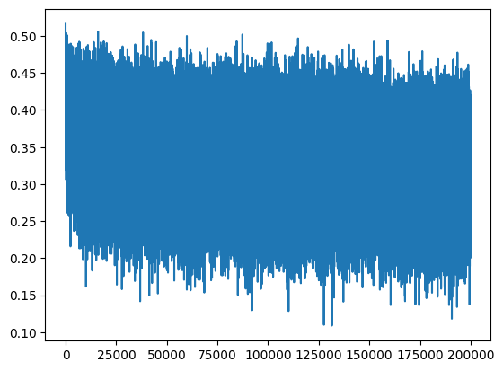
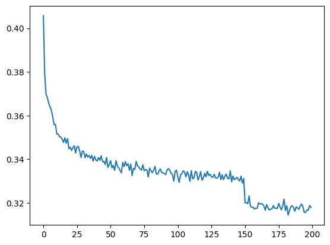
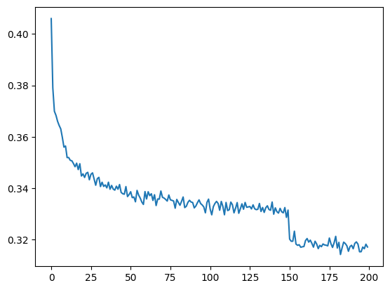
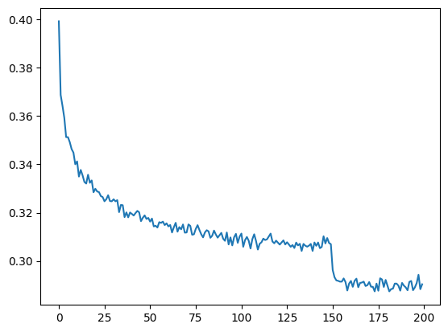
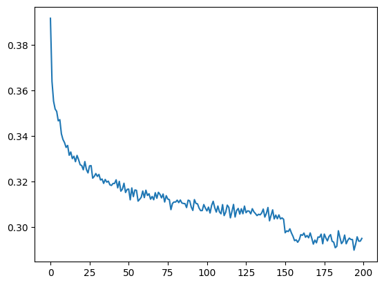
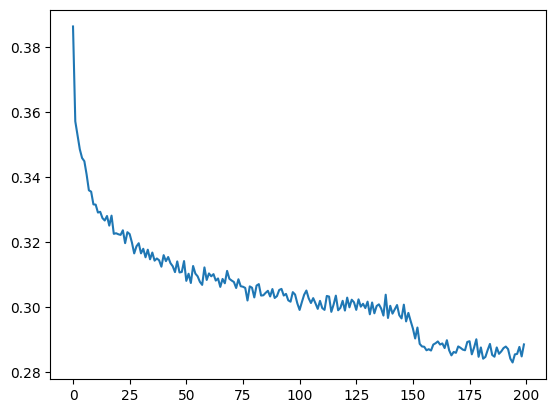
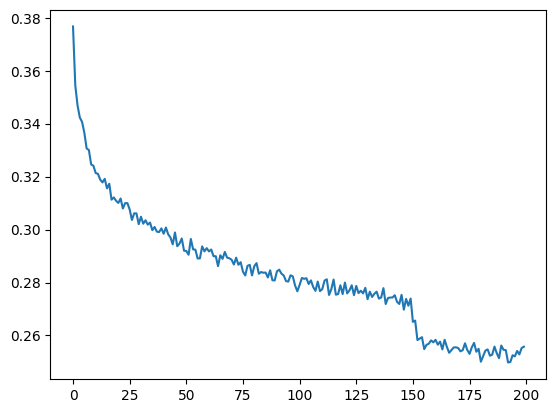
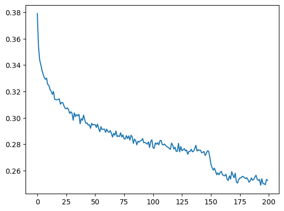

# Makemore 5：WaveNet

[视频](https://www.youtube.com/watch?v=t3YJ5hKiMQ0)
[代码仓库](https://github.com/karpathy/makemore)
[Eureka Labs Discord](https://discord.com/invite/3zy8kqD9Cp)

## 目录

- [网络搭建](#网络搭建)
- [处理嘈杂的损失曲线](#处理嘈杂的损失曲线)
- [改进前向传播](#改进前向传播)
- [更多简化](#更多简化)
- [走得更深](#走得更深)
- [膨胀因果卷积层](#膨胀因果卷积层)
- [BatchNorm 的 Bug？！](#batchnorm-的-bug)
- [走得更宽](#走得更宽)
- [深度神经网络开发流程](#深度神经网络开发流程)
  - [大致路线图](#大致路线图)
  - [眼下的挑战](#眼下的挑战)

到目前为止，在 makemore 这一系列讲中，我们已经为[这篇论文](https://www.jmlr.org/papers/volume3/bengio03a/bengio03a.pdf)所采用的方法搭建了处理和训练结构：


我们这套设置接收字符三元组（trigram，即三个字符），然后通过单个隐藏层和一个 `softmax` 输出，预测下一个、紧跟其后的字符。

**但这种做法有个问题。**

如果我们增大 `block_size`，也就是输入的字符数量，输入层的宽度就会增加，计算会因参数变多而变慢，隐藏层还可能成为瓶颈。
继续沿用我们现有的实现，就会限制可扩展性和能力。

为了更优雅地提升模型能力，我们必须输入更大的字符上下文；而关键在于，必须让模型变得更深。
为此，*我们可以跨多个更深的层逐级地合并输入*，而不是一次性地在输入层和隐藏层之间完成。


> **太多单独的输入直接塞进单个层，可扩展性并不好，而且会使该层给出的表示越发模糊。**
> **从现在起，我们要避免这种情况。**

我们将用多个更深的层、逐级融合输入表示，来替换掉“宽输入到隐藏层”这个瓶颈。
这种扩展方式在 [WaveNet 论文](https://arxiv.org/abs/1609.03499)（一个基于音频的语言模型）中也有描述。
不过从根本上说，其结构与 [\[Bengio 等人 2003\]](https://www.jmlr.org/papers/volume3/bengio03a/bengio03a.pdf) 仍然相同，只是层数更多而已。

首先，我们从 [makemore 第 3 讲](<../N004%20-%20Makemore%203%20-%20Activations,%20BatchNorm/N004%20-%20Makemore_3.ipynb>) 中复制一些代码过来：

```python
import torch
import torch.nn.functional as F
import matplotlib.pyplot as plt
%matplotlib inline
```

```python
# 读入所有名字
words = open('../names.txt', 'r').read().splitlines()
print('Word Count:', len(words))
print('Max Word Length:', max(len(w) for w in words))
print(words[:8])
```

```
Word Count: 32033
Max Word Length: 15
['emma', 'olivia', 'ava', 'isabella', 'sophia', 'charlotte', 'mia', 'amelia']
```

```python
# 构建字符词表并映射为整数
chars = sorted(list(set(''.join(words))))  # set(): 去除重复字母

stoi = {s:i+1 for i,s in enumerate(chars)} # 构造 (字符, 计数) 形式的元组
stoi['.'] = 0                              # 显式添加这个特殊字符的条目
itos = {i:s for s,i in stoi.items()}       # 把 (字符, 计数) 的顺序交换为 (计数, 字符)

vocab_size = len(itos)

# 展示这两个映射，它们其实互为镜像
print(itos)
print(stoi)
print(vocab_size)
```

```
{1: 'a', 2: 'b', 3: 'c', 4: 'd', 5: 'e', 6: 'f', 7: 'g', 8: 'h', 9: 'i', 10: 'j', 11: 'k', 12: 'l', 13: 'm', 14: 'n', 15: 'o', 16: 'p', 17: 'q', 18: 'r', 19: 's', 20: 't', 21: 'u', 22: 'v', 23: 'w', 24: 'x', 25: 'y', 26: 'z', 0: '.'}
{'a': 1, 'b': 2, 'c': 3, 'd': 4, 'e': 5, 'f': 6, 'g': 7, 'h': 8, 'i': 9, 'j': 10, 'k': 11, 'l': 12, 'm': 13, 'n': 14, 'o': 15, 'p': 16, 'q': 17, 'r': 18, 's': 19, 't': 20, 'u': 21, 'v': 22, 'w': 23, 'x': 24, 'y': 25, 'z': 26, '.': 0}
27
```

```python
# 打乱名字集合（保证可复现性）
import random
random.seed(42)
random.shuffle(words)
```

我们先沿用惯常的 `block_size` $= 3$，也就是说目前仍以字符三元组作为输入：

```python
# 构建数据集
block_size = 3 # 上下文长度：用多少个字符来预测下一个？

def build_dataset(words):  
  X, Y = [], []
  
  for w in words:
    context = [0] * block_size
    for ch in w + '.':
      ix = stoi[ch]
      X.append(context)
      Y.append(ix)
      context = context[1:] + [ix] # 裁剪并追加

  X = torch.tensor(X)
  Y = torch.tensor(Y)
  
  print(X.shape, Y.shape)
  return X, Y

# 这些是我们用来划分数据集的“标记点”
n1 = int(0.8 * len(words))
n2 = int(0.9 * len(words))

# 把数据集划分为训练、开发和测试三份
Xtr, Ytr = build_dataset(words[:n1])     # 80%
Xdev, Ydev = build_dataset(words[n1:n2]) # 10%
Xte, Yte = build_dataset(words[n2:])     # 10%
```

```
torch.Size([182625, 3]) torch.Size([182625])
torch.Size([22655, 3]) torch.Size([22655])
torch.Size([22866, 3]) torch.Size([22866])
```

给定一个字符三元组，我们要预测的就是紧随其后的那个字符：

```python
# 展示数据集的布局 -> 三个输入，一个期望输出（给定三个，期望第四个）
# 如上所示，我们有 182625 组这样的“给三个、求第四个”的字符集
for x, y in zip(Xtr[:20], Ytr[:20]):
    print(''.join(itos[ix.item()] for ix in x), '-->', itos[y.item()])
```

```
... --> y
..y --> u
.yu --> h
yuh --> e
uhe --> n
hen --> g
eng --> .
... --> d
..d --> i
.di --> o
dio --> n
ion --> d
ond --> r
ndr --> e
dre --> .
... --> x
..x --> a
.xa --> v
xav --> i
avi --> e
```

## 网络搭建

在 [makemore 第 3 讲](<../N004%20-%20Makemore%203%20-%20Activations,%20BatchNorm/N004%20-%20Makemore_3.ipynb>)里，我们开始构建线性层（Linear Layers）的结构，并对它们施加了批归一化（Batch Normalization）。
下面的代码还是那些，只是更加模块化了一些。

**这是有意为之的。**

把类的实例当作构成网络结构的积木来想，就像搭积木一样。
从长远看，这样更容易管理。

```python
# 几乎是 makemore 第 3 讲里所开发各层的复制粘贴
# -----------------------------------------------------

# 模仿 torch.nn.linear
class Linear:
  
  # fan_in: 输入维度数
  # fan_out: 输出维度数
  # bias: 是否添加偏置项
  def __init__(self, fan_in, fan_out, bias=True):
    self.weight = torch.randn((fan_in, fan_out)) / fan_in**0.5  # Kaiming 初始化
    self.bias = torch.zeros(fan_out) if bias else None
  
  # 被调用时执行前向传播（语法：l = Linear(x)）
  def __call__(self, x):
    self.out = x @ self.weight
    if self.bias is not None:
      self.out += self.bias
    return self.out
  
  # 返回参数列表（语法：l.parameters()）
  def parameters(self):
    return [self.weight] + ([] if self.bias is None else [self.bias])


# 模仿 torch.nn.batchnorm1d
class BatchNorm1d:
  
  # dim 表示施加归一化的那个维度
  # PyTorch 的 BatchNorm 也只是沿单一维度进行
  def __init__(self, dim, eps=1e-5, momentum=0.1):
    self.eps = eps           # 用于数值稳定性的小常数
    self.momentum = momentum # 滑动均值/方差的动量
    # BatchNorm1d 在训练和生产环境（production）下表现不同
    self.training = True
    # 参数（通过反向传播训练）
    self.gamma = torch.ones(dim) # 缩放
    self.beta = torch.zeros(dim) # 平移
    # 缓冲（buffer，通过反向传播之外的滑动“动量更新”来训练）
    self.running_mean = torch.zeros(dim) # 批归一化均值
    self.running_var = torch.ones(dim)   # 批归一化方差
  
  # 前向传播（语法：bn = BatchNorm1d(x)，其中 x 是一批输入）
  def __call__(self, x):
    # 训练模式下，计算批次均值和方差（用于主动归一化）
    # 否则使用滑动均值和方差（用于被动归一化）
    if self.training:
      xmean = x.mean(0, keepdim=True) # 批次均值
      xvar  = x.var(0, keepdim=True)  # 批次方差
      with torch.no_grad():
        self.running_mean = (1 - self.momentum) * self.running_mean + self.momentum * xmean
        self.running_var  = (1 - self.momentum) * self.running_var + self.momentum * xvar
    else:
      xmean = self.running_mean # 使用预先算好的滑动均值/方差
      xvar  = self.running_var  # （预先算好 = 训练期间算好的）
  
    xhat = (x - xmean) / torch.sqrt(xvar + self.eps) # 归一化为单位方差
    self.out = self.gamma * xhat + self.beta # 缩放并平移（gamma 和 beta 是学出来的）
    return self.out
  
  # 返回该层的参数列表（语法：bn.parameters()）
  def parameters(self):
    return [self.gamma, self.beta]


# 模仿 torch.nn.tanh
class Tanh:
  def __call__(self, x):
    self.out = torch.tanh(x)
    return self.out

  def parameters(self):
    return []
```

```python
torch.manual_seed(42); # 用于可复现性
```

有了上面这些代码，我们就可以搭建*真正的*网络结构了。

**和之前一样，我们会用：**

- 一个大小为 `(27, 10)` 的嵌入层，
- 一个大小为 `(30, 200)` 的隐藏层，
- 一个施加在隐藏层输出第二维上的批归一化层，
- 一个 $\text{tanh}$ 激活函数，
- 一个大小为 `(200, 27)` 的线性层

```python
n_embd = 10    # 字符嵌入向量的维度
n_hidden = 200 # MLP 隐藏层的神经元数量

# 搭建实际的网络设计
C = torch.randn((vocab_size, n_embd))  # 随机但唯一的 n_embd 维嵌入向量
layers = [
    Linear(n_embd * block_size, n_hidden, bias=False), 
    BatchNorm1d(n_hidden), 
    Tanh(),
    Linear(n_hidden, vocab_size),
]

# 参数初始化
with torch.no_grad():
  layers[-1].weight *= 0.1 # 让最后一层（在最初）不那么自信

# 打印模型中的参数数量
parameters = [C] + [p for layer in layers for p in layer.parameters()]
print(sum(p.nelement() for p in parameters)) # 总参数数
for p in parameters:
  p.requires_grad = True
```

```
12097
```

```python
# 与上次相同的优化（写法略有不同）
max_steps = 200000
batch_size = 32
lossi = []

for i in range(max_steps):
  
    # 构造小批量
    ix = torch.randint(0, Xtr.shape[0], (batch_size,))
    Xb, Yb = Xtr[ix], Ytr[ix] # 该批次的 X,Y
  
    # 前向传播
    emb = C[Xb]                         # 把字符嵌入为向量
    x = emb.view(emb.shape[0], -1)      # 拼接向量，“拉伸开”
    for layer in layers:
        x = layer(x)
    loss = F.cross_entropy(x, Yb)  # 损失函数
  
    # 反向传播
    for p in parameters:
        # 确保上一轮迭代的梯度被清掉
        p.grad = None
    loss.backward() # 这会计算当前（新的）梯度
  
    # 更新（无多余装饰的小批量 SGD）
    lr = 0.1 if i < 150000 else 0.01 # 学习率衰减
    for p in parameters:
        p.data += -lr * p.grad

    # 偶尔打印跟踪统计量
    if i % 10000 == 0:
        print(f'{i:7d}/{max_steps:7d}: {loss.item():.4f}')
  
    # 把当前损失值加入历史损失集合（供稍后展示）
    lossi.append(loss.log10().item())
```

```
      0/ 200000: 3.2844
  10000/ 200000: 2.3177
  20000/ 200000: 2.4191
  30000/ 200000: 1.8858
  40000/ 200000: 1.9077
  50000/ 200000: 1.5355
  60000/ 200000: 1.6192
  70000/ 200000: 2.5743
  80000/ 200000: 2.0838
  90000/ 200000: 2.1183
  100000/ 200000: 2.2409
  110000/ 200000: 2.4485
  120000/ 200000: 2.1119
  130000/ 200000: 1.8765
  140000/ 200000: 2.1631
  150000/ 200000: 1.9839
  160000/ 200000: 2.3134
  170000/ 200000: 1.8970
  180000/ 200000: 1.7244
  190000/ 200000: 1.8793
```

```python
plt.plot(lossi);
```



我们再来确定此刻的训练损失和验证损失：

```python
# 把各层切换到评估模式（对 batchnorm 尤为必要）
for layer in layers:
    layer.training = False
```

```python
# 见 makemore #2。
# 之前做过，这里为方便而重构成函数：
@torch.no_grad() # 装饰器，关闭梯度跟踪（torch 一侧不再做“记账”）
def split_loss(split):
    x, y = {
        'train': (Xtr, Ytr),
        'val': (Xdev, Ydev),
        'test': (Xte, Yte),
    }[split]   # 这就是个开关！
  
    emb = C[x] # (N, block_size, n_embd)
    x = emb.view(emb.shape[0], -1) # 拼接成 (N, block_size * n_embd)
  
    for layer in layers:
        x = layer(x)
  
    loss = F.cross_entropy(x, y)
    print(split, loss.item())

split_loss('train')
split_loss('val')
```

```
train 2.0587270259857178
val 2.1071507930755615
```

```python
# 从模型采样
for _ in range(20):
  
    out = []
    context = [0] * block_size # 用全 . 初始化
    while True:
      # 前向传播经过神经网络
      emb = C[torch.tensor([context])] # (1,block_size,n_embd)
      x = emb.view(emb.shape[0], -1)   # 拼接向量，“拉伸开”
      for layer in layers:
            x = layer(x)
      logits = x
      probs = F.softmax(logits, dim=1)
      # 从分布中采样
      ix = torch.multinomial(probs, num_samples=1).item()
      # 滑动上下文窗口并跟踪采样
      context = context[1:] + [ix]
      out.append(ix)
      # 一旦采到特殊的 '.' token 就跳出
      if ix == 0:
        break
  
    # 解码并打印生成的名字（推理结果）
    print(''.join(itos[i] for i in out))
```

```
damiara.
alyzah.
fard.
azalee.
sayah.
ayvi.
reino.
sophemuellani.
ciaub.
alith.
sira.
liza.
jah.
grancealynna.
jamaur.
ben.
quan.
torie.
coria.
cer.
```

到目前为止，我们基本上只是重构了 [makemore 第 3 讲](<../N004%20-%20Makemore%203%20-%20Activations,%20BatchNorm/N004%20-%20Makemore_3.ipynb>)的做法。
**它仍和之前完全一样地工作着。**

如果你看一下 `loss` 曲线，它看起来真是*疯了*，太*嘈杂*了，表达不出任何有意义的趋势。
**主要原因在于批次大小。**

$32$ 太小了。每个批次只有 $32$ 个预测。
这不足以得到一个好而稳定的平均损失值。
更糟的是，小批次可能造成损失意义上非常“走运”或“不走运”的批次，从而进一步扭曲损失曲线。

**来修掉这条糟糕的损失曲线吧。**

## 处理嘈杂的损失曲线

`lossi` 是我们累积的 `float` 值列表，代表每个批次的损失值。
为了让曲线更易读，我们可以跨多个批次对损失值取平均。
在此，回忆一下：只要元素总数不变，我们可以用不同维数来查看和重塑（reshape）一个张量。
*现在这会派上用场。*

```python
print(torch.arange(10))             # 一个含数字 0-9 的数组 -> (10,)
print(torch.arange(10).view(2, 5))  # 同一个数组，但变形 -> (2,5)
print(torch.arange(10).view(5, 2))  # 同一个数组，但另一种变形 -> (5,2)
print(torch.arange(10).view(2, -1)) # -1 当万能牌，在给定输入维度时自动推断其中一维 -> (2,5)
```

```
tensor([0, 1, 2, 3, 4, 5, 6, 7, 8, 9])
tensor([[0, 1, 2, 3, 4],
        [5, 6, 7, 8, 9]])
tensor([[0, 1],
        [2, 3],
        [4, 5],
        [6, 7],
        [8, 9]])
tensor([[0, 1, 2, 3, 4],
        [5, 6, 7, 8, 9]])
```

```python
print(len(lossi))
```

```
200000
```

如果我们把 `lossi` 变成一个 `torch.tensor`，修整起来就更方便了。

`lossi` 长度为 $200{,}000$。
我们把它结构化成形状 `(200, 1000)` 的矩阵。

对每一行（携带 $1{,}000$ 个值），我们计算平均值。
把所有这些单个损失（共 $200{,}000$ 个）算完，现在我们缩减成了 $200$ 个平均损失。

*这样会更易读。*

```python
print(torch.tensor(lossi).view(-1, 1000).shape)         # 每行有 1000 个连续损失
print(torch.tensor(lossi).view(-1, 1000).mean(1).shape) # 按行求均值 -> 200 行得到 200 个均值
plt.plot(torch.tensor(lossi).view(-1, 1000).mean(1));   # 对每一行求均值 -> 200 个均值的数组
```

```
torch.Size([200, 1000])
torch.Size([200])
```



这是让损失曲线更易读的一个非常简单的办法。*不过很优雅。*
例如，**我们现在可以清楚地看到学习率在哪里被下调了，以及这确实带来了对“完美”局部最小值更精细的逼近**，即整体误差更小。

## 改进前向传播

接下来我们想改进的是前向传播本身。
**它太臃肿了，太多行代码。**

此外，嵌入表 `C` 被“特殊处理”地放在了“常规”层之外。
`emb.view` 也作为额外一步发生在各层之外。
*这有代价，因为它没有被并行化。*

**换句话说：**前向传播代码里有这么一部分是多余的：

```python
emb = C[Xb]
```

它用输入字符的整数表示作为索引，到嵌入表里做查找。
我们应当换种方式把这一额外操作并入进来。

紧接着的向量展平也完全一样：

```python
# 拼接向量
# emb.shape[0] 是批次大小，
# -1 表示自动推断 block_size * n_embd
x = emb.view(emb.shape[0], -1)
```

我们已经在 `layers` 列表里组织了一些层（`Linear`、`BatchNorm1d`、`Linear`）。
我们完全可以把那两个操作也当作层，加进这个列表。
一个是 `Embedding` 层，另一个叫 `Flatten`。

先从嵌入层开始。
PyTorch 里有个功能等价物，叫 `torch.nn.embedding`。

**这个层长这样：**

```python
# 做索引操作
# 模仿 torch.nn.embedding
class Embedding:
  
  def __init__(self, num_embeddings, embedding_dim):
    # 之前的 C（查找表）现在变成了这一层的权重
    self.weight = torch.randn((num_embeddings, embedding_dim)) # 行为和 C 一样

  # 这是前向传播（语法：embedding(IX)）   
  def __call__(self, IX):
    self.out = self.weight[IX]
    return self.out
  
  # 返回该层所有参数的列表（语法：embedding.parameters()）
  def parameters(self):
    return [self.weight]
```

```python
# 做向量展平
class Flatten:
  # 这是前向传播（语法：flatten(x)）
  # x 是形状为 (N, block_size, n_embd) 的张量，N 是批次大小，n_embd 是嵌入维度
  def __call__(self, x):
    # 拼接向量，
    # x.shape[0] 是批次大小，
    # -1 表示“推断剩余部分”（此处即 block_size * n_embd）
    self.out = x.view(x.shape[0], -1)
    return self.out
  
  # 返回该层参数列表（此处没有，语法：flatten.parameters()）
  def parameters(self):
    return []
```

这种做法极大提升了可读性，并理顺了层的处理流程，因为我们现在可以把这些层加到旧的 `layers` 列表里，并一同迭代它们。
*功能相同，更好理解。*

```python
torch.manual_seed(42);
```

```python
n_embd   = 10  # 字符嵌入向量的维度
n_hidden = 200 # MLP 隐藏层的神经元数量

# 搭建实际的网络设计
layers = [
    Embedding(vocab_size, n_embd), # 新：之前是 C = torch.randn((vocab_size, n_embd))
    Flatten(),                     # 新：之前是 x = emb.view(emb.shape[0], -1)
    Linear(n_embd * block_size, n_hidden, bias=False), BatchNorm1d(n_hidden), Tanh(),
    Linear(n_hidden, vocab_size),
]

# 参数初始化
with torch.no_grad():
  layers[-1].weight *= 0.1 # 让最后一层不那么自信

# 旧：parameters = [C] + [p for layer in layers for p in layer.parameters()]
parameters = [p for layer in layers for p in layer.parameters()]
print(sum(p.nelement() for p in parameters)) # 总参数数
for p in parameters:
  p.requires_grad = True
```

```
12097
```

不仅设计本身，连前向传播与反向传播的交互也因我们的改动而简化了：

```python
# 与上次相同的优化（写法略有不同）
max_steps = 200000
batch_size = 32
lossi = []

for i in range(max_steps):
  
    # 构造小批量
    ix = torch.randint(0, Xtr.shape[0], (batch_size,))
    Xb, Yb = Xtr[ix], Ytr[ix] # 该批次的 X,Y
  
    # 前向传播
    x = Xb # 批次输入稍后会被嵌入为向量
    for layer in layers:
        x = layer(x)
    loss = F.cross_entropy(x, Yb)  # 损失函数
  
    # 反向传播
    for p in parameters:
        # 确保上一轮迭代的梯度被清掉
        p.grad = None
    loss.backward() # 这会计算梯度
  
    # 更新（无多余装饰的小批量 SGD）
    lr = 0.1 if i < 150000 else 0.01 # 学习率衰减
    for p in parameters:
        p.data += -lr * p.grad

    # 偶尔打印跟踪统计量
    if i % 10000 == 0:
        print(f'{i:7d}/{max_steps:7d}: {loss.item():.4f}')
  
    # 把当前损失值加入历史损失集合（供稍后展示）
    lossi.append(loss.log10().item())
  
    break # 先看看这能不能跑通
```

```
      0/ 200000: 3.2966
```

## 更多简化

**现在进一步简化我们的代码。**
我们把各层存在一个叫 `layers` 的列表里。
*这未必是最高效的存储方式。*
我们不如搭一个类似 `container`（容器）的东西。

就像 `torch.nn` 里那样，它应当是我们各层的一个组织器。
我们要照搬的 PyTorch 点子是 `Sequential` 容器。
它能自行把输入传过它所包含的所有层。
**正是我们需要的！**

来搭这个 `Sequential` 容器：

```python
# 模仿 torch.nn.Sequential
class Sequential:
  
  def __init__(self, layers):
    # 嘘，这基本上就是之前的列表结构
    self.layers = layers
  
  # 把输入 x 简单地传过 self.layers 里的每一层
  def __call__(self, x):
    for layer in self.layers:
      x = layer(x)
    self.out = x
    return self.out
  
  # 取所有层的参数，展平成一个列表
  def parameters(self):
    return [p for layer in self.layers for p in layer.parameters()]
```

再一次，把过程这样重新打包进类里，对我们的网络设计和交互性都有积极意义：

```python
torch.manual_seed(42);
```

```python
n_embd = 10    # 字符嵌入向量的维度
n_hidden = 200 # MLP 隐藏层的神经元数量

# 搭建实际的网络设计
model = Sequential([
    Embedding(vocab_size, n_embd), # 之前是 C = torch.randn((vocab_size, n_embd))
    Flatten(),                     # 之前是 x = emb.view(emb.shape[0], -1)
    Linear(n_embd * block_size, n_hidden, bias=False), BatchNorm1d(n_hidden), Tanh(),
    Linear(n_hidden, vocab_size),
])

# 参数初始化
with torch.no_grad():
  layers[-1].weight *= 0.1 # 让最后一层不那么自信

# 参数以前长这样：[p for layer in layers for p in layer.parameters()]
parameters = model.parameters()
print(sum(p.nelement() for p in parameters)) # 总参数数
for p in parameters:
  p.requires_grad = True
```

```
12097
```

```python
# 与上次相同的优化（写法略有不同）
max_steps = 200000
batch_size = 32
lossi = []

for i in range(max_steps):
  
    # 构造小批量
    ix = torch.randint(0, Xtr.shape[0], (batch_size,))
    Xb, Yb = Xtr[ix], Ytr[ix] # 该批次的 X,Y
  
    # 前向传播
    logits = model(Xb) # 我们的新 Sequential 容器在行动
    loss = F.cross_entropy(logits, Yb)  # 损失函数
  
    # 反向传播
    for p in parameters:
        # 确保上一轮迭代的梯度被清掉
        p.grad = None
    loss.backward() # 这会计算当前（新的）梯度
  
    # 更新（无多余装饰的 SGD）
    lr = 0.1 if i < 150000 else 0.01 # 学习率衰减
    for p in parameters:
        p.data += -lr * p.grad

    # 偶尔打印跟踪统计量
    if i % 10000 == 0:
        print(f'{i:7d}/{max_steps:7d}: {loss.item():.4f}')
  
    # 把当前损失值加入历史损失集合（供稍后展示）
    lossi.append(loss.log10().item())
  
    #break # 先看看这能不能跑通
```

```
      0/ 200000: 3.4915
  10000/ 200000: 2.2179
  20000/ 200000: 2.3681
  30000/ 200000: 2.1342
  40000/ 200000: 2.4067
  50000/ 200000: 2.2406
  60000/ 200000: 1.9608
  70000/ 200000: 1.9236
  80000/ 200000: 2.6587
  90000/ 200000: 2.0502
 100000/ 200000: 2.2596
 110000/ 200000: 1.6270
 120000/ 200000: 2.1705
 130000/ 200000: 2.2806
 140000/ 200000: 2.1980
 150000/ 200000: 1.8434
 160000/ 200000: 1.8250
 170000/ 200000: 2.3077
 180000/ 200000: 2.0817
 190000/ 200000: 2.1585
```

这些简化带来的可读性好处贯穿了整条流水线：

```python
print(torch.tensor(lossi).shape)                        # (200000,)
print(torch.tensor(lossi).view(-1, 1000).shape)         # 让每行携带 1000 个连续元素
print(torch.tensor(lossi).view(-1, 1000).mean(1).shape) # 按行 (1) 求均值 --> 200 行/均值
plt.plot(torch.tensor(lossi).view(-1, 1000).mean(1));   # 对每一行求均值 -> 200 个均值
```

```
torch.Size([200000])
torch.Size([200, 1000])
torch.Size([200])
```



我们再来确定训练损失和验证损失：

```python
# 把各层切换到评估模式（对 batchnorm 尤为必要）
# （像这样直接访问 Sequential 的各层是不好的，稍后我们会修这个）
for layer in model.layers:
    layer.training = False
```

```python
# 见 makemore #2。之前做过，这里为方便而重构成函数：
@torch.no_grad() # 装饰器，关闭梯度跟踪（torch 一侧不再做“记账”）
def split_loss(split):
    x, y = {
        'train': (Xtr, Ytr),
        'val': (Xdev, Ydev),
        'test': (Xte, Yte),
    }[split]   # 这就是个开关！
  
    logits = model(x) # 这被简化了
  
    loss = F.cross_entropy(logits, y)
    print(f'{split}\t{loss.item()}')

split_loss('train')
split_loss('val')
```

```
train	2.058220863342285
val	2.1056692600250244
```

```python
# 从模型采样
for _ in range(20):
    out = []
    context = [0] * block_size # 用全 . 初始化
    while True:
      # 前向传播经过神经网络
      logits = model(torch.tensor([context]))
      probs = F.softmax(logits, dim=1)
      # 从分布中采样
      ix = torch.multinomial(probs, num_samples=1).item()
      # 滑动上下文窗口并跟踪采样
      context = context[1:] + [ix]
      out.append(ix)
      # 一旦采到特殊的 '.' token 就跳出
      if ix == 0:
        break
  
    # 解码并打印生成的名字（推理结果）
    print(''.join(itos[i] for i in out))
```

```
ivon.
fanili.
thoommestenell.
mattevyn.
alana.
joleshaun.
siah.
prus.
carleen.
jah.
jorrena.
joriah.
jas.
vishylaharia.
juna.
vio.
orven.
mina.
laylee.
esteffead.
```

我们看到训练集和验证集的损失彼此非常接近。
**这暗示模型相当能泛化。**

**它没有过拟合。** *这非常好。**

现在我们有了一个好基础，可以尝试增大模型规模、
加深理解并进一步降低损失。

## 走得更深

**好，回到最开始。**

现在我们用一个（实现得更优雅的）架构接收三个字母并预测第四个。
问题在于，虽然理论上我们能“直接加更多层”，但在开头我们其实把所有输入字符都揉进了同一层。
**这就是该架构的核心问题/瓶颈。**

[WaveNet](https://arxiv.org/abs/1609.03499) 的方法正是为此而设：


不同的字符被喂进来，而不是一次性揉进单层。
这种“揉”的过程现在变得不那么突兀/粗暴了，被分散到了好几层上。
**这降低了信息丢失的风险。**

在第一层里，我们“融合”两个字符。
然后，我们“融合”那两个字符的融合产物（此时总共考虑 $4$ 个字符），依此类推。
一种树状结构浮现出来，我们可以按喜好在深度上扩展（也因此可以扩展上下文大小）。

> 这种把层堆叠起来、“树枝式”合并输入的概念，叫做
> **“膨胀因果卷积层（dilated causal convolutional layers）”。**

**简言之：**
我们其实要让网络变深，但主要是就输入流程而言。
这已经为我们提供了更多可学习的信息，
因为我们现在可以用更“上下文化”的方式把字符纳入考量。

我们把 `block_size` 从 $3$ 提到 $8$：

```python
# 构建数据集
block_size = 8 # 上下文长度：用多少个字符来预测下一个？

def build_dataset(words):  
  X, Y = [], []
  
  for w in words:
    context = [0] * block_size
    for ch in w + '.':
      ix = stoi[ch]
      X.append(context)
      Y.append(ix)
      context = context[1:] + [ix] # 裁剪并追加

  X = torch.tensor(X)
  Y = torch.tensor(Y)
  
  print(X.shape, Y.shape)
  return X, Y

# 这些是我们用来划分数据集的“标记点”
n1 = int(0.8 * len(words))
n2 = int(0.9 * len(words))

# 把数据集划分为训练、开发和测试三份
Xtr, Ytr = build_dataset(words[:n1])     # 80%
Xdev, Ydev = build_dataset(words[n1:n2]) # 10%
Xte, Yte = build_dataset(words[n2:])     # 10%
```

```
torch.Size([182625, 8]) torch.Size([182625])
torch.Size([22655, 8]) torch.Size([22655])
torch.Size([22866, 8]) torch.Size([22866])
```

```python
# 展示数据集的布局 -> 八个输入，一个关联/期望输出
for x, y in zip(Xtr[:20], Ytr[:20]):
    print(''.join(itos[ix.item()] for ix in x), '-->', itos[y.item()])
```

```
........ --> y
.......y --> u
......yu --> h
.....yuh --> e
....yuhe --> n
...yuhen --> g
..yuheng --> .
........ --> d
.......d --> i
......di --> o
.....dio --> n
....dion --> d
...diond --> r
..diondr --> e
.diondre --> .
........ --> x
.......x --> a
......xa --> v
.....xav --> i
....xavi --> e
```

模型架构暂时不变。
参数数量增加了 $10{,}000$。
这完全是因为上下文更大了。

**眼下的问题是：**仅仅是单纯地增大上下文大小，是否能在仍然把所有东西揉进第一层的同时，带来更低的损失？

来试试：

```python
n_embd = 10    # 字符嵌入向量的维度
n_hidden = 200 # MLP 隐藏层的神经元数量

# 搭建网络设计
model = Sequential([
    Embedding(vocab_size, n_embd), # 之前是 C = torch.randn((vocab_size, n_embd))
    Flatten(), # 之前是 C.view(-1, n_embd * block_size)
    Linear(n_embd * block_size, n_hidden, bias=False), BatchNorm1d(n_hidden), Tanh(),
    Linear(n_hidden, vocab_size),
])

# 参数初始化
with torch.no_grad():
  layers[-1].weight *= 0.1 # 让最后一层不那么自信

# 之前：[p for layer in layers for p in layer.parameters()]
parameters = model.parameters()
print(sum(p.nelement() for p in parameters)) # 总参数数
for p in parameters:
  p.requires_grad = True
```

```
22097
```

```python
# 与上次相同的优化（写法略有不同）
max_steps = 200000
batch_size = 32
lossi = []

for i in range(max_steps):
  
    # 构造小批量
    ix = torch.randint(0, Xtr.shape[0], (batch_size,))
    Xb, Yb = Xtr[ix], Ytr[ix] # 该批次的 X,Y
  
    # 前向传播
    logits = model(Xb)
    loss = F.cross_entropy(logits, Yb)  # 损失函数
  
    # 反向传播
    for p in parameters:
        # 确保上一轮迭代的梯度被清掉
        p.grad = None
    loss.backward() # 这会计算当前（新的）梯度
  
    # 更新（无多余装饰的 SGD）
    lr = 0.1 if i < 150000 else 0.01 # 学习率衰减
    for p in parameters:
        p.data += -lr * p.grad

    # 偶尔打印跟踪统计量
    if i % 10000 == 0:
        print(f'{i:7d}/{max_steps:7d}: {loss.item():.4f}')
  
    # 把当前损失值加入历史损失集合（供稍后展示）
    lossi.append(loss.log10().item())
  
    #break # 先看看这能不能跑通
```

```
      0/ 200000: 3.6036
  10000/ 200000: 2.1418
  20000/ 200000: 2.2006
  30000/ 200000: 2.4524
  40000/ 200000: 2.2123
  50000/ 200000: 1.8461
  60000/ 200000: 2.5121
  70000/ 200000: 2.1705
  80000/ 200000: 2.3022
  90000/ 200000: 2.2967
 100000/ 200000: 1.9490
 110000/ 200000: 2.0411
 120000/ 200000: 2.8504
 130000/ 200000: 1.5823
 140000/ 200000: 2.0511
 150000/ 200000: 2.0658
 160000/ 200000: 2.0859
 170000/ 200000: 1.7717
 180000/ 200000: 1.4267
 190000/ 200000: 2.0282
```

```python
plt.plot(torch.tensor(lossi).view(-1, 1000).mean(1)); # 对每一行求均值 -> 200 个均值
```



```python
# 把各层切换到评估模式
for layer in model.layers:
    layer.training = False
```

```python
# 见 makemore #2。之前做过，这里为方便而重构成函数：
@torch.no_grad() # 装饰器，关闭梯度跟踪（torch 一侧不再做“记账”）
def split_loss(split):
    x, y = {
        'train': (Xtr, Ytr),
        'val': (Xdev, Ydev),
        'test': (Xte, Yte),
    }[split] # 这就是个开关！！
  
    logits = model(x)
  
    loss = F.cross_entropy(logits, y)
    print(f'{split}\t{loss.item()}')

split_loss('train')
split_loss('val')
```

```
train	1.9186382293701172
val	2.0330464839935303
```

我们这里确实看到了损失上的**显著改善**。
而这仅仅是因为把批次大小变大了。
*别无其它，还没有结构上的改动。*

**性能记录：**

|                                        | train | val   |
| -------------------------------------- | ----- | ----- |
| 原始（3 字符，12K 参数）               | 2.058 | 2.105 |
| 上下文：3$\rightarrow$ 8（22K 参数） | 1.918 | 2.033 |

```python
# 从 22K 模型采样
for _ in range(20):
  
    out = []
    context = [0] * block_size # 用全 . 初始化
    while True:
      # 前向传播经过神经网络
      logits = model(torch.tensor([context]))
      probs = F.softmax(logits, dim=1)
      # 从分布中采样
      ix = torch.multinomial(probs, num_samples=1).item()
      # 滑动上下文窗口并跟踪采样
      context = context[1:] + [ix]
      out.append(ix)
      # 一旦采到特殊的 '.' token 就跳出
      if ix == 0:
        break
  
    # 解码并打印生成的名字（推理结果）
    print(''.join(itos[i] for i in out))
```

```
mahriah.
catheoj.
demanui.
briuja.
alim.
devon.
alunya.
duriyan.
amer.
catriana.
aryshail.
arpod.
nalynn.
elynn.
ozep.
lavade.
rudiel.
beitum.
micbelly.
karlene.
```

**这些名字开始看起来更好了。**
但现在我们也用上面讨论过的*“膨胀因果卷积层”*方法，让模型更具可扩展性吧。

## 膨胀因果卷积层

我们来建立一点直觉，看看这种多层输入结构可以怎么搭起来。
下面我们可以看到张量在网络各层中的形状变化。

**这只是为了可视化：**

```python
# 看看只有 4 个例子的一个批次会怎样
ix = torch.randint(0, Xtr.shape[0], (4,))

# 从训练集取这 4 行
Xb, Yb = Xtr[ix], Ytr[ix]
logits = model(Xb) # 把它们传过模型
print(Xb.shape)    # 总输入集维度，4x8；4 是批次大小，8 是 block size
print(Xb)          # 看看实际的输入批次
```

```
torch.Size([4, 8])
tensor([[ 0,  0,  0,  0,  0,  0,  0,  8],
        [ 0,  0,  0,  0,  5, 12, 12, 19],
        [ 0,  0,  0,  0,  0,  0,  0, 12],
        [ 0,  0,  0, 13,  1,  5,  2, 18]])
```

```python
# 每个字符由一个我们要学习的 10 维向量表示（我们自己选的）
print(model.layers[0].out.shape) # 4x8x10 -> 4 是批次大小，8 是 block size，10 是嵌入大小
```

```
torch.Size([4, 8, 10])
```

```python
# Flatten 层的输出（把 8 和 10 压成一个大的拼接，每个输入一份）
print(model.layers[1].out.shape) # 4x80 -> 4 是批次大小，80 由 8x10 推断而来
```

```
torch.Size([4, 80])
```

```python
# Linear 层的输出（每个输入产生 200 个期望输出）
print(model.layers[2].out.shape) # 4x200 -> 4 是批次大小，200 是隐藏层神经元数

# 题外话/复习：[4, 80] 怎么变成 [4, 200] 的？见下面解释
print((torch.randn(4, 80) @ torch.randn(80, 200) + torch.randn(200)).shape)
# 我们如计划那样得到 4（批次大小）组、每组 200 个激活
# + torch.randn(200) 是偏置
```

```
torch.Size([4, 200])
torch.Size([4, 200])
```

有趣的是，最后这一步无论输入维度是多少都能工作。
它总是“贴”在最后一维上，忽略前面 $n \geq 0$ 个列出的矩阵维度：

```python
# 只是旁注，没有结构性意义
print((torch.randn(4, 5, 6, 80) @ torch.randn(80, 200) + torch.randn(200)).shape)
```

```
torch.Size([4, 5, 6, 200])
```

**我们可以利用这一性质。**

我们有 `block_size=8` 这么多个字符：
`1 2 3 4 5 6 7 8`

我们把每个字符嵌入成一个 $10$ 维向量。（一如既往。）

我们现在想对嵌入后（现在是 $10$ 维）的字符施加逐步分组：
`(1 2) (3 4) (5 6) (7 8)`

我们也想用一种能高效、并行地处理上述涌现出的 $4$ 个子组的方式来做到这一点。

来修改我们之前用过的矩阵乘法，让它能照顾到这一点。
我们在第一层只想融合 $2$ 个字符。
这就是 $4$ 倍（批次大小）的 $4$ 组、每组 $2$ 个字符，
`(1 2) (3 4) (5 6) (7 8)`，其中每个字符本身是 $10$ 维的
（每组：$2$ 字符 $\times 10$ 嵌入 $= 20$）：

```python
# n_embd = 10    # 字符嵌入维度
# 我们希望新线性层有这种行为，眼下只是个草稿：
print((torch.randn(4, 4, 20) @ torch.randn(20, 200) + torch.randn(200)).shape)
```

```
torch.Size([4, 4, 200])
```

因此 `Flatten` 层应当被改造，不再输出 $[4, 80]$，而是输出 $[4, 4, 20]$（同样是 $4 \times 4$ 组、每组 $2$ 个字符、每个 $10$ 维），以便正确喂给现在已经考虑了分组输入方式的新线性层。

我们当前有一个维度为 $(4, 8, 10)$（`batch_size`、`block_size`、`embedding_size`）的输入。
**目标：**把它变成 $(4, 4, 20)$，其中 $20$ 是 $2$ 个连续 $10$ 维向量拼接而成

```python
e = torch.randn(4, 8, 10) # 模拟喂给 flatten 层的输入
# 当前，Flatten() 创建的只是这个重塑版本：
print(e.view(4, -1).shape)
```

```
torch.Size([4, 80])
```

为了解决这个重排任务，我们可以利用 python 列表 API 中的一个概念，按我们当下想要的方式精确重塑。
这就是我们要用的概念：

```python
print(list(range(10))[::2])
print(list(range(10))[1::2])
```

```
[0, 2, 4, 6, 8]
[1, 3, 5, 7, 9]
```

从批次中的每个输入（批次大小 $4$）里，我们现在只挑出每隔一个的 $10$ 维字符嵌入向量。
给定形状为 $(4, 8, 10)$ 的 `e`，我们要拔出一个形状 $(4, 4, 10)$：

```python
print(e[:, ::2, :].shape)  # 偶数位置的字符表示（第 0 个、第 2 个等）
print(e[:, 1::2, :].shape) # 奇数位置的字符表示（第 1 个、第 3 个等）
```

```
torch.Size([4, 4, 10])
torch.Size([4, 4, 10])
```

如果我们现在沿第三维（Python 中零索引，所以代码里是个 $2$）拼接这两个张量，
我们就把每个偶数字符嵌入只和它后面那个奇数字符嵌入重新组合到一起。

```python
explicit = torch.cat([e[:, ::2, :], e[:, 1::2, :]], dim=2)
print(explicit.shape)
```

```
torch.Size([4, 4, 20])
```

*一招妙手。*

我们有一个 $[4, 8, 10]$ 的输入。我们把这个张量切成两半，各为 $[4, 4, 10]$。
第一个张量含所有偶数编号的嵌入，第二个张量含这些嵌入组里所有奇数编号的嵌入。
然后我们沿第三维拼接这两个张量。
于是我们总是把第二个字符的 $10$ 维嵌入粘到第一个字符嵌入的后面。

事实上，我们刚才把那步操作做得非常显式。
PyTorch 的 `.view()` 在这种情况下能替我们兜底，我们不必这么啰嗦。
但看看这事是怎么做的总是好的。

利用 `.view()` 完成同样任务的简化代码：

```python
print((e.view(4, 4, 20) == explicit).all())
```

```
tensor(True)
```

**这可以推广。**

如果一个展平层接收一个形状为 $[B, T, C]$（`batch_size`、`characters`、`embedding_channels`）的张量，
并且它收到一个 $n$ 用于把字符分成 $n$ 组，
我们就可以把重塑推广为 $[B, T//n, C \times n]$（`batch_size`、`characters` 除以 $n$、`embedding_channels` 乘以 $n$）。

现在把我们的发现推广到模型架构，特别是 `Flatten` 的实现。
这些类保持不动：

```python
# 模仿 torch.nn.linear

class Linear:
  
  def __init__(self, fan_in, fan_out, bias=True):
    self.weight = torch.randn((fan_in, fan_out)) / fan_in**0.5  # Kaiming 初始化
    self.bias = torch.zeros(fan_out) if bias else None
  
  # 被调用时执行前向传播（语法：l = Linear(x)）
  def __call__(self, x):
    self.out = x @ self.weight
    if self.bias is not None:
      self.out += self.bias
    return self.out
  
  def parameters(self):
    return [self.weight] + ([] if self.bias is None else [self.bias])

# -----------------------------------------------------------------------------------------------

# 模仿 torch.nn.batchnorm1d
class BatchNorm1d:
  
  def __init__(self, dim, eps=1e-5, momentum=0.1):
    self.eps = eps
    self.momentum = momentum
    # BatchNorm1d 在训练和生产环境下表现不同
    self.training = True
    # 参数（通过反向传播训练）
    self.gamma = torch.ones(dim)
    self.beta = torch.zeros(dim)
    # 缓冲（通过反向传播之外的滑动“动量更新”来训练）
    self.running_mean = torch.zeros(dim)
    self.running_var = torch.ones(dim)
  
  def __call__(self, x):
    # 计算前向传播
    if self.training:
      xmean = x.mean(0, keepdim=True) # 批归一化均值
      xvar = x.var(0, keepdim=True) # 批归一化方差
    else:
      xmean = self.running_mean
      xvar = self.running_var
    xhat = (x - xmean) / torch.sqrt(xvar + self.eps) # 归一化为单位方差
    self.out = self.gamma * xhat + self.beta
    # 更新缓冲
    if self.training:
      with torch.no_grad():
        self.running_mean = (1 - self.momentum) * self.running_mean + self.momentum * xmean
        self.running_var = (1 - self.momentum) * self.running_var + self.momentum * xvar
    return self.out
  
  def parameters(self):
    return [self.gamma, self.beta]

# -----------------------------------------------------------------------------------------------

# 模仿 torch.nn.tanh
class Tanh:
  def __call__(self, x):
    self.out = torch.tanh(x)
    return self.out

  def parameters(self):
    return []

# -----------------------------------------------------------------------------------------------

# 模仿 torch.nn.embedding，做索引操作
class Embedding:
  
  def __init__(self, num_embeddings, embedding_dim):
    # 之前的 C（查找表）现在变成了这一层的权重
    self.weight = torch.randn((num_embeddings, embedding_dim))
  
  def __call__(self, IX):
    self.out = self.weight[IX]
    return self.out
  
  def parameters(self):
    return [self.weight]

# -----------------------------------------------------------------------------------------------

# 模仿 torch.nn.Sequential
class Sequential:
  
  def __init__(self, layers):
    self.layers = layers      # 这基本上就是之前的列表结构
  
  def __call__(self, x):      # 把输入 x 简单地传过 self.layers 里的每一层
    for layer in self.layers:
      x = layer(x)
    self.out = x
    return self.out
  
  def parameters(self):
    # 取所有层的参数，展平成一个列表
    return [p for layer in self.layers for p in layer.parameters()]
```

这个是新的：

```python
# 不再模仿 torch.nn.flatten
class FlattenConsecutive:
  
  def __init__(self, n):  # n 是要拼接的连续元素个数
    self.n = n
  
  def __call__(self, x):
    B, T, C = x.shape # 之前例子中是 4, 8, 10
    x = x.view(B, T//self.n, C*self.n) # 分组展平，n=2 时现在为 4, 4, 20
    if x.shape[1] == 1:
        x = x.squeeze(1) # 去掉维度 1，因为它只有一个值（无关紧要）
    self.out = x
    return self.out
  
  def parameters(self):
    return []
```

```python
torch.manual_seed(42); # 用于可复现性
```

现在来搭建那个精简并加深后的模型架构：

```python
n_embd   = 10 # 字符嵌入向量的维度
n_hidden = 68 # MLP 隐藏层的神经元数量

# 搭建实际的网络设计
model = Sequential([
    Embedding(vocab_size, n_embd),   # 之前是 C = torch.randn((vocab_size, n_embd))
    # 现在生效的新层（之前 block_size 为 8）
    FlattenConsecutive(2), Linear(n_embd * 2, n_hidden, bias=False), BatchNorm1d(n_hidden), Tanh(),
    FlattenConsecutive(2), Linear(n_hidden * 2, n_hidden, bias=False), BatchNorm1d(n_hidden), Tanh(),
    FlattenConsecutive(2), Linear(n_hidden * 2, n_hidden, bias=False), BatchNorm1d(n_hidden), Tanh(),
    Linear(n_hidden, vocab_size),
])

# 参数初始化
with torch.no_grad():
  layers[-1].weight *= 0.1 # 让最后一层不那么自信

# 之前：[p for layer in layers for p in layer.parameters()]
parameters = model.parameters()
print(sum(p.nelement() for p in parameters)) # 总参数数
for p in parameters:
  p.requires_grad = True
```

```
22397
```

```python
ix = torch.randint(0, Xtr.shape[0], (4,)) # 再看一个 4 个例子的随机批次
Xb, Yb = Xtr[ix], Ytr[ix]
logits = model(Xb)
print(Xb.shape)
print(Xb)
```

```
torch.Size([4, 8])
tensor([[ 0,  0,  0, 13,  9, 12,  9,  1],
        [ 0,  0,  0,  1, 22,  1, 12, 25],
        [ 0,  0,  0,  0,  0,  0,  0, 10],
        [ 0,  0,  0,  0, 11,  8, 25, 14]])
```

```python
# 这很巧妙，展示了每层输出的形状
for layer in model.layers:
    print(layer.__class__.__name__, ':', tuple(layer.out.shape))
```

```
Embedding : (4, 8, 10)
FlattenConsecutive : (4, 4, 20)
Linear : (4, 4, 68)
BatchNorm1d : (4, 4, 68)
Tanh : (4, 4, 68)
FlattenConsecutive : (4, 2, 136)
Linear : (4, 2, 68)
BatchNorm1d : (4, 2, 68)
Tanh : (4, 2, 68)
FlattenConsecutive : (4, 136)
Linear : (4, 68)
BatchNorm1d : (4, 68)
Tanh : (4, 68)
Linear : (4, 27)
```

我们现在搭出了 [WaveNet 论文](https://arxiv.org/abs/1609.03499) 所设定的东西：


**但又不完全是。** 论文模型的总感受野（receptive field）大小是 $16$。我们是 $8$。
基本上，少了一层“揉”的层。
在上面这套架构里，我们其实把 `n_hidden` 从 $200$ 降到了 $68$。
现在我们有了一个很不一样的神经网络架构，但总参数量大致相同。
我们现在可以看看架构上的改动有没有优化对参数量的利用。

**来训练吧！**

```python
# 与上次相同的优化（写法略有不同）
max_steps = 200000
batch_size = 32
lossi = []

for i in range(max_steps):
  
    # 构造小批量
    ix = torch.randint(0, Xtr.shape[0], (batch_size,))
    Xb, Yb = Xtr[ix], Ytr[ix] # 该批次的 X,Y
  
    # 前向传播
    logits = model(Xb)
    loss = F.cross_entropy(logits, Yb)  # 损失函数
  
    # 反向传播
    for p in parameters:
        # 确保上一轮迭代的梯度被清掉
        p.grad = None
    loss.backward() # 这会计算当前（新的）梯度
  
    # 更新（无多余装饰的 SGD）
    lr = 0.1 if i < 150000 else 0.01 # 学习率衰减
    for p in parameters:
        p.data += -lr * p.grad

    # 偶尔打印跟踪统计量
    if i % 10000 == 0:
        print(f'{i:7d}/{max_steps:7d}: {loss.item():.4f}')
  
    # 把当前损失值加入历史损失集合（供稍后展示）
    lossi.append(loss.log10().item())
  
    #break # 先看看这能不能跑通
```

```
      0/ 200000: 3.5555
  10000/ 200000: 2.2055
  20000/ 200000: 2.4019
  30000/ 200000: 2.1561
  40000/ 200000: 2.1377
  50000/ 200000: 2.2740
  60000/ 200000: 2.0626
  70000/ 200000: 1.8016
  80000/ 200000: 2.0158
  90000/ 200000: 2.0814
 100000/ 200000: 1.6752
 110000/ 200000: 2.3915
 120000/ 200000: 2.3702
 130000/ 200000: 2.1049
 140000/ 200000: 2.2882
 150000/ 200000: 1.7862
 160000/ 200000: 2.0824
 170000/ 200000: 2.2584
 180000/ 200000: 2.0024
 190000/ 200000: 1.7854
```



```python
plt.plot(torch.tensor(lossi).view(-1, 1000).mean(1));
```

```python
# 把各层切换到评估模式（对 batchnorm 尤为必要）
for layer in model.layers:
    layer.training = False
```

```python
# 评估损失
# 见 makemore #2。之前做过，这里为方便而重构成函数：
@torch.no_grad() # 装饰器，关闭梯度跟踪（torch 一侧不再做“记账”）
def split_loss(split):
    x, y = {
        'train': (Xtr, Ytr),
        'val': (Xdev, Ydev),
        'test': (Xte, Yte),
    }[split]
  
    logits = model(x)
  
    loss = F.cross_entropy(logits, y)
    print(split, loss.item())

split_loss('train')
split_loss('val')
```

```
train 1.9428514242172241
val 2.0290133953094482
```

**性能记录：**

|                                        | train | val   |
| -------------------------------------- | ----- | ----- |
| 原始（3 字符，12K 参数）               | 2.058 | 2.105 |
| 上下文：3$\rightarrow$ 8（22K 参数） | 1.918 | 2.033 |
| 扁平$\rightarrow$ 层级化（22K 参数） | 1.942 | 2.029 |

```python
# 从模型采样
for _ in range(20):
    out = []
    context = [0] * block_size # 用全 0 初始化（代表特殊的 '.' token）
    while True:
      # 前向传播经过神经网络
      logits = model(torch.tensor([context]))
      probs = F.softmax(logits, dim=1)
      # 从分布中采样
      ix = torch.multinomial(probs, num_samples=1).item()
      # 滑动上下文窗口并跟踪采样
      context = context[1:] + [ix]
      out.append(ix)
      # 一旦采到特殊的 '.' token 就跳出
      if ix == 0:
        break
  
    # 解码并打印生成的名字（推理结果）
    print(''.join(itos[i] for i in out))
```

```
zhlene.
jafar.
aleala.
zyanna.
sarman.
gidella.
lucove.
wilvi.
jerediah.
yanua.
keerthaus.
bryrio.
loursten.
aahli.
janaisha.
leynn.
zahmia.
ellam.
breck.
kendrix.
```

## BatchNorm 的 Bug？！

我们的 `BatchNorm1d` 层还有这个古怪的 bug。
它能跑，**但它做的到底对不对？**

来看看：

```python
for layer in model.layers:
    print(layer.__class__.__name__, ':', tuple(layer.out.shape))
```

```
Embedding : (1, 8, 10)
FlattenConsecutive : (1, 4, 20)
Linear : (1, 4, 68)
BatchNorm1d : (1, 4, 68)
Tanh : (1, 4, 68)
FlattenConsecutive : (1, 2, 136)
Linear : (1, 2, 68)
BatchNorm1d : (1, 2, 68)
Tanh : (1, 2, 68)
FlattenConsecutive : (1, 136)
Linear : (1, 68)
BatchNorm1d : (1, 68)
Tanh : (1, 68)
Linear : (1, 27)
```

第一个 `BatchNorm1d` 接收一个 $[32, 4, 68]$ 的输入。
这是三维的。**但我们当前的 `BatchNorm1d` 只照顾 2D 输入。**

**什么？那我们怎么还能得到输出？**

一切都跨模型正确地广播了，但 `BatchNorm1d` 层只是在做……某种事。*什么都行。*
我们仍有一种学习效应在一定程度上补偿这种“胡作非为”。
这就是让 `BatchNorm1d` 看起来跑得顺滑的原因。**其实并没有。**

**来顺着 `BatchNorm1d` 想一想：**

```python
# 我们有缺陷的 BatchNorm1d 是这样工作的：
e = torch.randn(32, 4, 68)      # 32 个例子，4 个字符，68 个嵌入
emean = e.mean(0, keepdim=True) # (1, 4, 68)；只对第一维求均值
evar = e.var(0, keepdim=True)   # (1, 4, 68)；只对第一维求方差
ehat = (e-emean) / torch.sqrt(evar + 1e-5) # (32, 4, 68)；沿第一维归一化
print(ehat.shape)
```

```
torch.Size([32, 4, 68])
```

```python
model.layers[3].running_mean.shape
```

```
torch.Size([1, 4, 68])
```

均值只对第一维的 $32$ 个输入求取。现在每个输入本身是一个 $[4, 68]$ 的向量。*这正是问题所在。*
这样 `running_mean` 就成了 $[1, 4, 68]$，而不是期望的 $68$。
这告诉我们，当前实现是并行地在 $4 \times 68$ 个通道上做“批归一化”，
而不是总共只在 $68$ 个通道上。

> 我们是在对字符嵌入的组上归一化，而不是对字符嵌入本身。
> 组很小，所以诚然也不算太糟，但它仍扭曲了归一化过程。

所以，我们其实想对 $32 \times 4$ 个嵌入（每个 $68$ 个通道）求平均。

> 我们想要的是所有嵌入在 $68$ 个通道上的平均值。

为此，我们可以这样做：

```python
# 只是为了搞清楚怎么回事：
emean_alt = e.mean(0, keepdim=True) # 沿批次维度求均值
print(emean_alt.shape)
emean_alt = emean_alt.mean(1, keepdim=True) # 沿字符维度求均值
print(emean_alt.shape) # 看着不错，但能不能做得更好？
```

```
torch.Size([1, 4, 68])
torch.Size([1, 1, 68])
```

```python
e = torch.randn(32, 4, 68)
emean = e.mean((0,1), keepdim=True)        # 1, 4, 68；只对第一维求均值
evar = e.var((0,1), keepdim=True)          # 1, 4, 68
ehat = (e-emean) / torch.sqrt(evar + 1e-5) # 32, 4, 68

print(ehat.shape)
```

```
torch.Size([32, 4, 68])
```

```python
print(emean.shape)                             # 这就是我们想要的
print((emean.all() == emean_alt.all()).item()) # 结果一样，但高效得多
```

```
torch.Size([1, 1, 68])
True
```

现在我们在*理论上*解决了“错误的均值”问题，
来给 `BatchNorm1d` 层加一点逻辑，在实践中解决它：

```python
# 模仿 torch.nn.linear
class Linear:
  
  def __init__(self, fan_in, fan_out, bias=True):
    self.weight = torch.randn((fan_in, fan_out)) / fan_in**0.5  # Kaiming 初始化
    self.bias = torch.zeros(fan_out) if bias else None
  
  # 被调用时执行前向传播（语法：l = Linear(x)）
  def __call__(self, x):
    self.out = x @ self.weight
    if self.bias is not None:
      self.out += self.bias
    return self.out
  
  def parameters(self):
    return [self.weight] + ([] if self.bias is None else [self.bias])

# -----------------------------------------------------------------------------------------------

# 不再模仿 torch.nn.batchnorm1d
class BatchNorm1d:
  
  def __init__(self, dim, eps=1e-5, momentum=0.1):
    self.eps = eps
    self.momentum = momentum
    # BatchNorm1d 在训练和生产环境下表现不同
    self.training = True
    # 参数（通过反向传播训练）
    self.gamma = torch.ones(dim)
    self.beta = torch.zeros(dim)
    # 缓冲（通过反向传播之外的滑动“动量更新”来训练）
    self.running_mean = torch.zeros(dim)
    self.running_var = torch.ones(dim)
  
  def __call__(self, x):
    # 计算前向传播
    if self.training:
      # 这就是新增部分！它打破了 PyTorch 的惯用法
      # 解决上面那个“错误的均值”问题
      if x.ndim == 2:
        dim = 0 # 只沿批次维度求平均
      elif x.ndim == 3:
        dim = (0,1) # 沿批次和字符两个维度求平均
      xmean = x.mean(dim, keepdim=True) # 批归一化均值
      xvar = x.var(dim, keepdim=True) # 批归一化方差
    else:
      xmean = self.running_mean
      xvar = self.running_var
    xhat = (x - xmean) / torch.sqrt(xvar + self.eps) # 归一化为单位方差
    self.out = self.gamma * xhat + self.beta
    # 更新缓冲
    if self.training:
      with torch.no_grad():
        self.running_mean = (1 - self.momentum) * self.running_mean + self.momentum * xmean
        self.running_var = (1 - self.momentum) * self.running_var + self.momentum * xvar
    return self.out
  
  def parameters(self):
    return [self.gamma, self.beta]

# -----------------------------------------------------------------------------------------------

# 模仿 torch.nn.tanh
class Tanh:
  def __call__(self, x):
    self.out = torch.tanh(x)
    return self.out

  def parameters(self):
    return []

# -----------------------------------------------------------------------------------------------

# 模仿 torch.nn.embedding，做索引操作
class Embedding:
  
  def __init__(self, num_embeddings, embedding_dim):
    # 之前的 C（查找表）现在变成了这一层的权重
    self.weight = torch.randn((num_embeddings, embedding_dim))
  
  def __call__(self, IX):
    self.out = self.weight[IX]
    return self.out
  
  def parameters(self):
    return [self.weight]

# -----------------------------------------------------------------------------------------------

# 改自 torch.nn.flatten
class FlattenConsecutive:
  
  def __init__(self, n):  # n 是要拼接的连续元素个数
    self.n = n
  
  def __call__(self, x):
    B, T, C = x.shape # 之前例子中是 4, 8, 10
    x = x.view(B, T//self.n, C*self.n) # 分组展平，n=2 时现在为 4, 4, 20
    if x.shape[1] == 1:
        x = x.squeeze(1) # 去掉维度 1，因为它只有一个值（无关紧要）
    self.out = x
    return self.out
  
  def parameters(self):
    return []

# -----------------------------------------------------------------------------------------------

# 模仿 torch.nn.Sequential
class Sequential:
  
  def __init__(self, layers):
    self.layers = layers      # 这基本上就是之前的列表结构
  
  def __call__(self, x):      # 把输入 x 简单地传过 self.layers 里的每一层
    for layer in self.layers:
      x = layer(x)
    self.out = x
    return self.out
  
  def parameters(self):
    # 取所有层的参数，展平成一个列表
    return [p for layer in self.layers for p in layer.parameters()]
```

既然 `BatchNorm1d` 层里那个隐蔽的 bug 已经处理并修复了，我们来看看模型现在的表现：

```python
torch.manual_seed(42); # 用于可复现性
```

```python
n_embd   = 10 # 字符嵌入向量的维度
n_hidden = 68 # MLP 隐藏层的神经元数量

# 搭建实际的网络设计
model = Sequential([
    Embedding(vocab_size, n_embd),   # 之前是 C = torch.randn((vocab_size, n_embd))
    # 现在生效的新层（之前 block_size 为 8）
    FlattenConsecutive(2), Linear(n_embd * 2, n_hidden, bias=False), BatchNorm1d(n_hidden), Tanh(),
    FlattenConsecutive(2), Linear(n_hidden * 2, n_hidden, bias=False), BatchNorm1d(n_hidden), Tanh(),
    FlattenConsecutive(2), Linear(n_hidden * 2, n_hidden, bias=False), BatchNorm1d(n_hidden), Tanh(),
    Linear(n_hidden, vocab_size),
])

# 参数初始化
with torch.no_grad():
  layers[-1].weight *= 0.1 # 缩小输出层权重以避免饱和

# 之前：[p for layer in layers for p in layer.parameters()]
parameters = model.parameters()
print(sum(p.nelement() for p in parameters)) # 总参数数
for p in parameters:
  p.requires_grad = True
```

```
22397
```

```python
# 训练健全性检查
# 与上次相同的优化（写法略有不同）
max_steps = 200000
batch_size = 32
lossi = []

for i in range(max_steps):
  
    # 构造小批量
    ix = torch.randint(0, Xtr.shape[0], (batch_size,))
    Xb, Yb = Xtr[ix], Ytr[ix] # 该批次的 X,Y
  
    # 前向传播
    logits = model(Xb)
    loss = F.cross_entropy(logits, Yb)  # 损失函数
  
    # 反向传播
    for p in parameters:
        # 确保上一轮迭代的梯度被清掉
        p.grad = None
    loss.backward() # 这会计算当前（新的）梯度
  
    # 更新（无多余装饰的 SGD）
    lr = 0.1 if i < 150000 else 0.01 # 学习率衰减
    for p in parameters:
        p.data += -lr * p.grad

    # 偶尔打印跟踪统计量
    if i % 10000 == 0:
        print(f'{i:7d}/{max_steps:7d}: {loss.item():.4f}')
  
    # 把当前损失值加入历史损失集合（供稍后展示）
    lossi.append(loss.log10().item())
  
    break # 先看看这能不能跑通
```

```
      0/ 200000: 3.3012
```

```python
model.layers[3].running_mean.shape # 正如我们想要的 (1, 1, 68)
```

```
torch.Size([1, 1, 68])
```

```python
for layer in model.layers:
    print(layer.__class__.__name__, ':', tuple(layer.out.shape))
```

```
Embedding : (32, 8, 10)
FlattenConsecutive : (32, 4, 20)
Linear : (32, 4, 68)
BatchNorm1d : (32, 4, 68)
Tanh : (32, 4, 68)
FlattenConsecutive : (32, 2, 136)
Linear : (32, 2, 68)
BatchNorm1d : (32, 2, 68)
Tanh : (32, 2, 68)
FlattenConsecutive : (32, 136)
Linear : (32, 68)
BatchNorm1d : (32, 68)
Tanh : (32, 68)
Linear : (32, 27)
```

```python
# 完整训练
# 与上次相同的优化（写法略有不同）
max_steps = 200000
batch_size = 32
lossi = []

for i in range(max_steps):
  
    # 构造小批量
    ix = torch.randint(0, Xtr.shape[0], (batch_size,))
    Xb, Yb = Xtr[ix], Ytr[ix] # 该批次的 X,Y
  
    # 前向传播
    logits = model(Xb)
    loss = F.cross_entropy(logits, Yb)  # 损失函数
  
    # 反向传播
    for p in parameters:
        # 确保上一轮迭代的梯度被清掉
        p.grad = None
    loss.backward() # 这会计算当前（新的）梯度
  
    # 更新（无多余装饰的 SGD）
    lr = 0.1 if i < 150000 else 0.01 # 学习率衰减
    for p in parameters:
        p.data += -lr * p.grad

    # 偶尔打印跟踪统计量
    if i % 10000 == 0:
        print(f'{i:7d}/{max_steps:7d}: {loss.item():.4f}')
  
    # 把当前损失值加入历史损失集合（供稍后展示）
    lossi.append(loss.log10().item())
  
    #break # 先看看这能不能跑通
```

```
      0/ 200000: 3.2207
  10000/ 200000: 2.1758
  20000/ 200000: 2.4535
  30000/ 200000: 2.0300
  40000/ 200000: 2.0540
  50000/ 200000: 2.2182
  60000/ 200000: 2.1820
  70000/ 200000: 1.9922
  80000/ 200000: 2.2610
  90000/ 200000: 1.5608
 100000/ 200000: 2.3285
 110000/ 200000: 1.6706
 120000/ 200000: 2.0902
 130000/ 200000: 2.3220
 140000/ 200000: 1.8958
 150000/ 200000: 1.5260
 160000/ 200000: 2.2711
 170000/ 200000: 1.8425
 180000/ 200000: 2.0662
 190000/ 200000: 2.0791
```



```python
plt.plot(torch.tensor(lossi).view(-1, 1000).mean(1));
```

```python
# 把各层切换到评估模式（对 batchnorm 尤为必要）
for layer in model.layers:
    layer.training = False
```

```python
# 评估损失
# 见 makemore #2。之前做过，这里为方便而重构成函数：
@torch.no_grad() # 装饰器，关闭梯度跟踪（torch 一侧不再做“记账”）
def split_loss(split):
    x, y = {
        'train': (Xtr, Ytr),
        'val': (Xdev, Ydev),
        'test': (Xte, Yte),
    }[split]   # 这就是个开关！
  
    logits = model(x)
  
    loss = F.cross_entropy(logits, y)
    print(split, loss.item())

split_loss('train')
split_loss('val')
```

```
train 1.9114720821380615
val 2.019570827484131
```

**性能记录：**

|                                        | train | val   |
| -------------------------------------- | ----- | ----- |
| 原始（3 字符，12K 参数）               | 2.058 | 2.105 |
| 上下文：3$\rightarrow$ 8（22K 参数） | 1.918 | 2.033 |
| 扁平$\rightarrow$ 层级化（22K 参数） | 1.942 | 2.029 |
| 修复 batchnorm 中的 bug（22K 参数）    | 1.911 | 2.019 |

```python
# 从模型采样
for _ in range(20):
  
    out = []
    context = [0] * block_size # 用全 . 初始化
    while True:
      # 前向传播经过神经网络
      logits = model(torch.tensor([context]))
      probs = F.softmax(logits, dim=1)
      # 从分布中采样
      ix = torch.multinomial(probs, num_samples=1).item()
      # 滑动上下文窗口并跟踪采样
      context = context[1:] + [ix]
      out.append(ix)
      # 一旦采到特殊的 '.' token 就跳出
      if ix == 0:
        break
  
    # 解码并打印生成的名字（推理结果）
    print(''.join(itos[i] for i in out))
```

```
jaspinger.
kelly.
anna.
milonna.
bankin.
darielle.
denesse.
julian.
braya.
zieha.
ahmarice.
aniy.
aren.
ieroseb.
shalees.
aryabah.
jolana.
olenity.
nechlea.
thivae.
```

## 走得更宽

既然各组件都查过 bug 了，我们现在可以增大网络的隐藏层尺寸了。

```python
torch.manual_seed(42); # 用于可复现性
```

```python
n_embd = 24    # 字符嵌入向量的维度
n_hidden = 128 # MLP 隐藏层的神经元数量

# 搭建实际的网络设计
model = Sequential([
    Embedding(vocab_size, n_embd),   # 之前是 C = torch.randn((vocab_size, n_embd))
    # 现在生效的新层（之前 block_size 为 8）
    FlattenConsecutive(2), Linear(n_embd * 2, n_hidden, bias=False), BatchNorm1d(n_hidden), Tanh(),
    FlattenConsecutive(2), Linear(n_hidden * 2, n_hidden, bias=False), BatchNorm1d(n_hidden), Tanh(),
    FlattenConsecutive(2), Linear(n_hidden * 2, n_hidden, bias=False), BatchNorm1d(n_hidden), Tanh(),
    Linear(n_hidden, vocab_size),
])

# 参数初始化
with torch.no_grad():
  layers[-1].weight *= 0.1 # 让最后一层不那么自信

# 之前：[p for layer in layers for p in layer.parameters()]
parameters = model.parameters()
print(sum(p.nelement() for p in parameters)) # 总参数数
for p in parameters:
  p.requires_grad = True
```

```
76579
```

```python
# 完整训练
# 与上次相同的优化（写法略有不同）
max_steps = 200000
batch_size = 32
lossi = []

for i in range(max_steps):
  
    # 构造小批量
    ix = torch.randint(0, Xtr.shape[0], (batch_size,))
    Xb, Yb = Xtr[ix], Ytr[ix] # 该批次的 X,Y
  
    # 前向传播
    logits = model(Xb)
    loss = F.cross_entropy(logits, Yb)  # 损失函数
  
    # 反向传播
    for p in parameters:
        # 确保上一轮迭代的梯度被清掉
        p.grad = None
    loss.backward() # 这会计算当前（新的）梯度
  
    # 更新（无多余装饰的 SGD）
    lr = 0.1 if i < 150000 else 0.01 # 学习率衰减
    for p in parameters:
        p.data += -lr * p.grad

    # 偶尔打印跟踪统计量
    if i % 10000 == 0:
        print(f'{i:7d}/{max_steps:7d}: {loss.item():.4f}')
  
    # 把当前损失值加入历史损失集合（供稍后展示）
    lossi.append(loss.log10().item())
  
    #break # 先看看这能不能跑通
```

```
      0/ 200000: 3.6596
  10000/ 200000: 2.0551
  20000/ 200000: 2.0342
  30000/ 200000: 2.6254
  40000/ 200000: 2.1558
  50000/ 200000: 1.7977
  60000/ 200000: 2.2949
  70000/ 200000: 1.8409
  80000/ 200000: 1.6752
  90000/ 200000: 2.1980
 100000/ 200000: 1.9085
 110000/ 200000: 2.0375
 120000/ 200000: 1.7248
 130000/ 200000: 1.8603
 140000/ 200000: 1.8157
 150000/ 200000: 1.9445
 160000/ 200000: 1.7933
 170000/ 200000: 1.6338
 180000/ 200000: 1.5115
 190000/ 200000: 1.8932
```



```python
plt.plot(torch.tensor(lossi).view(-1, 1000).mean(1));
```

```python
# 把各层切换到评估模式（对 batchnorm 尤为必要）
for layer in model.layers:
    layer.training = False
```

```python
# 评估损失
# 见 makemore #2。之前做过，这里为方便而重构成函数：
@torch.no_grad() # 装饰器，关闭梯度跟踪（torch 一侧不再做“记账”）
def split_loss(split):
    x, y = {
        'train': (Xtr, Ytr),
        'val': (Xdev, Ydev),
        'test': (Xte, Yte),
    }[split]   # 这就是个开关！
  
    logits = model(x)
  
    loss = F.cross_entropy(logits, y)
    print(split, loss.item())

split_loss('train')
split_loss('val')
```

```
train 1.7686810493469238
val 1.9930694103240967
```

**性能记录：**

|                                        | train | val   |
| -------------------------------------- | ----- | ----- |
| 原始（3 字符，12K 参数）               | 2.058 | 2.105 |
| 上下文：3$\rightarrow$ 8（22K 参数） | 1.918 | 2.033 |
| 扁平$\rightarrow$ 层级化（22K 参数） | 1.942 | 2.029 |
| 修复 batchnorm 中的 bug（22K 参数）    | 1.911 | 2.019 |
| 放大网络（76K 参数）                   | 1.769 | 1.993 |

```python
# 从模型采样
for _ in range(20):
  
    out = []
    context = [0] * block_size # 用全 . 初始化
    while True:
      # 前向传播经过神经网络
      logits = model(torch.tensor([context]))
      probs = F.softmax(logits, dim=1)
      # 从分布中采样
      ix = torch.multinomial(probs, num_samples=1).item()
      # 滑动上下文窗口并跟踪采样
      context = context[1:] + [ix]
      out.append(ix)
      # 一旦采到特殊的 '.' token 就跳出
      if ix == 0:
        break
  
    # 解码并打印生成的名字（推理结果）
    print(''.join(itos[i] for i in out))
```

```
apoljwah.
tayone.
jossadette.
helejwa.
jamyah.
abrsei.
loge.
brennet.
blayah.
aragras.
anny.
annayvi.
aurah.
jayce.
nodine.
remit.
dniya.
ganiyla.
demary.
anaya.
```

*通常*，在模型优化过程中，你会深入地同时审视训练损失和验证损失。
我们没这么做，仅仅拿带训练损失的那条曲线当某种指引，对我们的目的而言已足够。

从技术上讲，我们现在实现的就是 [WaveNet](https://arxiv.org/abs/1609.03499) 论文里所阐述的方法。
你可以用一个更耳熟的名字来称呼我们刚刚做的事：**简单的一维卷积。**


`FlattenConsecutive(2)` 层把相邻的字符嵌入合并成单个特征向量。
`Linear` 层随后对所有这些特征向量独立地施加同一个学到的变换，就像卷积核所做的那样。

## 深度神经网络开发流程

1. 我们在 [PyTorch](https://pytorch.org/docs/stable/nn.html) 的文档页上花了大量时间（其实这份文档没那么好）
2. 围绕这些我们让其在模型中穿行的多维数组有大量杂技式操作（3D、2D、什么输入形状、什么输出形状、什么隐藏的坑）
3. 在 Jupyter 笔记本里给形状和层做原型，把 VS Code 和 Jupyter Notebook 放在旁边

### 大致路线图

**从现在起，我们把“使用‘真正的’ `torch.nn`”视为一项已解锁的成就。**
我们已经在足够复杂的程度上知道它在干什么了。**RNN 和 LSTM 随后将登场。**

### 眼下的挑战

通过改动模型和/或其参数，打败上一个模型 $1.993$ 的验证损失。

```python
n_embd = 26    # 提高后的字符嵌入向量维度
n_hidden = 128 # MLP 隐藏层的神经元数量

# 搭建实际的网络设计
model = Sequential([
    Embedding(vocab_size, n_embd),   # 之前是 C = torch.randn((vocab_size, n_embd))
    # 现在生效的新层（之前 block_size 为 8）
    FlattenConsecutive(2), Linear(n_embd * 2, n_hidden, bias=False), BatchNorm1d(n_hidden), Tanh(),
    FlattenConsecutive(2), Linear(n_hidden * 2, n_hidden, bias=False), BatchNorm1d(n_hidden), Tanh(),
    FlattenConsecutive(2), Linear(n_hidden * 2, n_hidden, bias=False), BatchNorm1d(n_hidden), Tanh(),
    Linear(n_hidden, vocab_size),
])

# 参数初始化
with torch.no_grad():
  layers[-1].weight *= 0.1 # 让最后一层不那么自信

# 之前：[p for layer in layers for p in layer.parameters()]
parameters = model.parameters()
print(sum(p.nelement() for p in parameters)) # 总参数数
for p in parameters:
  p.requires_grad = True
```

```
77145
```

```python
# 完整训练
# 与上次相同的优化（写法略有不同）
max_steps = 200000
batch_size = 32
lossi = []

for i in range(max_steps):
  
    # 构造小批量
    ix = torch.randint(0, Xtr.shape[0], (batch_size,))
    Xb, Yb = Xtr[ix], Ytr[ix] # 该批次的 X,Y
  
    # 前向传播
    logits = model(Xb)
    loss = F.cross_entropy(logits, Yb)  # 损失函数
  
    # 反向传播
    for p in parameters:
        # 确保上一轮迭代的梯度被清掉
        p.grad = None
    loss.backward() # 这会计算当前（新的）梯度
  
    # 更新（无多余装饰的 SGD）
    lr = 0.1 if i < 150000 else 0.01 if i < 180000 else 0.001 # 学习率衰减
    for p in parameters:
        p.data += -lr * p.grad

    # 偶尔打印跟踪统计量
    if i % 10000 == 0:
        print(f'{i:7d}/{max_steps:7d}: {loss.item():.4f}')
  
    # 把当前损失值加入历史损失集合（供稍后展示）
    lossi.append(loss.log10().item())
  
    #break # 先看看这能不能跑通
```

```
      0/ 200000: 3.3710
  10000/ 200000: 2.2575
  20000/ 200000: 2.4482
  30000/ 200000: 1.9136
  40000/ 200000: 2.3482
  50000/ 200000: 1.9565
  60000/ 200000: 1.8290
  70000/ 200000: 1.7270
  80000/ 200000: 1.8911
  90000/ 200000: 1.6795
 100000/ 200000: 2.0539
 110000/ 200000: 2.2396
 120000/ 200000: 2.2207
 130000/ 200000: 1.3878
 140000/ 200000: 1.5571
 150000/ 200000: 1.8661
 160000/ 200000: 1.4331
 170000/ 200000: 2.0536
 180000/ 200000: 1.9294
 190000/ 200000: 1.8688
```

```python
plt.plot(torch.tensor(lossi).view(-1, 1000).mean(1));

# 把各层切换到评估模式（对 batchnorm 尤为必要）
for layer in model.layers:
    layer.training = False

# 评估损失
# 见 makemore #2。之前做过，这里为方便而重构成函数：
@torch.no_grad() # 装饰器，关闭梯度跟踪（torch 一侧不再做“记账”）
def split_loss(split):
    x, y = {
        'train': (Xtr, Ytr),
        'val': (Xdev, Ydev),
        'test': (Xte, Yte),
    }[split]   # 这就是个开关！
  
    logits = model(x)
  
    loss = F.cross_entropy(logits, y)
    print(split, loss.item())

split_loss('train')
split_loss('val')
```



```
train 1.7690072059631348
val 1.984166145324707
```

<center>本笔记本由 <a href="https://github.com/mk2112" target="_blank">mk2112</a> 编写。</center>
