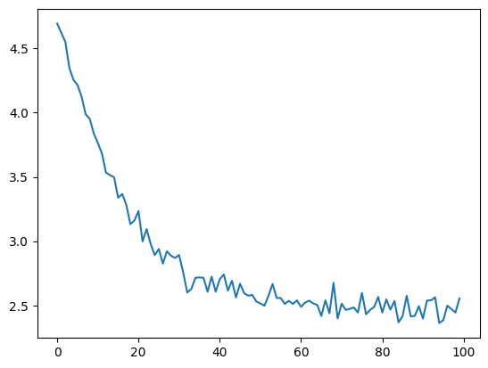
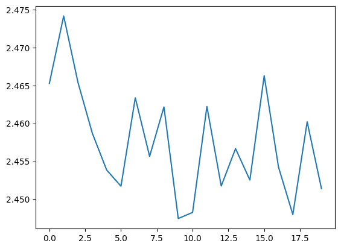
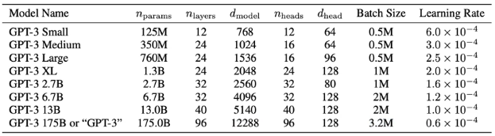
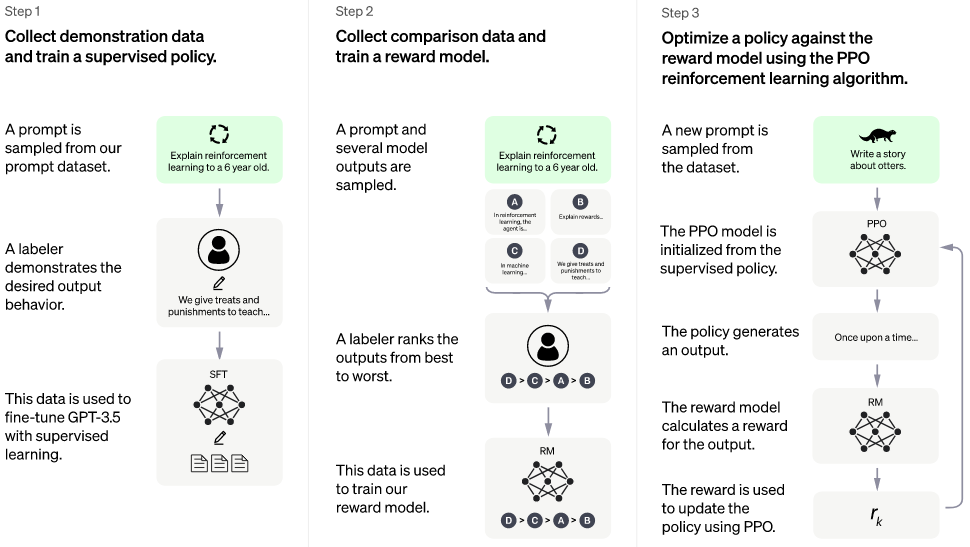

# GPT，从零开始、用代码逐行拼出

[视频](https://www.youtube.com/watch?v=kCc8FmEb1nY)
[代码仓库](https://github.com/karpathy/ng-video-lecture)
[Eureka Labs Discord](https://discord.com/invite/3zy8kqD9Cp)

## 目录

- [目标](#目标)
- [构建数据集](#构建数据集)
- [旁支：Tiktoken](#旁支tiktoken)
- [给数据集分词](#给数据集分词)
- [划分数据集](#划分数据集)
  - [我们到底能拿什么来训练？](#我们到底能拿什么来训练)
- [嵌入层](#嵌入层)
- [设立损失函数](#设立损失函数)
- [生成第一段文本](#生成第一段文本)
- [自注意力中的数学技巧](#自注意力中的数学技巧)
  - [旁支：理解 Softmax 技巧](#旁支理解-softmax-技巧)
- [构建自注意力](#构建自注意力)
  - [旁支：残差连接](#旁支残差连接)
  - [旁支：Add and Norm](#旁支add-and-norm)
- [结语](#结语)
  - [ChatGPT？！](#chatgpt)

[ChatGPT](https://chatgpt.com/) 会基于提示词逐字生成文本。
每次返回的回答都会略有不同。
ChatGPT 处理提示词的能力，似乎只受到三方面的限制：对近期事件的引用、工具调用，以及刻意施加的安全措施。

ChatGPT 系统主要由一个大规模概率系统——**大语言模型**（LLM）驱动。
当人们提到 "GPT-3"、"GPT-4" 或 "GPT-5" 时，指的是在 ChatGPT 中可使用的特定种类的 LLM。
这个 LLM 会接着用户最初提供的提示词，把这个词序列延续下去。
它通过一遍又一遍地按概率采样下一个词来完成这件事。

**这是怎么做到的？** LLM 在底层究竟长什么样？
[Attention Is All You Need \[Vaswani 等人, 2017\]](https://arxiv.org/abs/1706.03762) 这篇论文引入了 **transformer** 架构，为大多数主流 LLM 奠定了基础。

**transformer 已经成为自然语言处理（NLP）领域的主导架构。**

## 目标

**我们将训练一个 *基于 transformer 的*、*字符级* 的语言模型**，训练数据是 [Tiny-Shakespeare](https://raw.githubusercontent.com/jcjohnson/torch-rnn/master/data/tiny-shakespeare.txt)（全部莎士比亚作品装在一个文件里）。
更具体地说，我们将训练一个 **GPT**（Generative Pre-trained Transformer，生成式预训练 Transformer）模型，它是 transformer 架构的一种。
事实上，我们将从零开始用 Python 重新实现 [nanoGPT](https://github.com/karpathy/nanoGPT)——GPT 架构的一个极简版本。

给定一段来自 Tiny-Shakespeare 的文本块，我们的 nanoGPT 模型会预测并追加下一个字符，并把这个过程迭代地重复下去。
GPT 模型不断刷新各项基准，始终处于生成式语言模型的前沿。

```python
import torch
import torch.nn as nn
from torch.nn import functional as F
import tiktoken
```

## 构建数据集

先来看看数据：

```python
# 读入 txt 文件以查看其内容
with open('../tiny-shakespeare.txt', 'r') as f:
    text = f.read()

print("Length of dataset:", len(text), "\n")
print(text[:100]) # 前 100 个字符
```

```
Length of dataset: 1115394 

First Citizen:
Before we proceed any further, hear me speak.

All:
Speak, speak.

First Citizen:
You
```

**先把数据准备好。**
我们可以把整段文本看成一个由其中所有字符构成的 `set`，从而找到数据集中出现的所有不重复字符。
这样做时，由于 Python 中 `set` 会自动去重，最终只保留原文本中每个不重复字符的一个实例。

现在，有了这个由所有不重复字符构成的 `set`，我们可以把它重新解读成这些不重复字符的一个 `list`。
这让我们能按字母顺序对字符排序，便于阅读。
数一下这个 `list` 的长度，也就得到了原文本中不重复字符的数量：

```python
chars = sorted(list(set(text))) # 找出文本中所有不重复字符
vocab_size = len(chars)         # 词表的长度（字符的个数，包含空格字符）

print(''.join(chars))
print(f'\nVocabulary size: {vocab_size}')
```

```

 !$&',-.3:;?ABCDEFGHIJKLMNOPQRSTUVWXYZabcdefghijklmnopqrstuvwxyz

Vocabulary size: 65
```

我们的 nanoGPT 将能够读取并生成 `chars` 列表中的每一个字符，即字母、标点、空格、大小写等。
原始字符对语言模型来说很难直接"消化"和学习，所以我们改为分词：把每个不重复字符映射到它在 `chars` 中的位置所对应的那个整数。（更多内容见[下一讲](<../N008%20-%20GPT%20Tokenizer/N008%20-%20Tokenization.ipynb>)。）**眼下，请把分词理解为一个必要步骤：它把原始文本表示成我们的概率语言模型能够处理的形态。**

在这些整数 token 上训练，等于给模型提供了一种紧凑的数值表示，同时仍保留了从整数序列重建原文的能力。

```python
# 这同时是编码器和解码器
stoi = { ch:i for i,ch in enumerate(chars) }     # 字符到索引的映射
itos = { i:ch for i,ch in enumerate(chars) }     # 索引到字符的映射

encode = lambda s: [stoi[c] for c in s]          # 把字符串编码成一个整数列表
decode = lambda l: ''.join([itos[i] for i in l]) # 把整数列表解码成字符串

msg = "hii there"
token_list = encode(msg)
print(token_list)
print(decode(token_list))
```

```
[46, 47, 47, 1, 58, 46, 43, 56, 43]
hii there
```

## 旁支：Tiktoken

不同系统在文本与数值表示之间的编码/解码上可能采用不同方法。
例如 OpenAI 在其 GPT-2 模型中使用了字节对编码（BPE）。

BPE 是一种子词分词技术。
坦白说，BPE 比我们在这个小分支里简短带过的内容要复杂一些，这里只是作为简要参考而提及。

```python
enc = tiktoken.get_encoding('gpt2')

msg = "hii there"
token_list = enc.encode(msg)
print(token_list) # BPE 返回的 token 数比字符编码少
print(enc.decode(enc.encode("hii there")))

print(enc.n_vocab) # 词表中 token 的总数
```

```
[71, 4178, 612]
hii there
50257
```

[Tiktoken](https://pypi.org/project/tiktoken/) 体现了编码长度与 token 数量之间存在的一种权衡。
我们可以用很短的 token 序列配一个很大的词表，也可以反过来用很长的 token 序列配一个很小的词表，两者各有优劣。
BPE 方法在 NLP 任务中被广泛使用。（更多 BPE 内容见[下一讲](<../N008%20-%20GPT%20Tokenizer/N008%20-%20Tokenization.ipynb>)。）

**分支讲完**，回到正题：我们实际该如何用更简单的方式给数据集分词。

## 给数据集分词

用我们的字符到索引映射，给 Tiny-Shakespeare 数据集分词：

```python
# 把文本编码成一个整数张量
data = torch.tensor(encode(text), dtype=torch.long)
print(f'Total size: {data.shape} elements of type {data.dtype}')
print('First 10 tokens from the dataset:', data[:10])
```

```
Total size: torch.Size([1115394]) elements of type torch.int64
First 10 tokens from the dataset: tensor([18, 47, 56, 57, 58,  1, 15, 47, 58, 47])
```

## 划分数据集

现在，整段 Tiny-Shakespeare 文本被表示成了一条长长的整数序列。
在继续之前，我们应当先把数据划分成训练集和验证集。

```python
n = int(0.9 * len(data)) # 90% 的数据用于训练，10% 用于验证
train_data = data[:n]    # 0 到第 90 百分位
val_data = data[n:]      # 第 90 百分位到末尾
```

现在来准备模型。我们*永远不会*把整条 token 序列当作提示一次性喂给模型。
相反，我们会**每次随机抽取一段连续的 token 序列喂给它**。
然后模型只需从这段序列预测下一个 token。

> 我们把这些连续的、长度受限的输入 token 序列称为 **block（块）**。
> 长度受限意味着 **block 的长度最多为** `block_size`。

来看一个 block 的例子：

```python
block_size = 8              # 文本序列长度的上限
train_data[:block_size + 1] # 前 9 个字符（8 个 + 1 个目标）
```

```
tensor([18, 47, 56, 57, 58,  1, 15, 47, 58])
```

### 我们到底能拿什么来训练？

仔细看的话，这个 block 其实就是一串"正确对齐"的 token。
给定 $[18, 47, 56, 57, 58, 1, 15, 47, 58]$，我们有 $8$ 个不同的可训练样本：

- $[18] \rightarrow 47$
- $[18, 47] \rightarrow  56$
- $[18, 47, 56] \rightarrow 57$，等等。

用一个小例子来演示：

```python
# 第一个 token 块
x = train_data[:block_size]    # 例如 [1, 2, 3, 4, 5, 6, 7, 8]
# 整体后移一位的各个 token（现在也包含最后一个 token）
y = train_data[1:block_size+1] # 例如 [2, 3, 4, 5, 6, 7, 8, 9]

for t in range(block_size):
    context = x[:t+1] # context 即提示
    target = y[t]     # 我们想预测的 token
    print(f'When the prompt is {context}, predict {target}')
```

```
When the prompt is tensor([18]), predict 47
When the prompt is tensor([18, 47]), predict 56
When the prompt is tensor([18, 47, 56]), predict 57
When the prompt is tensor([18, 47, 56, 57]), predict 58
When the prompt is tensor([18, 47, 56, 57, 58]), predict 1
When the prompt is tensor([18, 47, 56, 57, 58,  1]), predict 15
When the prompt is tensor([18, 47, 56, 57, 58,  1, 15]), predict 47
When the prompt is tensor([18, 47, 56, 57, 58,  1, 15, 47]), predict 58
```

我们有了从 $1$ 到 $8$ 的各种 context 长度。

> 在所有可能的 context 长度上训练，会让模型对不同长度的输入更具鲁棒性。

对于**超过** `block_size` 的提示，我们会开始把提示截断到 `block_size` 或更小。

理论上，我们可以一次只在一个 block 上训练。
然而，数据集里能抽出的 block 多得很。"一次一个 block"的做法显然**效率不高**。

我们的 GPU 一次能容纳不止一个 block。我们会一次训练多段序列，每段都*恰好*长 `block_size`。
这种做法叫 **mini-batching（小批量）**。

```python
torch.manual_seed(1337)
batch_size = 4  # 一个批次中的序列数 / 并行处理的序列数
block_size = 8  # 作为提示/上下文的序列的最大长度
```

```python
def get_batch(split, batch_size):
    # 生成一批输入/提示 x 和对应的目标 y
    # 批次形状恒为 (batch_size, block_size)
    data = train_data if split == 'train' else val_data
    # 形状为 (batch_size,) 的张量，元素是 0 到 len(data) - block_size 之间的随机序列起始索引
    ix = torch.randint(len(data) - block_size, (batch_size,))
    # 把本批次中每段序列累加、堆叠成一个张量
    x = torch.stack([data[i:i+block_size] for i in ix])
    # 与 x 相同但整体后移一个 token
    y = torch.stack([data[i+1:i+block_size+1] for i in ix])
    return x, y # x 为 (4,8)，y 也为 (4,8)

# 取一批输入和目标
xb, yb = get_batch('train', batch_size)

# 打印批次的形状和实际数据
print('inputs shape: ', xb.shape)
print(xb,'\n')
print('targets shape: ', yb.shape)
print(yb, '\n')

# 打印第一个批次
for b in range(batch_size):     # 批次维度，批次中的序列数 (batch_size)
    for t in range(block_size): # 时间维度，序列中的 token 数 (block_size)
        context = xb[b, :t+1]   # context 即提示，取批次中第 b 个序列的前 t+1 个 token
        target = yb[b, t]       # 取批次中第 b 个序列的第 t 个 token 作为目标（即我们要预测的 token）
        print(f'When the prompt is {context}, predict {target}')
        # 这组 context <-> target 配对就是要喂给模型的，长度可变
```

```
inputs shape:  torch.Size([4, 8])
tensor([[24, 43, 58,  5, 57,  1, 46, 43],
        [44, 53, 56,  1, 58, 46, 39, 58],
        [52, 58,  1, 58, 46, 39, 58,  1],
        [25, 17, 27, 10,  0, 21,  1, 54]]) 

targets shape:  torch.Size([4, 8])
tensor([[43, 58,  5, 57,  1, 46, 43, 39],
        [53, 56,  1, 58, 46, 39, 58,  1],
        [58,  1, 58, 46, 39, 58,  1, 46],
        [17, 27, 10,  0, 21,  1, 54, 39]]) 

When the prompt is tensor([24]), predict 43
When the prompt is tensor([24, 43]), predict 58
When the prompt is tensor([24, 43, 58]), predict 5
When the prompt is tensor([24, 43, 58,  5]), predict 57
When the prompt is tensor([24, 43, 58,  5, 57]), predict 1
When the prompt is tensor([24, 43, 58,  5, 57,  1]), predict 46
When the prompt is tensor([24, 43, 58,  5, 57,  1, 46]), predict 43
When the prompt is tensor([24, 43, 58,  5, 57,  1, 46, 43]), predict 39
When the prompt is tensor([44]), predict 53
When the prompt is tensor([44, 53]), predict 56
When the prompt is tensor([44, 53, 56]), predict 1
When the prompt is tensor([44, 53, 56,  1]), predict 58
When the prompt is tensor([44, 53, 56,  1, 58]), predict 46
When the prompt is tensor([44, 53, 56,  1, 58, 46]), predict 39
When the prompt is tensor([44, 53, 56,  1, 58, 46, 39]), predict 58
When the prompt is tensor([44, 53, 56,  1, 58, 46, 39, 58]), predict 1
When the prompt is tensor([52]), predict 58
When the prompt is tensor([52, 58]), predict 1
When the prompt is tensor([52, 58,  1]), predict 58
When the prompt is tensor([52, 58,  1, 58]), predict 46
When the prompt is tensor([52, 58,  1, 58, 46]), predict 39
When the prompt is tensor([52, 58,  1, 58, 46, 39]), predict 58
When the prompt is tensor([52, 58,  1, 58, 46, 39, 58]), predict 1
When the prompt is tensor([52, 58,  1, 58, 46, 39, 58,  1]), predict 46
When the prompt is tensor([25]), predict 17
When the prompt is tensor([25, 17]), predict 27
When the prompt is tensor([25, 17, 27]), predict 10
When the prompt is tensor([25, 17, 27, 10]), predict 0
When the prompt is tensor([25, 17, 27, 10,  0]), predict 21
When the prompt is tensor([25, 17, 27, 10,  0, 21]), predict 1
When the prompt is tensor([25, 17, 27, 10,  0, 21,  1]), predict 54
When the prompt is tensor([25, 17, 27, 10,  0, 21,  1, 54]), predict 39
```

## 嵌入层

一个输入批次由张量 `xb` 和 `yb` 组成。
`xb` 和 `yb` 的大小都恰好是 $\text{batch\_size} \times \text{block\_size}$。
`yb` 张量就是 `xb` 张量整体后移一个 token，即 `yb[i, j]` 是 `xb[i, j]` 之后的下一个 token。

这个批次是**"子批量"（sub-batching）**的基础。所谓"子批量"，就是在这些"小批量"内部再切分：
既然 `yb` 只是 `xb` 整体后移一个 token，我们就能借助于 `yb`，在同一个批次里同时训练多个样本。
具体而言，这指的是每个批次里那些由部分 block 构成的样本——每个样本都有自己独特的 context 长度。

这些"子批量"就是成对的 `context` 和 `target`。
它们才是我们要喂给模型的配对。

眼下，我们可以把注意力放到模型本身了：先把 `xb`、再把 `yb` 喂给它。
我们先来搭一个 bigram 模型，就像之前 Makemore 系列里那样。

这是一个基于上一个 token 预测下一个 token 的模型：

```python
torch.manual_seed(1337) # 用于可复现性

# 此阶段还算不上是个语言模型，但我们终会走到那一步……
class BigramLM(nn.Module):

    def __init__(self, vocab_size):
        super().__init__()
        # 给词表做嵌入
        # vocab_size 个 token 中每一个都用一个大小为 vocab_size 的向量表示
        self.embed = nn.Embedding(vocab_size, vocab_size) # 65 个不重复的 65 维向量

    def forward(self, idx, targets):
        # idx 形状为 (batch_size, block_size)
        # targets 形状为 (batch_size, block_size)
        # 嵌入输入索引，形状变为 (batch_size, block_size, vocab_size) (B, T, C)
        logits = self.embed(idx)
        return logits


print('Vocabulary size:', vocab_size)  # 词表列表长度（含空格字符）
m = BigramLM(vocab_size)  # 实例化模型
out = m(xb, yb)           # 前向传播（yb 暂时未用）
print(out.shape)          # (batch_size, block_size, vocab_size) -> 4×8 个字符，每个嵌入成 65 维向量
```

```
Vocabulary size: 65
torch.Size([4, 8, 65])
```

分词文本中每个 token 对应的整数，现在都用一个大小为 $\text{vocab\_size}$ 的嵌入向量来表示。
我们用一个所谓的 **嵌入层** 来做这件事。这个嵌入层本质上是一张查找表，把每一个可能的（共 $\text{vocab\_size}$ 个）字符索引，映射到一个独特的大小为 $\text{vocab\_size}$ 的向量。**而且这一层是可训练的。**
这意味着模型可以按对当前训练最有利的方式来表示 token，而不必受限于原始的分词方式。

对于嵌入层，我们把 `idx` 张量——也就是 token 索引张量——喂给一个 PyTorch 的 `nn.Embedding` 层。
这个层用词表大小和嵌入维度（我们设为 $\text{vocab\_size}$）来初始化。
随后嵌入层输出形状为 ($\text{batch\_size} \times \text{block\_size} \times \text{vocab\_size}$) 的张量，我们称之为 `logits`。
换言之，`logits` 是一个 3D 张量：第一维对应 batch size，第二维对应 $\text{block\_size}$，第三维对应词表大小；`logits` 里承载的信息就是输入 token 学到的嵌入。

我们*尚未*用任何更深层的模型/逻辑把 token 互相关联起来。
我们*尚未*训练或预测*任何东西*，甚至连 token 嵌入都没有。

*这马上就要改变了。*

## 设立损失函数

```python
torch.manual_seed(1337)

class BigramLM(nn.Module):

    def __init__(self, vocab_size):
        super().__init__()
        self.embed = nn.Embedding(vocab_size, vocab_size)  # 给词表做嵌入，每个 token 用一个大小为 vocab_size 的向量表示

    def forward(self, idx, targets):
        logits = self.embed(idx)      # 嵌入输入索引，形状变为 (batch_size, block_size, vocab_size) (B, T, C)
        B, T, C = logits.shape        # B = batch_size, T = block_size, C = vocab_size
        logits = logits.view(B*T, C)  # 把 logits 重塑成 (B*T, C)
        # 这里我们第一次真正用上 targets：
        targets = targets.view(B*T)   # 把 targets 重塑成 (B*T)（targets 含每个输入序列下一个 token 的索引）
        loss = F.cross_entropy(logits, targets)  # 在批次中所有 token 上算交叉熵损失（用 targets 把每个输入序列正确的 token "挑"出来）
        return logits, loss


m = BigramLM(vocab_size)  # 实例化模型
logits, loss = m(xb, yb)  # 前向传播（xb 被嵌入，yb 用于算损失）
print(logits.shape)       # (batch_size * block_size, vocab_size)
print(loss.item())        # 损失值
```

```
torch.Size([32, 65])
4.878634929656982
```

既然我们通过 `yb` 已经知道下一个字符是什么，那么模型通过 `logits` 给出的预测有多准？`loss` 就是对预测质量的度量。

我们希望 `yb` 里的索引与 `logits` 中概率最大/最活跃的索引对上。
损失取的是输入批次中所有 token 上的平均。

我们知道 `vocab_size` 是 $65$。
如果完全随机地预测下一个 token，损失应该是：

$$
-\ln(\frac{1}{65}) = 4.1743872699
$$

我们算出的损失**更高/更差**，因为我们一开始并不是在完美地均匀预测。
初始预测并非在 $\text{vocab\_size}$ 上完美均匀分布。
它们没那么散，还带着一点熵。
我们还没学到在 $\text{vocab\_size}$ 上的均匀分布。


来源：[Shiken.ai](https://shiken.ai/chemistry/entropy)

**`loss` 要被最小化。**
我们需要模型能对单个下一个 token 做出预测。

让我们给当前模型追加一个 `generate` 函数：它接收一个序列的最后一个 token，并按我们想要的次数返回下一个 token：

```python
torch.manual_seed(1337)

class BigramLM(nn.Module):

    def __init__(self, vocab_size):
        super().__init__()
        self.embed = nn.Embedding(vocab_size, vocab_size)      # 给词表做嵌入，每个 token 用一个大小为 vocab_size 的向量表示

    def forward(self, idx, targets=None):
        logits = self.embed(idx)                               # 嵌入输入索引，形状变为 (batch_size, block_size, vocab_size) (B, T, C)
        if targets is None:
            loss = None
        else:
            B, T, C = logits.shape
            logits = logits.view(B*T, C)                       # 把 logits 重塑成 (B*T, C) (B=batch_size, T=block_size, C=vocab_size)
            targets = targets.view(B*T)                        # 把 targets 重塑成 (B*T)
            loss = F.cross_entropy(logits, targets)            # 在批次中所有 token 上算交叉熵损失
        return logits, loss

    # 基于相应序列的最后一个 token 生成新 token
    def generate(self, idx, max_new_tokens):
        for _ in range(max_new_tokens):
            logits, _ = self(idx)                              # 用当前字符序列 idx 做前向传播（即 forward 函数），得 (B, T, C)
            logits = logits[:, -1, :]                          # 只关注 logits 的最后一个 token (B, T, C) -> (B, C)
            probs = F.softmax(logits, dim=-1)                  # 基于这最后一个 token 算下一个 token 的概率分布，得 (B, C)
            idx_next = torch.multinomial(probs, num_samples=1) # 采样下一个 token (B, 1)，概率最高的 token 最可能被采到
            idx = torch.cat((idx, idx_next), dim=1)            # 把新 token 加到序列上 (B, T+1)，供下一轮迭代
        return idx                                             # 返回 token 序列 (B, T+1)，这些就是字符

m = BigramLM(vocab_size)  # 实例化模型
logits, loss = m(xb, yb)  # 前向传播

print(logits.shape)       # (batch_size, block_size, vocab_size)
print(loss) # 损失值
```

```
torch.Size([32, 65])
tensor(4.8786, grad_fn=<NllLossBackward0>)
```

来回顾一下这个 `generate` 函数：
它接收一批 token `xb` 和要生成的 token 数 `n`。

重复 `n` 次，它会：

- 用 token `xb` 做一次前向传播，得到 `logits`
- 丢弃 `xb` 中除最后一个 token 以外的所有内容
- 用 `F.softmax` 计算词表中每个可能 token 紧跟这最后一个 `xb` token 之后的概率
- 用 `torch.multinomial` 从概率分布中采样一个 token，返回的是该 token 的索引，需要时可用它在词表中查到 token 本身
- 把采到的 token 追加到 token `xb` 上
- 重复上述过程

注意 `self(idx)` 调用的是模型的 `forward` 函数。上面的 `forward` 也相应调整过，以支持只用 `idx` 调用。

*来跑跑这个模型。*

## 生成第一段文本

```python
ix = torch.zeros((1, 1), dtype=torch.long)  # 从一个形状 (1, 1)、值为 0（换行）的张量开始
tokens = m.generate(ix, max_new_tokens=100) # 生成 100 个 token，作为一串索引
print(tokens.shape)                         # 打印结果 token 序列的形状
print(decode(tokens[0].tolist()))           # 把这串索引解码成字符串
```

```
torch.Size([1, 101])

SKIcLT;AcELMoTbvZv C?nq-QE33:CJqkOKH-q;:la!oiywkHjgChzbQ?u!3bLIgwevmyFJGUGp
wnYWmnxKWWev-tDqXErVKLgJ
```

我们在这里做的是最基础的生成任务：
给模型一个只含换行符的提示，让它迭代地
生成 $100$ 个"最可能"的字符作为续写。

print 语句里用到了 `[0]`。
这**并不是**因为我们只对生成文本的第一个字符感兴趣之类的。
之所以要 `[0]`，是因为 `generate` 返回的是一个大小为 $\text{batch\_size} \times 101$ 的张量。我们这里的 $\text{batch\_size}$ 为 $1$，所以直接取数组第一个元素并转成字符串即可。

就目前而言，生成效果不怎么样。
`generate` 函数会循环、不断增大 `context_size`，并总是把这个不断增长的 context 重新喂给自己。
然而，在根据生成的 logits 做预测时，我们并没有把 context 中最后一个 token 之前/之外的信息利用起来。

就当前方法而言，我们的 context 本可以是定长的。在当前的（bigram）模型里，我们并没有充分利用 context。这一点很快会得到处理。

*眼下，先训练起来！*

```python
# 创建一个 PyTorch 优化器
# 用模型参数（权重）实例化 AdamW 优化器，
# 学习率取 0.001（*小型*网络常用的取值）
opt = torch.optim.AdamW(m.parameters(), lr=1e-3)
```

```python
batch_size = 32 # 把 batch size 从 4 提到 32
losses = []

# 训练 10000 步/批次
for steps in range(10000):
    xb, yb = get_batch('train', batch_size) # 抽取一批数据
    logits, loss = m(xb, yb)                # 前向传播，算损失
    loss.backward()                         # 用 PyTorch 的 autograd 做反向传播
                                            # （实际上只是更新 logits / 嵌入向量）
    opt.step()                              # 更新权重
    opt.zero_grad()                         # 把梯度清零

    # 每 100 步打印一次损失
    if steps % 100 == 0:
        print(f'Loss at step {steps}: {loss.item()}')
        losses.append(loss.item())
```

```
Loss at step 0: 4.692410945892334
Loss at step 100: 4.621085166931152
Loss at step 200: 4.549462795257568
Loss at step 300: 4.345612049102783
Loss at step 400: 4.25573205947876
Loss at step 500: 4.214480876922607
Loss at step 600: 4.124096870422363
Loss at step 700: 3.9863951206207275
Loss at step 800: 3.9517807960510254
Loss at step 900: 3.837888717651367
Loss at step 1000: 3.7637593746185303
Loss at step 1100: 3.6824679374694824
Loss at step 1200: 3.533822536468506
Loss at step 1300: 3.513597011566162
Loss at step 1400: 3.4971799850463867
Loss at step 1500: 3.3378093242645264
Loss at step 1600: 3.3668529987335205
Loss at step 1700: 3.2826082706451416
Loss at step 1800: 3.1327052116394043
Loss at step 1900: 3.16090965270996
Loss at step 2000: 3.2342259883880615
Loss at step 2100: 2.9978363513946533
Loss at step 2200: 3.094273090362549
Loss at step 2300: 2.9780406951904297
Loss at step 2400: 2.890953302383423
Loss at step 2500: 2.9391205310821533
Loss at step 2600: 2.8254294395446777
Loss at step 2700: 2.921311378479004
Loss at step 2800: 2.886559247970581
Loss at step 2900: 2.8697657585144043
Loss at step 3000: 2.892245292663574
Loss at step 3100: 2.7563703060150146
Loss at step 3200: 2.6004953384399414
Loss at step 3300: 2.627633810043335
Loss at step 3400: 2.7147138118743896
Loss at step 3500: 2.718297004699707
Loss at step 3600: 2.714982748031616
Loss at step 3700: 2.606290817260742
Loss at step 3800: 2.723785161972046
Loss at step 3900: 2.606304883956909
Loss at step 4000: 2.703908920288086
Loss at step 4100: 2.7407634258270264
Loss at step 4200: 2.6153860092163086
Loss at step 4300: 2.6925723552703857
Loss at step 4400: 2.5623557567596436
Loss at step 4500: 2.6690523624420166
Loss at step 4600: 2.595306396484375
Loss at step 4700: 2.5762505531311035
Loss at step 4800: 2.5814590454101562
Loss at step 4900: 2.531094789505005
Loss at step 5000: 2.5153486728668213
Loss at step 5100: 2.4976727962493896
Loss at step 5200: 2.5762481689453125
Loss at step 5300: 2.6668245792388916
Loss at step 5400: 2.5578126907348633
Loss at step 5500: 2.557616710662842
Loss at step 5600: 2.5119683742523193
Loss at step 5700: 2.5358903408050537
Loss at step 5800: 2.5115206241607666
Loss at step 5900: 2.539799213409424
Loss at step 6000: 2.4889943599700928
Loss at step 6100: 2.5222768783569336
Loss at step 6200: 2.5372188091278076
Loss at step 6300: 2.5158963203430176
Loss at step 6400: 2.50382924079895
Loss at step 6500: 2.4178597927093506
Loss at step 6600: 2.540128707885742
Loss at step 6700: 2.4389612674713135
Loss at step 6800: 2.6755778789520264
Loss at step 6900: 2.3983147144317627
Loss at step 7000: 2.514069080352783
Loss at step 7100: 2.465423583984375
Loss at step 7200: 2.4735515117645264
Loss at step 7300: 2.483755588531494
Loss at step 7400: 2.444798707962036
Loss at step 7500: 2.5974466800689697
Loss at step 7600: 2.4312326908111572
Loss at step 7700: 2.465223789215088
Loss at step 7800: 2.4884133338928223
Loss at step 7900: 2.5662145614624023
Loss at step 8000: 2.44449782371521
Loss at step 8100: 2.5472488403320312
Loss at step 8200: 2.4675867557525635
Loss at step 8300: 2.5351293087005615
Loss at step 8400: 2.3684191703796387
Loss at step 8500: 2.417297124862671
Loss at step 8600: 2.5745158195495605
Loss at step 8700: 2.4143502712249756
Loss at step 8800: 2.418973445892334
Loss at step 8900: 2.494617462158203
Loss at step 9000: 2.3975775241851807
Loss at step 9100: 2.5384695529937744
Loss at step 9200: 2.539673089981079
Loss at step 9300: 2.563826560974121
Loss at step 9400: 2.363532304763794
Loss at step 9500: 2.384711742401123
Loss at step 9600: 2.497910499572754
Loss at step 9700: 2.4720048904418945
Loss at step 9800: 2.4446794986724854
Loss at step 9900: 2.555168628692627
```

现在从模型采样，看看它表现如何：

```python
print(decode(m.generate(torch.zeros((1, 1), dtype=torch.long), max_new_tokens=500)[0].tolist()))
```

```

lso br. ave aviasurf my, yxMPZI ivee iuedrd whar ksth y h bora s be hese, woweee; the! KI 'de, ulseecherd d o blllando;LUCEO, oraingofof win!
RIfans picspeserer hee tha,
TOFonk? me ain ckntoty ded. bo'llll st ta d:
ELIS me hurf lal y, ma dus pe athouo
BEY:! Indy; by s afreanoo adicererupa anse tecorro llaus a!
OLeneerithesinthengove fal amas trr
TI ar I t, mes, n IUSt my w, fredeeyove
THek' merer, dd
We ntem lud engitheso; cer ize helorowaginte the?
Thak orblyoruldvicee chot, p,
Bealivolde Th li
```

我们目前只是把 token 嵌入成随机生成的 65 维向量。
当我们随后输入一批 $4$ 段 token 序列、每段 $8$ 个字符索引时，
我们把索引嵌入，得到大小为 $[4 \times 8 \times 65]$ 的张量。
然后把这个张量重塑成 $[32 \times 65]$，与（同样重塑过的）大小为 $32$ 的目标张量比较。
损失随后由 `CrossEntropyLoss` 函数决定：它实际上是用目标 token 的索引，从 `logits` 中"挑"出该目标 token 对应的概率，再取其负对数。
然后损失在批次中所有 token 上取平均，返回一个标量。

我们构建的模型会优化嵌入向量，使之对最可能的下一个 token 给出最高概率。

记住，我们只是增大了 `batch_size` 并多训了几个 epoch。
模型本身没变。我们仍然只基于上一个 token 来预测下一个 token。

**关于损失有一件事要说：**
此时损失非常嘈杂。这是因为每个批次在预测上都多少带点运气成分。
纵观整个训练过程，各批次之间的损失并不真正可比，于是损失就上下跳动。

```python
from matplotlib import pyplot as plt
plt.plot(losses);
```



注意这是每 $100$ 步采样一次的损失。
我们这里可视化的损失太依赖具体批次，而每个批次又太小，不足以代表整轮训练。
不过我们仍能看出趋势。到这里，请转去 [`bigram.py`](./bigram.py) 看我们这份代码的执行优化脚本形式。
在那里，这个损失解读问题是这样处理的：

```python
eval_iters = 200
max_iters = 10000
eval_interval = 500

@torch.no_grad() # 为本函数禁用梯度计算
def evaluate_loss():
    out = {}
    m.eval() # 把模型设为评估模式
    for split in ['train', 'val']:
        losses = torch.zeros(eval_iters)
        for k in range(eval_iters):
            X, Y = get_batch(split, batch_size)
            _, loss = m(X, Y)
            losses[k] = loss.item()
        out[split] = losses.mean()
    m.train() # 把模型切回训练模式
    return out

train_losses = []

# 训练
for iter in range(max_iters):
    xb, yb = get_batch('train', batch_size) # 取一批
    logits, loss = m(xb, yb)                # 前向传播
    loss.backward()                         # 反向传播
    opt.step()                        # 更新参数
    opt.zero_grad(set_to_none=True)   # 重置梯度

    if iter % eval_interval == 0:
        losses = evaluate_loss()
        train_losses.append(losses["train"].item())
        print(f'Iter {iter:4d} | Train Loss {losses["train"]:6.4f} | Val Loss {losses["val"]:6.4f}')

# 从模型生成文本
context = torch.zeros((1, 1), dtype=torch.long) # 从一个为零的 context 开始
print(decode(m.generate(context, max_new_tokens=500)[0].tolist()))
```

```
Iter    0 | Train Loss 2.4653 | Val Loss 2.4886
Iter  500 | Train Loss 2.4742 | Val Loss 2.4727
Iter 1000 | Train Loss 2.4654 | Val Loss 2.4810
Iter 1500 | Train Loss 2.4587 | Val Loss 2.4703
Iter 2000 | Train Loss 2.4539 | Val Loss 2.4912
Iter 2500 | Train Loss 2.4517 | Val Loss 2.4801
Iter 3000 | Train Loss 2.4634 | Val Loss 2.4788
Iter 3500 | Train Loss 2.4557 | Val Loss 2.4851
Iter 4000 | Train Loss 2.4622 | Val Loss 2.4873
Iter 4500 | Train Loss 2.4475 | Val Loss 2.4838
Iter 5000 | Train Loss 2.4483 | Val Loss 2.4757
Iter 5500 | Train Loss 2.4622 | Val Loss 2.4837
Iter 6000 | Train Loss 2.4517 | Val Loss 2.4863
Iter 6500 | Train Loss 2.4567 | Val Loss 2.4837
Iter 7000 | Train Loss 2.4525 | Val Loss 2.4908
Iter 7500 | Train Loss 2.4663 | Val Loss 2.4820
Iter 8000 | Train Loss 2.4542 | Val Loss 2.4769
Iter 8500 | Train Loss 2.4480 | Val Loss 2.4832
Iter 9000 | Train Loss 2.4602 | Val Loss 2.4832
Iter 9500 | Train Loss 2.4514 | Val Loss 2.4857

Risaveld s,

NGES t y s;
IUKI e ysinse hane Ifencethe nk anownk pres iningor d hote MARERD:
DUSBe, anor wofr had shyounurig cea sthay s
Heve archerod
ORM:
Fot t f wed, acous whasand ot qunontyeallongnd d hin:
RGow chiked an, t e nck:
Din soous t t theralyourthe du yofore he t t rapst ace Morayofaventhe ourd haghit hinorone t. asthiche! ad hiea ndsthaiosheain y h withe.
Puse w d yon A e tiseren
Go byod g'd te al po ather furd bumpaind;
UGoritr t l tide verthe h 'stamen ilame e'sat s d t
M:
Berk n
```

```python
plt.plot(train_losses);
```



`evaluate_loss` 不再逐批打印损失，而是把损失在 `eval_iters` 个批次上取平均。
具体地，`evaluate_loss` 会采样 `eval_iters` 批 token，用当前模型各跑一遍，再对损失取平均。

这要对训练集和验证集*都*做一遍。

这样做更准确，因为现在我们是在多批随机采样的批次上、即对数据集更具代表性的样本上观察损失趋势。
由于损失在多批上取平均，它也没那么嘈杂了。

至此，我们的 [`bigram.py`](./bigram.py) 脚本是构建 GPT 的一个绝佳起点。

## 自注意力中的数学技巧

我们*几乎*准备好开始实现一个自注意力块了。
有一件事得先弄明白：**自注意力里的那个技巧**。
它乍看会让人困惑，但其实*非常*简单。

*来深入看看。* 考虑下面这个例子，其中 `vocab_size` 取 $2$：

```python
torch.manual_seed(1337)  # 设种子以保证可复现性
B, T, C = 4, 8, 2        # batch size, block size, vocab size
x = torch.randn(B, T, C) # 随机数构成形状 (B, T, C) 的张量
```

这里我们有 $8$ 个 token，每个是大小为 $2$ 的向量。
它们彼此之间还没有任何交流/关联。

我们想让它们耦合起来，比如让第 $3$ 个 token 只能和第 $2$ 个、第 $1$ 个位置上的 token 通信，但**不能**和第 $4$ 个位置上的"未来"token 通信。

> **信息必须能流动，但只能单向流动。**

我们可以用一个最简单的办法做到：对前面的 token（含当前 token）取平均。
这本质上就是把当前 token 放在它自身历史的上下文里做一次概括。

对每个第 $t$ 个 token，我们想得到它之前所有 token 以及当前 token（$t$）的向量平均值：

```python
# 我们想要 x[b, t] = mean_{i <= t} x[b, i]
xbow = torch.zeros((B, T, C))          # 建一个形状 (B, T, C) 的全零张量（输入的词袋表示）
for b in range(B):                     # 遍历所有批次
    for t in range(T):                 # 遍历批次中所有 token
        xprev = x[b, :t+1]             # 取到当前 token（含）为止的所有 token (t, C)
        xbow[b, t] = xprev.mean(dim=0) # 算到当前 token（含）为止的均值

print('Batch [0]:\n', x[0], "\n")     # 第 0 个批次的 8 个 token，每个大小 2
print('Running Averages:\n', xbow[0]) # 第 0 个批次 8 个 token 的滚动均值，每个大小 2
```

```
Batch [0]:
 tensor([[ 0.1808, -0.0700],
        [-0.3596, -0.9152],
        [ 0.6258,  0.0255],
        [ 0.9545,  0.0643],
        [ 0.3612,  1.1679],
        [-1.3499, -0.5102],
        [ 0.2360, -0.2398],
        [-0.9211,  1.5433]]) 

Running Averages:
 tensor([[ 0.1808, -0.0700],
        [-0.0894, -0.4926],
        [ 0.1490, -0.3199],
        [ 0.3504, -0.2238],
        [ 0.3525,  0.0545],
        [ 0.0688, -0.0396],
        [ 0.0927, -0.0682],
        [-0.0341,  0.1332]])
```

因为有循环，这相对低效。**技巧在于：我们可以用快得多的矩阵乘法来构建这样的滚动均值：**

```python
# 考虑下面这个例子

torch.manual_seed(42)
a = torch.ones(3, 3)                        # 3x3 的全 1 矩阵
b = torch.randint(0, 10, (3, 2)).float()    # 3x2 的、0 到 9 之间的随机整数矩阵
c = a @ b                                   # a 与 b 的矩阵乘法
print(f'a (ones) =\n{a}\n')
print(f'b (random) =\n{b}\n')
print(f'c = a @ b =\n{c}\n')
```

```
a (ones) =
tensor([[1., 1., 1.],
        [1., 1., 1.],
        [1., 1., 1.]])

b (random) =
tensor([[2., 7.],
        [6., 4.],
        [6., 5.]])

c = a @ b =
tensor([[14., 16.],
        [14., 16.],
        [14., 16.]])
```

回顾一下幕后发生的事情：

<center></center>
<br>来源：<a href=https://www.mscroggs.co.uk/img/full/multiply_matrices.gif>mscroggs.co.uk</a>

现在看 torch 函数 `torch.tril`。
它返回一个矩阵（2D 张量）的下三角部分。
对矩阵 `a` 施加 `torch.tril` 后再与 `b` 做矩阵乘法，得到的 `c` 就是 `b` 按行滚动求和的结果：

```python
torch.manual_seed(42)
a = torch.tril(torch.ones(3, 3))            # 全 1 的下三角矩阵（此处用了 tril）
b = torch.randint(0, 10, (3, 2)).float()    # 3x2 的、0 到 9 之间的随机整数矩阵
c = a @ b                                   # a 与 b 的矩阵乘法

print(f'a (ones + tril) =\n{a}\n')
print(f'b (random) =\n{b}\n')
print(f'c = a @ b =\n{c}\n')
```

```
a (ones + tril) =
tensor([[1., 0., 0.],
        [1., 1., 0.],
        [1., 1., 1.]])

b (random) =
tensor([[2., 7.],
        [6., 4.],
        [6., 5.]])

c = a @ b =
tensor([[ 2.,  7.],
        [ 8., 11.],
        [14., 16.]])
```

如果把做了 `torch.tril` 的矩阵 `a` 按每行的元素个数做归一化（除以行和），就得到了 `a` 的滚动均值：

```python
torch.manual_seed(42)
a = torch.tril(torch.ones(3, 3))   # 全 1 的下三角矩阵
a = a / a.sum(dim=1, keepdim=True) # 按行除以行和来归一化矩阵
b = torch.randint(0, 10, (3, 2)).float() # 3x2 的、0 到 9 之间的随机整数矩阵
c = a @ b                                # a 与 b 的矩阵乘法

print(f'a (ones + tril + avg) =\n{a}\n')
print(f'b (random) =\n{b}\n')
print(f'c = a @ b =\n{c}\n')
```

```
a (ones + tril + avg) =
tensor([[1.0000, 0.0000, 0.0000],
        [0.5000, 0.5000, 0.0000],
        [0.3333, 0.3333, 0.3333]])

b (random) =
tensor([[2., 7.],
        [6., 4.],
        [6., 5.]])

c = a @ b =
tensor([[2.0000, 7.0000],
        [4.0000, 5.5000],
        [4.6667, 5.3333]])
```

回到我们的语境，这意味着我们可以用批次乘以那个做了 `torch.tril` 的矩阵 `a`，
来计算批次中各 token 的滚动均值：

```python
# 目标：我们想要 x[b, t] 为 x[b, i] 在 i <= t 上的均值
B, T, C = 4, 8, 2        # batch size, block size, vocab size
x = torch.randn(B, T, C) # 形状 (B, T, C) 的随机输入

# 旧：
xbow = torch.zeros((B, T, C))          # 建一个形状 (B, T, C) 的全零张量（输入的词袋表示）
for b in range(B):                     # 遍历所有批次
    for t in range(T):                 # 遍历批次中所有 token
        xprev = x[b, :t+1]             # 取到当前 token（含）为止的所有 token (t, C)
        xbow[b, t] = xprev.mean(dim=0) # 算到当前 token（含）为止的均值

# 新：
wei = torch.tril(torch.ones(T, T))       # 全 1 的下三角矩阵
wei = wei / wei.sum(dim=1, keepdim=True) # 用每行行和归一化 wei
xbow2 = wei @ x # (T, T) @ (B, T, C) -> PyTorch 的自动升维 -> (B, T, T) @ (B, T, C) = (B, T, C)

torch.allclose(xbow, xbow2) # True
```

```
True
```

这一实现里的矩阵乘法步骤间接用到了
PyTorch 把矩阵 `wei`"撑"到批次 `x` 维度的能力。
正因如此，我们实际上是对数据集中每个批次 `B` 都施加了同一个矩阵 `wei`。
而这就让我们能**一口气**算出整个批次的滚动均值。

把 `wei` 想成一张 `(block_size, block_size)` 或 `(每个输入的字符数, 每个输入的字符数)` 的掩码。
现在我们并行地把 `wei` 施加到每个批次条目上。
而由于 PyTorch 沿批次维度复制了 `wei`，我们一把就拿到了整个批次的滚动均值。
**这就是那个技巧**。

弄明白这点后，我们就可以把 softmax 加到矩阵乘法步骤里，向着自注意力块再进一步：

```python
# 新：
wei = torch.tril(torch.ones(T, T))       # 全 1 的下三角矩阵
wei = wei / wei.sum(dim=1, keepdim=True) # 用每行行和归一化 wei
xbow2 = wei @ x                          # (T, T) @ (B, T, C) -> (B, T, T) @ (B, T, C) = (B, T, C)

# 更新：
tril = torch.tril(torch.ones(T, T))             # 全 1 的下三角矩阵

wei = torch.zeros((T, T))                       # (T, T)
wei = wei.masked_fill(tril == 0, float('-inf')) # 把 tril == 0 处的 wei 全掩成 -inf
wei = F.softmax(wei, dim=-1)                    # (T, T)

xbow3 = wei @ x                                 # (T, T) @ (B, T, C) -> (B, T, T) @ (B, T, C) = (B, T, C)

torch.allclose(xbow2, xbow3)                     # True
```

```
True
```

### 旁支：理解 Softmax 技巧

来看看 softmax 函数。到目前为止，在把 softmax 施加到矩阵乘法步骤之前，我们先做了几步：

- 建一个维度为 `(T, T)`、其中 `T = block_size` 的全 1 三角矩阵 `tril`
- 建一个维度为 `(T, T)` 的全零矩阵 `wei`
- 对 `tril` 中每个为 0 的元素：把 `wei` 中对应元素设为 `-inf`

我们现在对 `wei` 逐行施加 softmax，它会做如下事情：

```python
exwei = torch.tensor([[0, 0, float('-inf'), float('-inf'), float('-inf'), float('-inf'), float('-inf')], 
                      [0, 0, 0, float('-inf'), float('-inf'), float('-inf'), float('-inf')]])
exsof = F.softmax(exwei, dim=-1) # -1 指最后一个维度
print(exsof)
```

```
tensor([[0.5000, 0.5000, 0.0000, 0.0000, 0.0000, 0.0000, 0.0000],
        [0.3333, 0.3333, 0.3333, 0.0000, 0.0000, 0.0000, 0.0000]])
```

**softmax 为什么会这样？**

$$
softmax(x_i) = \frac{e^{x_i}}{\sum_{j=1}^{n}e^{x_j}}
$$

```python
def softmax(x):
    return np.exp(x) / np.sum(np.exp(x), axis=0)
```

从逐行的角度看，`wei` 持有一堆我们想变成概率的值——也就是我们熟知的概率掩码 `wei`。
softmax 登场。逐行地，它把所有值压成一个概率分布：把每个值取 $e$ 的幂，再除以该行所有值取 $e$ 的幂之和，从而把值归一化成加起来等于 $1$。**我们造出了一个概率分布。**

现在，`wei` 中不在下三角部分的那些元素是 `-inf`。
这意味着 softmax 会把这些元素的概率设成最小 / $0$。
而其余元素全都相等（$0$），softmax 会把总概率 $1$ 均摊到剩下的那些元素上。

这意味着我们能用 `wei` 得到想要的掩码效果。事实也确实如此：

```python
tril = torch.tril(torch.ones(T, T))             # 全 1 的下三角矩阵
wei = torch.zeros((T, T))                       # (T, T)
wei = wei.masked_fill(tril == 0, float('-inf')) # 把 tril == 0 处的 wei 全掩成 -inf
wei = F.softmax(wei, dim=-1)                    # (T, T)
xbow3 = wei @ x                                 # (T, T) @ (B, T, C) -> (B, T, T) @ (B, T, C) = (B, T, C)

print(wei[0:3])
```

```
tensor([[1.0000, 0.0000, 0.0000, 0.0000, 0.0000, 0.0000, 0.0000, 0.0000],
        [0.5000, 0.5000, 0.0000, 0.0000, 0.0000, 0.0000, 0.0000, 0.0000],
        [0.3333, 0.3333, 0.3333, 0.0000, 0.0000, 0.0000, 0.0000, 0.0000]])
```

放大来看，这个 softmax 技巧非常有启发性。
实际上，`wei.masked_fill(tril == 0, float('-inf'))` 说的是：来自*未来*的 token 在注意力计算中应被忽略。

**剧透：** 留在 `wei` 里的那些概率就是注意力权重，或者说 *亲和度（affinities）*。它们是会被训练的。

**关键收获**仍然是：我们现在可以用 `tril` 做矩阵乘法，来对过去的 token 做加权聚合，其中下三角元素会告诉某个过去或当前的 token：它该在多大程度上影响下一个 token 的选择。让我们在 [`gpt.py`](./gpt.py) 里据此重构模型。

**相对 [`bigram.py`](./bigram.py) 的改动清单：**

- `__init__` 现在不接收参数（`vocab_size` 现在是全局变量）
- 在 logit 嵌入之前加入一个中间阶段：
  - 嵌入层维度从 `(vocab_size, vocab_size)` 改为 `(vocab_size, n_embd)`
    - `n_embd` 是把 token 嵌入进去的那个向量如今可任取的尺寸
  - 加了一个维度为 `(n_embd, vocab_size)` 的线性层用于 logit 嵌入，这样我们就能用大小 `(n_embd, n_embd)` 来做过去 token 的加权聚合
- 加了位置嵌入
  - `position_embd` 是一个维度为 `(vocab_size, n_embd)` 的嵌入层，嵌入 token 在序列中的位置
  - `pos_embd` 是当前 token 的位置嵌入，会被加（+）到当前 token 信息的嵌入上
  - 这个和随后被传给用于 logit 嵌入的线性层

这些改动*尚不*影响任何东西，因为我们仍缺自注意力块，仍在跑那个可靠的 bigram 模型。但模型仍能正常工作。

## 构建自注意力

为简单起见，我们为单个、单独的 head 构建一个自注意力块。
为此，我们接着前面那个"滚动均值"技巧往下走。
我已经暗示过了：我们并不希望 `wei` 的概率逐行均匀分布。

不同的 token 应当发现其他 token 各自不同程度地重要/有趣。**而这应当由模型自己学出来**（[见此](https://www.youtube.com/watch?v=ZoHfX_Os344)）。

> 从过去收集信息，但要以数据相关的方式去做，并随训练改进。

在自注意力中，批次里每个单独的 token 都发出两个向量：`query` 和 `key`：

- **`query` 向量**是 token 特有的 **"我在找什么？"** 信息
- **`key` 向量**是 token 特有的 **"我包含什么？"** 信息

为了在批次中的 token 之间建立**亲和度**（高关联、对采样决策的高影响），
我们计算每个 token 的 `query` 与 `key` 向量和批次中其他每个 token 的点积。
**这就是 `affinity`（亲和度）矩阵，在我们的语境里即 `wei`。**

如果在点积计算中 `key` 和 `query` 对齐良好或相似，亲和度就高；否则就低。

来搭这个单独的 head：

```python
# 版本 4：自注意力
torch.manual_seed(1337)

B, T, C = 4, 8, 32        # batch size, block size, vocab size（每个 token 是大小 32 的向量）
x = torch.randn(B, T, C)  # 形状 (B, T, C) 的随机输入

head_size = 16
key = nn.Linear(C, head_size, bias=False)   # 不要偏置，从而只做固定的权重矩阵乘法
query = nn.Linear(C, head_size, bias=False) # 不要偏置，从而只做固定的权重矩阵乘法
value = nn.Linear(C, head_size, bias=False) # 不要偏置，从而只做固定的权重矩阵乘法

k = key(x)   # (B, T, C) -> (B, T, head_size)
q = query(x) # (B, T, C) -> (B, T, head_size)

wei = q @ k.transpose(-2, -1)  # (B, T, head_size) @ (B, head_size, T) = (B, T, T)（T 为 block_size）

tril = torch.tril(torch.ones(T, T))             # 全 1 的下三角矩阵
#wei = torch.zeros((T, T))                      # (T, T)
wei = wei.masked_fill(tril == 0, float('-inf')) # 把 tril == 0 处的 wei 全掩成 -inf
wei = F.softmax(wei, dim=-1)                    # (T, T)
#out = wei @ x  # (T, T) @ (B, T, C) -> (B, T, T) @ (B, T, C) = (B, T, C)

v = value(x)   # (B, T, C) -> (B, T, head_size)
out = wei @ v  # (B, T, T) @ (B, T, head_size) = (B, T, head_size)

print(wei[0])
```

```
tensor([[1.0000, 0.0000, 0.0000, 0.0000, 0.0000, 0.0000, 0.0000, 0.0000],
        [0.1574, 0.8426, 0.0000, 0.0000, 0.0000, 0.0000, 0.0000, 0.0000],
        [0.2088, 0.1646, 0.6266, 0.0000, 0.0000, 0.0000, 0.0000, 0.0000],
        [0.5792, 0.1187, 0.1889, 0.1131, 0.0000, 0.0000, 0.0000, 0.0000],
        [0.0294, 0.1052, 0.0469, 0.0276, 0.7909, 0.0000, 0.0000, 0.0000],
        [0.0176, 0.2689, 0.0215, 0.0089, 0.6812, 0.0019, 0.0000, 0.0000],
        [0.1691, 0.4066, 0.0438, 0.0416, 0.1048, 0.2012, 0.0329, 0.0000],
        [0.0210, 0.0843, 0.0555, 0.2297, 0.0573, 0.0709, 0.2423, 0.2391]],
       grad_fn=<SelectBackward0>)
```

当我们把 `x` 批次喂给 `key` 和 `query` 两个 Linear 层做 `forward()` 时，对 `x = (B, T, C)` 中的每个 `C`，我们都得到了训练后的 `query` 向量和 `key` 向量。
因此，把 `x` 施加到这两个线性层上，就一次性地为每个批次、每个 block 中的每个 token 都拿到了 `query` 和 `key`。
这就是为什么 `k` 和 `q` 都是 `(B, T, head_size)`。注意，为批次中所有 token 生成 `query` 和 `key` 向量仍是各自独立进行的。

交流是通过计算 `affinity` 矩阵 `wei` 来完成的。
我们计算每个 token 的 `query` 和 `key` 向量与批次中其他每个 token 的点积。为此，先把 `k` 转置成 `(B, head_size, T)`，得到维度 `(B, T, T)` 的 `wei`。
对 `B` 的每一行，我们都有一张 $\text{T} \times \text{T}$（`block_size x block_size`）的、批次中所有 token 之间亲和度的矩阵。

因为高度和宽度维度都是 $\text{T}$，我们可以像之前那样用 softmax 技巧把未来 token 掩除掉。
问题在于，我们现在*不是*从一个全零的 `wei` 起步，而是已经有了可学习的亲和度。
于是 softmax 不会把概率 $1$ 均匀分给所有 token，而是按我们已有的可学习亲和度来分配。**这就是自注意力的全部要义。**

来看看第 1 个批次中第 $8$ 个 token 处的 `wei` 值。
它是 $0.2391$。第 $8$ 个 token 知道自己的内容是什么、自己在什么位置。
基于此，它生成一个 `query`。

第 $8$ 个 token 的 `query` 向量是：
"我在找那些距我最多四个位置之内的辅音。"

第 $8$ 个 token 的 `key` 向量是：
"我是第 $8$ 个位置上的一个元音，我是关于这个元音的一堆信息的一张名片。"

第 $5$ 个 token 的 `key` 向量是：
"我是第 $5$ 个位置上的一个辅音，我是关于这个辅音的一张带一堆信息的名片。"

有了这些信息，第 $8$ 个 token 就能计算与第 $5$ 个 token 的亲和度。做法是把它自己的 `query` 与第 $5$ 个 token 的 `key` 做点积。
这个点积会很高，因为 `query` 和 `key` 对齐良好。亲和度高了，第 $5$ 个 token 就更可能被选为下一个 token。

好，现在来谈谈 `value` 这个 `v`。
`v` 是 token 的 value 向量。
它是 token 特有的 "我能向你传达什么？" 信息。

注意我们现在只通过 `k` 和 `q` 间接地与 `x` 交互。
因此我们可以说：

- `x` 是 "我在和谁说话？" 的信息

<center></center>

- 注意力是一种**通信机制**。它可以看作有向图中各节点相互张望，从所有指向它的节点那里、以数据相关权重的加权求和来聚合信息。
  - 在我们的图里有 8 个节点/token。第一个节点只被自己指向，第二个节点被第一个节点和自己指向，依此类推。
- 注意力**没有空间概念**，因为它只是作用在一组向量上。正因如此，我们需要对 token 做位置编码，使模型能学会按某种顺序去注意 token。
- 跨批次维度的每个样本当然是完全独立处理的，从不与批次中其他样本"交谈"。
- 我们的 block（见上）叫"decoder"注意力块，因为它有三角掩码。这通常用于自回归场景，如语言建模。
  - 在 'encoder' 注意力块里，只要删掉用 `tril` 做掩码的那一行，让所有 token 都能通信即可。
- 'self-attention'（自注意力）仅指 keys 和 values 与 queries 来自同一来源（我们的情形是 $x$）。
  - 在 'cross-attention'（交叉注意力）里，queries 仍由 $x$ 产生，但 keys 和 values 来自某个其他外部来源（如一个 encoder 模块）。
- 'Scaled'（缩放）注意力会额外把 `wei` 乘以 $1/\sqrt{\text{head\_size}}$（即除以 $\sqrt{\text{head\_size}}$）。这样当输入 `Q`、`K` 是单位方差时，`wei` 也会是单位方差，softmax 保持发散而不会过饱和。
  图示如下：

```python
k = torch.randn(B, T, head_size)
q = torch.randn(B, T, head_size)
wei = q @ k.transpose(-2, -1) * (head_size ** -0.5) # 这就是缩放注意力，避免方差爆炸（方差爆炸会让 softmax 分布变尖，从而使注意力更确定）

print(k.var().item().__format__('.4f'))   # 方差与之前相仿
print(q.var().item().__format__('.4f'))   # 方差与之前相仿
print(wei.var().item().__format__('.4f')) # 方差现在小得多
```

```
1.0449
1.0700
1.0918
```

我们现在把这个自注意力概念拿到 [`gpt.py`](./gpt.py) 里试一试。

**改动清单：**

- 定义并向模型添加了一个 `Head` 模块，其中含 `query`、`key`、`value` 线性层和 `affinity` 矩阵计算。
- 向模型并行添加了多个 `Head`。
- 向模型添加了 `FeedForward` 模块，其中含 `intermediate` 和 `output` 线性层。
  - 之前我们有多头注意力模块，但算 logits 算得太早。现在我们有一个 `FeedForward` 模块，它接收多头注意力模块的输出并算出 logits。这样更好，因为 `FeedForward` 让 token 能基于从多头注意力模块看到的内容做"思考"。
  - 施加 `FeedForward` 进一步降低了损失、改善了困惑度。
- 向模型添加了 `Block` 模块，其中含 `Head` 和 `FeedForward` 模块，可像 "Attention is all you need" 那样堆叠 $N$ 次：


### 旁支：残差连接

很深和极深的神经网络难以训练。它们受梯度消失和梯度爆炸等优化问题困扰。
残差连接有助于缓解。它们在 "Attention is all you need" 中被使用，我们这里也会用。
残差连接的想法最初由 "Deep Residual Learning for Image Recognition" 引入。

**它基本上是这样的：**
你可以通过权重层变换数据，但随后把原始数据值加到变换后的数据值上。在某种程度上，你现在可以自由地从这条残差通路分叉出去，对其施加变换。你不一定非得分叉——可以用一个可学习参数来控制残差连接的强度。这叫 `Skip Connection`（跳跃连接）。

这种结构之所以能解决训练问题，是因为加法是线性运算。加法把梯度均等地分到所有输入上。
来自损失的梯度基本上是"跳"着从输出回到输入的，并且保持更有效。同时它们也传进残差通路，这是好事。

> 有了残差连接，你基本上有了一条从监督到输入的梯度高速公路。
> 不受中间权重层阻碍。
> 残差块最初对残差通路贡献很小。
> 在优化过程中，残差块学会向残差通路贡献越来越多。

### 旁支：Add and Norm

在上图中，有这么个 `Add & Norm` 部分。`Add` 就是残差连接，见上。
`Norm` 是一个 `LayerNorm` 类型的归一化层。没错，这跟我们在 [Makemore 3](<../N004%20-%20Makemore%203%20-%20Activations,%20BatchNorm/N004%20-%20Makemore_3.ipynb>) 里讨论的很接近。

> 批归一化保证数据在**批次维度**上被归一化。
> 任何单个神经元都有单位高斯分布，均值为 $0$、标准差为 $1$。
> 层归一化保证数据在**特征维度**上被归一化。
> 任何单个特征（如向量中的一个值）都有单位高斯分布，均值为 $0$、标准差为 $1$。

`LayerNorm` 在残差连接*之后*施加，以归一化数据。它施加在残差连接的输出上。
它施加在多头注意力模块的输出和前馈模块的输出上。
它施加在 block 的输出上。它施加在模型的输出上。

我们从之前 Makemore 3 的工作出发来搭建 `LayerNorm`：

```python
# Makemore 3 的 BatchNorm1d
class BatchNorm1d:
  
  def __init__(self, dim, eps=1e-5, momentum=0.1):
    self.eps = eps                        # epsilon 取 PyTorch 默认值，你可更改
    self.momentum = momentum              # momentum 取 PyTorch 默认值，你可更改
    self.training = True
    # 初始化参数（用反向传播训练）
    # (bngain -> gamma, bnbias -> beta)
    self.gamma = torch.ones(dim)
    self.beta = torch.zeros(dim)
    # 初始化缓冲
    # （用一个滑动的"动量更新"来训练）
    self.running_mean = torch.zeros(dim)
    self.running_var = torch.ones(dim)

  def __call__(self, x):
    # 前向传播
    if self.training:
      xmean = x.mean(0, keepdim=True) # 批次均值
      xvar = x.var(0, keepdim=True)   # 批次方差
    else:
      xmean = self.running_mean # 以滑动均值为基准
      xvar = self.running_var   # 以滑动方差为基准
  
    # 归一化到单位方差
    xhat = (x - xmean) / torch.sqrt(xvar + self.eps)
    self.out = self.gamma * xhat + self.beta  # 施加批次的 gain 和 bias
  
    # 更新滑动缓冲
    if self.training:
      with torch.no_grad():
        self.running_mean = (1 - self.momentum) * self.running_mean + self.momentum * xmean
        self.running_var = (1 - self.momentum) * self.running_var + self.momentum * xvar
  
    return self.out

  def parameters(self):
    return [self.gamma, self.beta] # 返回该层的张量

torch.manual_seed(1337)
module = BatchNorm1d(100)
x = torch.randn(32, 100)           # 批次大小 32，100 个特征（100 维向量）
print(x[:,0].mean(), x[:,0].std()) # 跨批次看第一个特征的旧均值和标准差（非 0 和 1）
x = module(x)                      # 前向传播
print(x[:,0].mean(), x[:,0].std()) # 跨批次看第一个特征的新均值和标准差（应为 0 和 1）
print(x[:5,0])                     # 看看特征如何"按特征、跨批次"地指示归一化，而非"按样本、跨特征"
print(x.shape)                     # 输出形状应与输入形状相同
```

```
tensor(0.1392) tensor(0.8899)
tensor(7.4506e-09) tensor(1.0000)
tensor([ 0.0468, -0.1209, -0.1358,  0.6035, -0.0515])
torch.Size([32, 100])
```

用 `LayerNorm` 时，我们归一化的是"按样本、跨特征"，而不是"按特征、跨批次"。
为此需要在 `BatchNorm1d` 的代码上做大量改动。

*开个玩笑。* 我们只需把 `mean` 和 `std` 的计算改成跨特征、而非跨批次即可。

```python
# LayerNorm
class LayerNorm:
  
  def __init__(self, dim, eps=1e-5, momentum=0.1):
    self.eps = eps                        # epsilon 取 PyTorch 默认值，你可更改
    self.gamma = torch.ones(dim)          # 初始化 gain
    self.beta = torch.zeros(dim)          # 初始化 bias

  def __call__(self, x):
    # 前向传播
    xmean = x.mean(1, keepdim=True) # 样本均值（跨特征）
    xvar = x.var(1, keepdim=True)   # 样本方差（跨特征）
    xhat = (x - xmean) / torch.sqrt(xvar + self.eps) # 把 x 归一化到单位方差
    self.out = self.gamma * xhat + self.beta         # 施加特征维度的 gain 和 bias

    return self.out

  def parameters(self):
    return [self.gamma, self.beta] # 返回该层的张量

torch.manual_seed(1337)
module = LayerNorm(100)
x = torch.randn(32, 100)           # 批次大小 32，100 个特征（100 维向量）
print(x[0,:].mean(), x[0,:].std()) # 跨批次看第一个特征的旧均值和标准差（非 0 和 1）
x = module(x)                      # 前向传播
print(x[0,:].mean(), x[0,:].std()) # 跨批次看第一个特征的新均值和标准差（应为 0 和 1）
print(x[0,:5])                     # 看看特征如何"按样本、跨特征"地指示归一化，而非"按特征、跨批次"
print(x.shape)                     # 输出形状应与输入形状相同
```

```
tensor(0.0409) tensor(1.0476)
tensor(-9.5367e-09) tensor(1.0000)
tensor([ 0.1335, -0.1059, -0.3824, -0.9127,  0.5583])
torch.Size([32, 100])
```

因为 `LayerNorm` 内部的计算不跨批次维度，我们可以移除 `running_mean` 和 `running_var` 这两个缓冲。也不再区分训练和评估模式，可以移除 `train` 参数。训练过程会按优化器认为合适的方式来决定偏离单位高斯分布的程度。

改完之后，我们现在可以把 `LayerNorm` 加进模型。但**注意我们在这里偏离了原论文**。
更常见的做法是在变换*之前*而非之后施加 `LayerNorm`。

这是因为 `LayerNorm` 比变换更昂贵。我们想尽早施加 `LayerNorm`，这样若变换被跳过，我们也能在残差连接里跳过它。这被称为 "pre-norm" 形式。

到这里，[`gpt.py`](./gpt.py) 已更新以纳入 `LayerNorm`。$5{,}000$ 步后的验证损失是 $2.06$。

为了进一步扩大该模型，Dropout 被同时施加到 `MultiHeadAttention` 和 `Sequential` 模块，以及 `Head` 模块里 softmax 之后。
训练时，我们每一步都在训练一个随机选取的神经元子集 / 一个子网络。在测试时，我们得到的是由原始架构的各个子网络组成的"堆叠集成"，它们协同工作，更均衡地分担负载。

*这里我在 [`gpt.py`](./gpt.py) 里以原始配置训练了完整模型。在启用 GPU 的 Colab 笔记本上训练耗时 1 小时 36 分。$5{,}000$ 步后的验证损失是 $1.48$。*

这是大规模 decoder 训练后的输出：

---

```
But with pricept, and unseek thine eyes merely.

KING HENRY VI:
Love hath bore the king, after live over. Here's iron, Mistinius.
At the blows fellow me slain in, thus any other
As will I have: all the accordations him.
Therefore, they 'll chedge clook you, look upon:
Whose admition-for Henry, who farewell.
I clear thee--Lo this is, in resolved.

ISABELLA:
A guest!

DUKE VINCENTIO:
An's barr'd leave prodigy,
I hath asleepency with this city believed.
Even this tyrant; this farther mules
For muna
```

---

你可以这样加载模型并用它做推理：

```python
# 加载模型架构
model = BigramLanguageModel()
model.load_state_dict(torch.load("model_5000.pt"))
model.eval()
```

## 结语

让我们回到 "Attention is all you need" 那张图，看看我们做得如何：


据此，我们实现了一个 **decoder-only transformer 模型**。说它是 decoder，是因为我们对注意力矩阵 `wei` 施加了三角掩码。
**encoder 部分缺失。** 我们的模型只由 Self-Attention 块和 Feed-Forward 块组成。
"融合 encoder"的 cross-attention 部分也缺失。

我们只是基于一个初始提示生成文本，因此基本上是在"自顾自地絮叨"，不参照任何额外信息。
原论文为机器翻译提出了一种 encoder-decoder 架构：

- encoder 部分也是一个 transformer 模型。它被训练来把源语言编码成一个固定大小的向量
- decoder 部分被训练来把这个固定大小的向量解码成目标语言
- encoder 和 decoder 都被训练以协同工作

| 编码                   | 解码                                        |
| ---------------------- | ------------------------------------------- |
| les chats sont mignons | <START></start>the cats are cute<END></end> |

与我们做的不同，生成会受到额外信息影响，也就是源语言输入。
在 encoder 内部，**没有**施加三角掩码，允许 encoder 在时间维度上看到所有输入 token。
把它喂给 decoder 后，decoder 不仅以当前已解码的过去为条件，还以完整编码后的输入为条件。

### ChatGPT？！

**ChatGPT 与我们这里做的有何关系？**
要构建一个像 ChatGPT 这样的系统，需要两步：预训练一个 decoder-only transformer 让它"絮叨文本"，然后在提示-响应对上微调。

有了现在的上下文，下面这张图应该看着眼熟：


我们数据集里大约有 $300{,}000$ 个 token。OpenAI 训练集里大约有 $300{,}000{,}000{,}000$ 个 token。而按今天（万亿级）的标准，那仍算小的。

**长话短说（TL;DR）：** OpenAI 用 transformer 把训练和微调都放大到极致。
因此 OpenAI 面临的挑战不只在构建 AI 本身，更在于维护一套能承载这种规模模型训练与微调的基础设施。

要让这个 decoder-only 的"絮叨" transformer 对齐到像聊天生成这样的任务，我们需要加入 encoder 部分和 cross-attention 部分。

**OpenAI 是这样做的：**


**第 1 步：** 收集示范数据并训练一个监督策略

- 收集（规模小得多的）用于代码生成的训练数据（如一个编程任务的问题与答案集）
- 微调模型，聚焦于让响应尽可能接近答案集。这就把模型与聊天生成任务对齐了。

**第 2 步：** 收集比较数据并训练一个奖励模型

- 对同一个输入，收集多轮输出并由人工排序
- 用这些信息训练一个奖励模型，使其能大规模地自行给模型输出排序

**第 3 步：** 用 [PPO](https://openai.com/blog/openai-baselines-ppo/) 强化学习算法针对奖励模型优化一个策略

- 同样，我们从训练数据中取一个提示
- 我们训练好的（监督策略）模型接收提示并生成响应
  - 施加 [PPO](https://openai.com/blog/openai-baselines-ppo/)，使被奖励模型排得更高的输出更可能被生成

这些步骤把模型从一个"絮叨的" decoder-only transformer 变成了一个聊天生成器。

<center>Notebook by <a href="https://github.com/mk2112" target="_blank">mk2112</a>.</center>
